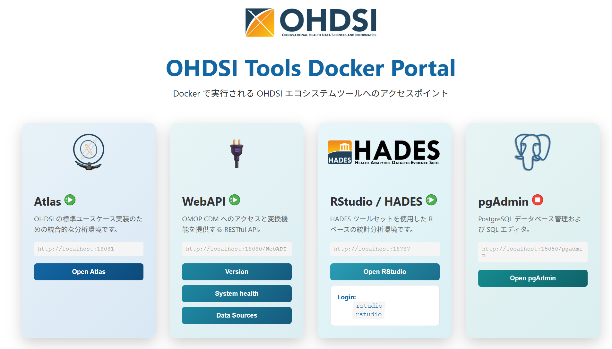

# OHDSI Tools Docker管理者向けドキュメント（ビルド〜Dockerイメージ作成〜配布）
> **概要**  
> 本ドキュメントでは、OHDSIツール群のDocker環境を構築し、利用者に配布可能な状態にするための手順を説明します。

> [!NOTE]
> 本ドキュメントはWindows環境での操作手順を記載しています。macOSやLinux環境で実行する場合は、コマンドやパス表記を適宜読み替えてください。

---

## セットアップ手順

以下の順序で作業を進めてください:

1. [**前提条件の確認**](#1-前提条件の確認) → メモリ16GB以上、空き容量20GB以上
2. [**Docker環境のインストール**](#2-docker環境のインストール) → WSL2 + Rancher Desktop（推奨、必要時のみDocker Desktop）
3. [**リポジトリの取得**](#3-リポジトリの取得) → Git clone + 依存リポジトリ
4. [**GitHub PAT の設定**](#4-github-pat-の設定) → `ghpat.txt`に記述
5. [**ビルド実行**](#5-ビルド実行) → Dockerイメージ作成
6. [**動作確認**](#6-動作確認) → 各サービスにアクセス
7. [**配布準備**](#7-配布準備イメージバージョンアップ時) → イメージをエクスポートしてZIPを作成
    
---

## 1. 前提条件の確認

### 必要なシステム要件
- **メモリ**: 16GB以上
- **ディスク**: 20GB以上の空き容量
- **OS**: Windows 11, Windows Server 2025, macOS, Linux
- **Docker**: Rancher Desktop（推奨・標準）または Docker Desktop（利用環境がDocker Desktopのライセンス要件を満たしている場合のみ）

> [!TIP]
> **選択の指針**  
> Rancher Desktopについて: 
> 本手順は Rancher Desktop を優先して作業を進めます（Apache 2.0ライセンス）。Container Engine は dockerd（moby）モードで利用してください。

---

## 2. Docker環境のインストール

> [!NOTE]
> 以下はWindows環境での手順です。macOSやLinux環境では、WSL2のインストールは不要です。Rancher Desktop（推奨）または Docker Desktop をインストール後、Step 3の確認から実施してください。

### Windows環境の場合

**Step 1: WSL2を有効化**（管理者権限で実行）

```powershell
wsl --install
wsl --set-default-version 2
```

再起動後、確認：
```powershell
wsl --status
```

**Step 2: Git for Windowsをインストール**

[ダウンロード](https://git-scm.com/install/windows) → インストール → 確認：
```powershell
git --version
```

**Step 3: Rancher Desktop（推奨）** または **Docker Desktopをインストール**

- [Rancher Desktop](https://rancherdesktop.io/) (推奨)
- [Docker Desktop](https://www.docker.com/products/docker-desktop/) (利用環境がDocker Desktopのライセンス要件を満たしている場合利用できます。)

確認：
```powershell
docker run --rm hello-world
```

**Rancher Desktop での追加設定**

インストール後、Open Main Window > Preferencesを開き以下の設定を行ってください：

1. **Application > Behavior**:
   - Startup: 「Automatically start at login」をチェック（推奨）
   - Background: 「Start in the background」をチェック（推奨）

2. **Application > Container Engine**:
   - Container Engine: **dockerd (moby)** を選択（**必須**）
   - WebAssembly (Wasm): 無効のまま（チェックを外す）

3. **Kubernetes**:
   - 「Enable Kubernetes」のチェックを外す（推奨）

> [!NOTE]
> Kubernetesを有効にすると不要なリソース消費が発生するため、無効化を推奨します。

---

## 3. リポジトリの取得

以下のいずれかの方法で資源一式を取得してください。

### 方法A: GitHub からクローン

```bash
# 改行コード設定（Windows環境でのCRLF変換を無効化。改行コードが正しくないとビルドやコンテナ起動が失敗する場合があるため）
git config --global core.autocrlf false

# クローン
chcp 65001
git clone https://github.com/<organization>/<repository>.git
cd <repository>
```

### 方法B: 管理者から資源一式を受領

管理者から提供されたZIPファイル（ソースコード一式）を任意のフォルダに展開してください。

```
例: C:\rinchu-omop-etl\
```

### 共通: 関連するGitHubリポジトリの資源取得

方法A・B共通で実施してください。

```bash
# 関連するGitHubリポジトリ(Atlas, WebAPI, RStudio, HADES)を取得
cd 8000_ohdsi_tools_docker\git
git_clone.bat
```

---

## 4. GitHub PAT の設定

> [!IMPORTANT]
> **必須の設定**
> HADESのビルド時、非常に多くのRパッケージをGitHub Packagesからダウンロードします。GitHubは認証なしのアクセスにレート制限を設けているため、PATなしではダウンロードが途中で遮断されビルドが失敗します。

1. [GitHub PAT管理ページ](https://github.com/settings/tokens?type=classic) を開く
2. トークン生成（スコープ: `repo`, `read:packages`）
3. `8000_ohdsi_tools_docker\hades_setup\ghpat.txt` にトークンを記述

---

## 5. ビルド実行

> [!NOTE]
> **`.env` ファイルとは**
> Docker Compose が参照する環境変数の設定ファイルです。イメージのバージョンやプロジェクト名などをここで一元管理します。`.env.example` をコピーして `.env` を作成し、環境に合わせて編集して使用します。

> [!NOTE]
> **2つの `.env` ファイルの使い分け**
>
> | ファイル | 参照される場面 | 主な役割 |
> |---|---|---|
> | `8000_ohdsi_tools_docker\.env`（ルート） | `docker-compose.yml` による起動・停止・再起動 | 現在稼働中のイメージバージョンを指定する **日常運用用** |
> | `builder\.env` | `builder\docker-compose-build.yml` によるビルド | ビルドするイメージのバージョンやプロジェクト名を指定する **ビルド用** |
>
> 変更・リビルドの手順：
> 1. `builder\.env` のバージョンを変更してビルド・検証
> 2. 配布するイメージが確定したら、ルート `.env` を同じバージョンに更新

```cmd
cd 8000_ohdsi_tools_docker\builder
docker-compose-build.bat
```

確認：
```cmd
docker image ls
```

以下のイメージが表示されることを確認してください（表示例）：
- `rinchu/atlas:<バージョン>` (例: 2.15.0)
- `rinchu/hades:<バージョン>` (例: 1.0.0)
- `rinchu/omopdb:<バージョン>` (例: 1.0.0)
- `rinchu/webapi:<バージョン>` (例: 2.15.1)
- `dpage/pgadmin4:latest`
- `postgres:latest`

---

## 6. 動作確認

```cmd
cd 8000_ohdsi_tools_docker
controller_start.bat
```

起動完了後、ブラウザが自動的に開きポータルページが表示されます。



以下のURLにアクセスし、各サービスが正常に動作していることを確認してください：

| サービス | URL | 確認内容 |
|---------|-----|---------|
| **pgAdmin** | http://localhost:15050/pgadmin | ログイン可能であることを確認 |
| **WebAPI** | http://localhost:18080/WebAPI/info | JSONが表示されることを確認 |
| **Atlas** | http://localhost:18081/atlas | ページが表示されることを確認（初期状態はデータソース未設定のエラー画面が表示されます。利用者向けドキュメント Section 4.2 の手順でデータソースを登録してください） |
| **RStudio** | http://localhost:18787 | ログイン可能であることを確認 |

> [!TIP]
> RStudioのログイン情報: `rstudio` / `rstudio`

> [!NOTE]
> **初回アクセス時に画面が表示されない場合**
> Atlas・RStudio は起動直後の初回アクセスで白画面や画面が展開しない場合があります。ブラウザの再読み込み（F5）で解消されます。コンテナ起動後、数分待ってからアクセスすることを推奨します。

> [!IMPORTANT]
> **配布前チェック** — 上記4サービスすべての動作を確認してから配布準備へ進んでください。

---

## 7. 配布準備（イメージバージョンアップ時）

**Step 1: Dockerイメージをエクスポート**

```cmd
8000_ohdsi_tools_docker\images\save_images.bat
```

**Step 2: 配布用ZIPを作成**

```cmd
8000_ohdsi_tools_docker\builder\create_distribution_zip.bat
```

ZIPには `images\*.tar`（新バージョンのイメージ）と `.env`（更新後のバージョン番号）が含まれます。

> [!IMPORTANT]
> `create_distribution_zip.bat` は `images\*.tar` が無い場合は失敗します。Step 1 を先に実行してください。

**利用者側の更新手順**

1. 受け取ったZIPを展開
2. `images\*.tar` を既存の `images\` フォルダに上書き
3. `.env` を既存のルートフォルダに上書き
4. イメージをロードして再起動
   ```cmd
   cd 8000_ohdsi_tools_docker\images
   load_images.bat
   cd ..
   controller_restart.bat
   ```

---

## トラブルシューティング

| 症状 | 対処法 |
|------|--------|
| GitHub PAT エラー | `ghpat.txt` の内容を確認してください |
| ポートが使用できない | ルート `.env` ファイルでポート番号を変更してください |
| メモリ不足 | Docker設定でメモリ割り当てを増やしてください |
| ビルド失敗 | プロキシおよびファイアウォール設定を確認してください |

ログの確認方法：
```cmd
docker compose logs -f webapi
```

---

## OHDSIツールのバージョンアップ手順

**イメージの更新手順**

1. 依存リポジトリを更新
   ```cmd
   cd 8000_ohdsi_tools_docker\git
   git_pull.bat
   ```

2. `builder\.env` のバージョン番号を変更

   | 変数 | バージョンの決め方 |
   |---|---|
   | `ATLAS_VERSION` | GitHubのリリースバージョンに合わせる（例: 2.15.0） |
   | `WEBAPI_VERSION` | GitHubのリリースバージョンに合わせる（例: 2.15.1） |
   | `HADES_VERSION` | 独自バージョン（パッケージの組み合わせが変わった際に更新） |
   | `OMOPDB_VERSION` | 独自バージョン（DBスキーマ・設定が変わった際に更新） |

3. ビルド実行
   ```cmd
   cd 8000_ohdsi_tools_docker\builder
   docker-compose-build.bat
   ```

4. 動作確認後、イメージをエクスポート（Section 7 参照）

**設定の変更手順**

設定ファイルを編集後、再起動：
```cmd
controller.bat restart
```

主な設定ファイル：
- `webapi_setting\application.properties`（通常変更不要。コンテナ外の外部DBを使用する場合のみ接続先を変更。詳細は下記参照）

---

## application.properties 設定リファレンス

`webapi_setting\application.properties` は WebAPI Application Database（WebAPIがコホート定義・解析結果・設定情報を保存するDB）への接続先を設定するファイルです。本環境ではコンテナ内（omopdb）に保持する設計のため通常は変更不要ですが、コンテナ外の既存DBサーバーを使用する場合に変更します。

**Primary DataSource（WebAPI Application Database 接続用）**

| 項目 | 説明 | デフォルト例 |
|------|------|-----|
| `datasource.driverClassName` | JDBCドライバクラス | `org.postgresql.Driver` |
| `datasource.url` | 接続URL | `jdbc:postgresql://omopdb:5432/OHDSI` |
| `datasource.username` | ユーザー名 | `ohdsi_app_user` |
| `datasource.password` | パスワード | `app1` |
| `datasource.dialect` | データベース種類 | `postgresql` |
| `datasource.ohdsi.schema` | WebAPIスキーマ名 | `webapi` |

**Flyway DataSource（スキーママイグレーション用・DDL権限が必要）**

| 項目 | 説明 | デフォルト例 |
|------|------|-----|
| `flyway.enabled` | マイグレーションの有効化 | `true` |
| `flyway.datasource.url` | 接続URL | `jdbc:postgresql://omopdb:5432/OHDSI` |
| `flyway.datasource.username` | 管理者ユーザー名 | `ohdsi_admin_user` |
| `flyway.datasource.password` | 管理者パスワード | `admin1` |
| `flyway.schemas` | 管理対象スキーマ（大文字小文字区別） | `webapi` |

**Security DataSource（ユーザー認証情報管理用）**

| 項目 | 説明 | デフォルト例 |
|------|------|-----|
| `security.db.datasource.url` | 接続URL | `jdbc:postgresql://omopdb:5432/OHDSI` |
| `security.db.datasource.username` | ユーザー名 | `ohdsi_app_user` |
| `security.db.datasource.password` | パスワード | `app1` |
| `security.db.datasource.schema` | セキュリティ用スキーマ名 | `atlas_security` |

> [!NOTE]
> - テンプレートファイル（`application.properties.localdb` / `application.properties.containerdb`）は直接編集せず、`application.properties` にコピーしてから編集してください
> - ファイルは UTF-8 エンコーディングで保存してください
> - スキーマ名は大文字小文字を区別します（特に `flyway.schemas`）

---

## 詳細情報

**Windows環境での注意点**

### コードページ設定
```cmd
chcp 65001  # UTF-8に変更
```

### パス長の制限
Windows環境ではパス長の制限があるため、リポジトリは可能な限り浅い階層に配置することを推奨します。

バージョン番号の決め方は「OHDSIツールのバージョンアップ手順」セクションを参照してください。

