# OHDSI Tools Docker利用者向けドキュメント（セットアップ〜起動・動作確認）

## はじめに

### 概要
本ドキュメントは、提供されたOHDSIツールセット（Docker版）を受領してから、ローカル環境で起動し、動作確認を行うまでの手順をまとめたものです。

### 対象読者
- OHDSIツールを使用する解析担当者
- 環境構築を行うシステム利用者

### 何ができるようになるか
本手順を実施することで、お手元のPC（Windows/Mac/Linux）上でOHDSIツール群（Atlas, WebAPI等）をDockerコンテナとして稼働させ、ブラウザから利用可能な状態にすることができます。

## 1. 前提条件

### システム要件
- メモリ: 16GB以上
- ディスク空き容量: 20GB以上
- OS: Windows 11, Windows Server 2025, macOS, Linux

### 必要なソフトウェアのインストール
以下のいずれかのコンテナランタイムがインストールされ、起動している必要があります（本手順は Rancher Desktop を標準とします）。
- Rancher Desktop (推奨・標準、Apache 2.0ライセンス、dockerdモードで使用)
  - インストール時の設定:
      - Application > Container Engine: **dockerd (moby)** を選択
      - **Kubernetes を無効化**（Enable Kubernetesのチェックを外す）
- Docker Desktop （代替手段。利用環境がDocker Desktopのライセンス要件を満たしている場合のみ利用できます。）

## 2. 手順の全体像

:::mermaid
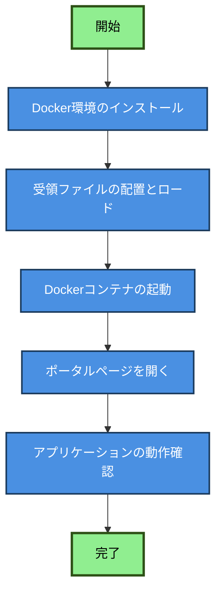
:::

1. **Docker環境のインストール**: 前提となるDocker環境を準備します。
2. **受領ファイルの配置とロード**: 配布された資材を展開し、Dockerイメージをロードします。
3. **Dockerコンテナの起動**: `controller_start.bat` を実行してコンテナを起動します。
4. **ポータルページを開く**: ブラウザでポータルページにアクセスしてブックマークします。
5. **動作確認**: 各サービスが正常に動作しているか確認します。

## 3. 導入手順

### 3.1 Docker環境のインストール

#### 1. Dockerのインストール
以下のいずれかをインストールしてください(Windows環境の場合)。本手順では Rancher Desktop を優先します:
- **Rancher Desktop**: https://rancherdesktop.io/ （推奨・標準、Apache 2.0ライセンス、dockerdモードで使用）
  - インストール時の設定:
      - Application > Container Engine: **dockerd (moby)** を選択
      - **Kubernetes を無効化**（Enable Kubernetesのチェックを外す）
- **Docker Desktop**: https://www.docker.com/products/docker-desktop (代替手段。利用環境がDocker Desktopのライセンス要件を満たしている場合のみ利用できます。)

#### 2. Dockerの起動
- インストール後、まず Rancher Desktop を起動します（Docker Desktop を利用する場合は Docker Desktop を起動します）
- タスクバー（Windows）またはメニューバー（Mac）にDockerのアイコンが表示され、「Running」状態になるまで待ちます

#### 3. 起動確認

**Rancher Desktop の場合**
1. スタートメニューから **Rancher Desktop** を起動します
2. アプリが起動したら、画面下部のステータスが **「Running」** になるまで待ちます
3. タスクバーの通知領域にRancher Desktopのアイコンが表示されていれば準備完了です

**Docker Desktop の場合**
1. スタートメニューから **Docker Desktop** を起動します
2. タスクバーの通知領域のDockerアイコンが **緑色（Running）** になるまで待ちます

> [!TIP]
> **コマンドで確認したい場合（任意）**
> ターミナル（cmdまたはPowerShell）を開き、以下を実行します：
> ```cmd
> docker ps
> ```
> ヘッダー行のみ表示されれば正常です（まだコンテナを起動していないため）：
> ```
> CONTAINER ID   IMAGE     COMMAND   CREATED   STATUS    PORTS     NAMES
> ```

> [!NOTE]
> **起動しない場合**
> - Rancher Desktop / Docker Desktop を右クリック → 「Restart」または「再起動」を試してください
> - それでも解決しない場合は再インストールをお試しください

### 3.2 受領ファイルの配置とロード
1. 配布されたzipファイル等を解凍し、作業用フォルダに配置します。
   以下の例では `C:\ohdsi_tools_docker` を作業用フォルダとしていますが、任意のパスに変更できます。

```
# フォルダ構成例（展開先: C:\ohdsi_tools_docker\ など任意のパス）
8000_ohdsi_tools_docker\
  ├── images\
  │   ├── rinchu_webapi_{バージョン}.tar
  │   ├── rinchu_atlas_{バージョン}.tar
  │   ├── rinchu_hades_{バージョン}.tar
  │   ├── rinchu_omopdb_{バージョン}.tar
  │   ├── dpage_pgadmin4_latest.tar
  │   ├── load_images.bat
  │   └── load_check_images.bat
  ├── portal\
  │   └── portal.html
  ├── webapi_setting\
  │   └── application.properties
  ├── database_setup\
  ├── documents\
  ├── hades_user\
  ├── docker-compose.yml
  ├── .env
  ├── controller_start.bat
  ├── controller_stop.bat
  ├── controller_restart.bat
  └── controller.bat
```

> [!NOTE]
> **Dockerイメージファイルが別ZIPで提供される場合**
> DockerイメージファイルはサイズがGB単位と大きいため、別ZIPで提供される場合があります。
> その場合は、受け取ったZIPを解凍し、中の `*.tar` ファイルを `8000_ohdsi_tools_docker\images\` フォルダに配置してからロードに進んでください。

2. エクスプローラーで `images` フォルダを開き、`load_images.bat` をダブルクリックしてDockerイメージをロードします。ロード完了まで数分かかります。

   ロードが完了すると、Rancher Desktop の **Images** 画面に以下のようにイメージが表示されます。

   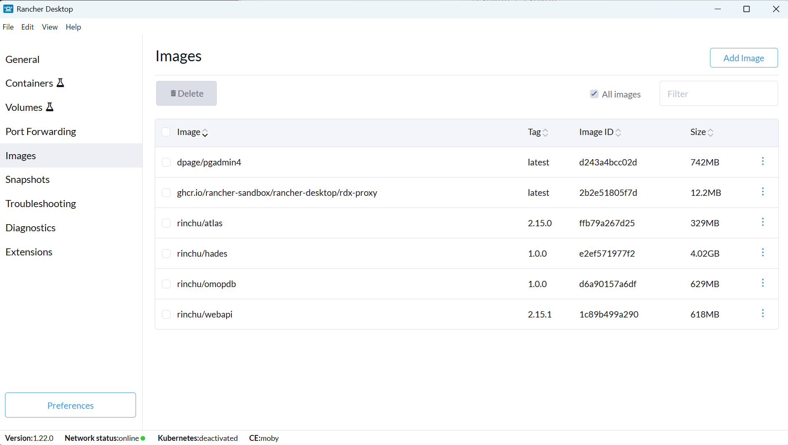

> [!TIP]
> **コマンドラインで実行する場合（任意）**
> ```cmd
> cd <作業用フォルダ>\8000_ohdsi_tools_docker\images
> load_images.bat
> ```
> Mac/Linux の場合は `./load_images.sh` を実行してください。

### 3.3 Dockerコンテナの起動

エクスプローラーで作業フォルダ（`8000_ohdsi_tools_docker`）を開き、`controller_start.bat` をダブルクリックして実行します。

初回の起動にはコンテナの初期化が含まれるため、数分かかる場合があります。

起動が完了すると、Rancher Desktop の **Containers** 画面に全コンテナが **running** 状態で表示されます。

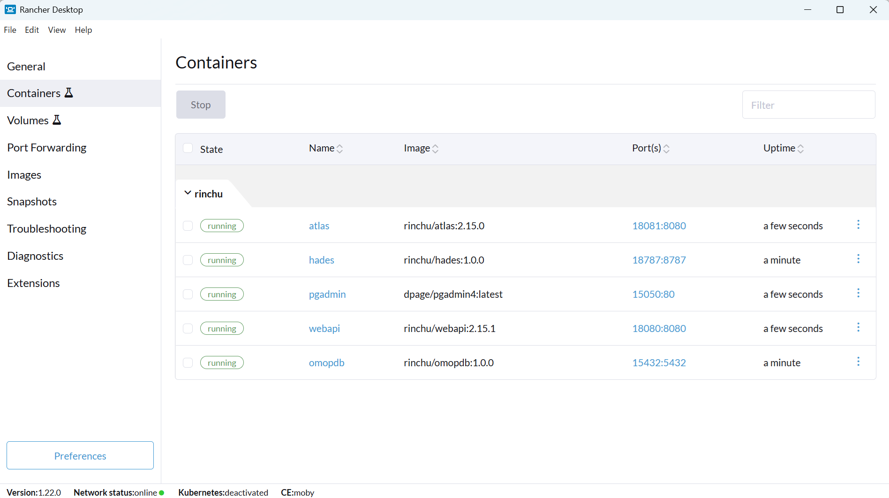

> [!TIP]
> **コマンドラインで実行する場合（任意）**
> ```cmd
> cd <作業用フォルダ>\8000_ohdsi_tools_docker
> controller_start.bat
> ```
> 例: `cd C:\ohdsi_tools_docker\8000_ohdsi_tools_docker`

### 3.4 ポータルページの開き方
`controller_start.bat` の実行後、コンテナ起動完了とともにブラウザが自動的に開き、ポータルページが表示されます。

自動で開かない場合は、以下のいずれかの方法で開いてください。

   **方法1: エクスプローラーから開く**
   - エクスプローラーで `<作業用フォルダ>\8000_ohdsi_tools_docker\portal\portal.html` をダブルクリック
   - 例: `C:\ohdsi_tools_docker\8000_ohdsi_tools_docker\portal\portal.html`

   **方法2: ブラウザのアドレスバーに直接入力**
   ```
   file:///C:/ohdsi_tools_docker/8000_ohdsi_tools_docker/portal/portal.html
   ```
   ※スラッシュは `/` を使用し、作業用フォルダのパスに合わせて変更してください

3. ポータルページが表示されたら、**ブラウザのブックマーク機能でこのページをブックマークしてください**。
   - ブラウザのアドレスバーの右側のアイコンをクリック、または
   - キーボードの `Ctrl+D` で追加できます

#### ポータルページの機能

ポータルページは、OHDSIツール群の一元的なアクセスポイントとなり、以下の機能を提供します。


| 機能 | 説明 |
|------|------|
| **稼働状態の確認** | 各コンテナ・サービスの稼働状況をリアルタイムで表示します。アイコンやステータス表示で一目で稼働状況を確認できます |
| **各ツールへのリンク** | pgAdmin、WebAPI、Atlas、RStudio など各ツールへの直接リンクを提供し、ワンクリックでアクセスできます |
| **ログイン情報の表示** | 各サービスのデフォルトユーザー名やパスワードが表示されており、すぐに利用可能です |
| **トラブルシューティング** | よくある問題と解決方法へのリンクが含まれています |
| **ドキュメントへのアクセス** | README やその他のドキュメントへのリンクから、詳細な情報にアクセスできます |

## 4. 各サービスの動作確認

### 4.1 pgAdmin/OMOPDB
- URL: `http://localhost:15050/pgadmin`
- ログイン不要（パスワード入力なしで直接開きます）
- 左ペインの **Servers → omopdb_docker** をクリックすると自動接続されます（パスワード入力不要）
- 確認事項: 左ペインに **Databases → OHDSI** が表示されていること

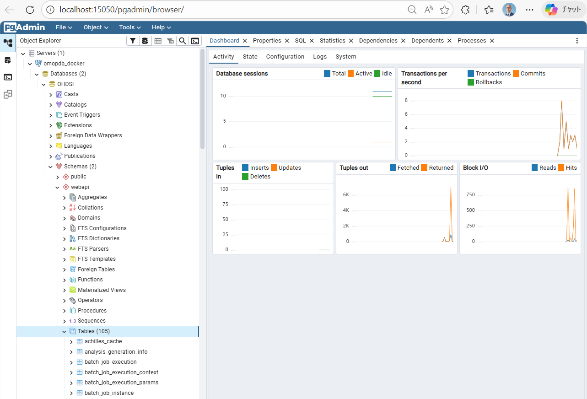

### 4.2 WebAPI とデータソースの登録

#### 動作確認
ポータルページの **WebAPI → Version** ボタンをクリックし、バージョン情報が表示されることを確認します。

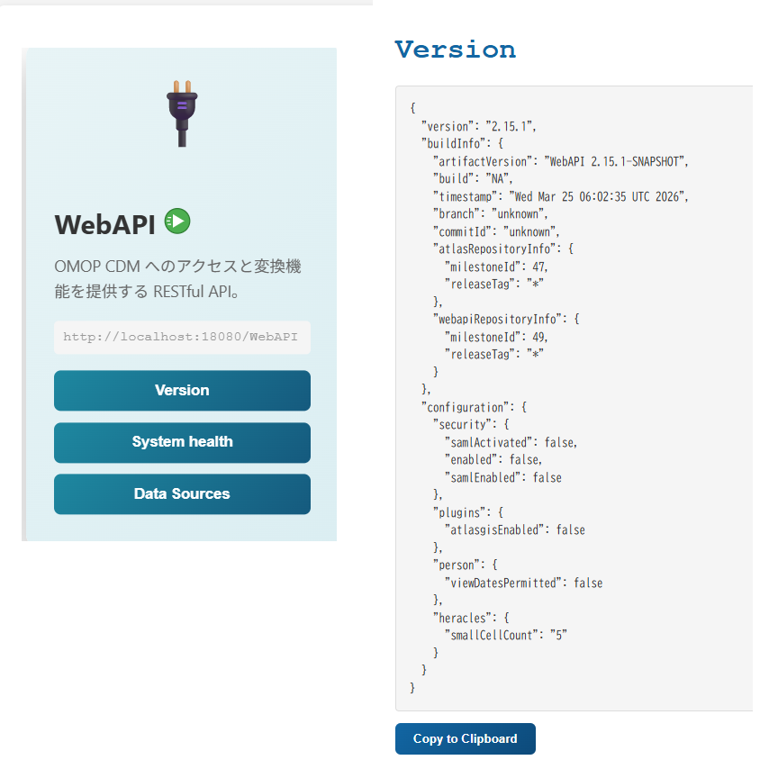

> [!TIP]
> ブラウザから直接確認する場合は http://localhost:18080/WebAPI/info にアクセスし、JSON形式のレスポンスが返されることを確認してください。

#### データソースの登録（初回セットアップ時に必須）

Atlasでデータソースを選択・利用するには、WebAPIにデータソース情報を登録する必要があります。

> [!IMPORTANT]
> この手順を実施しないと、Atlasでデータソースが選択できず、コホート定義等の機能が利用できません。

1. pgAdmin（http://localhost:15050/pgadmin）にアクセスします

2. 左ペインで **Servers → omopdb_docker** をクリックして接続します（パスワード入力不要）

3. **Databases → OHDSI** を選択します

4. **Query Tool** を開きます

5. 以下のいずれかのSQLファイルをテキストエディタで開き、内容を全選択してコピーします：

   | ファイル | 用途 |
   |--------|------|
   | `webapi_setting\webapi_sources_sample_localdb.sql` | ホストOS上のOMOP DBに接続する場合（通常はこちら） |
   | `webapi_setting\webapi_sources_sample_containerdb.sql` | コンテナ内のOMOP DBに接続する場合 |

   > [!IMPORTANT]
   > **ホストPCへの接続について**
   > DockerコンテナからホストPC上のDBに接続する場合、`localhost` や `127.0.0.1` はコンテナ自身を指すため使用できません。以下のホスト名を使用してください：
   > - **Rancher Desktop**: `host.rancher-desktop.internal`
   > - **Docker Desktop**: `host.docker.internal`
   >
   > `webapi_sources_sample_localdb.sql` にはデフォルトで `host.rancher-desktop.internal` が設定されています。Docker Desktop を使用している場合は、ファイル内の該当箇所を `host.docker.internal` に変更してから実行してください。

6. Query Tool にコピーした内容を貼り付け（`Ctrl+V`）、実行（`F5`）します

   SQLファイルには以下の2つのINSERT文が含まれており、それぞれ `webapi.source`（データソース接続情報）と `webapi.source_daimon`（データソース種別）を登録します。

   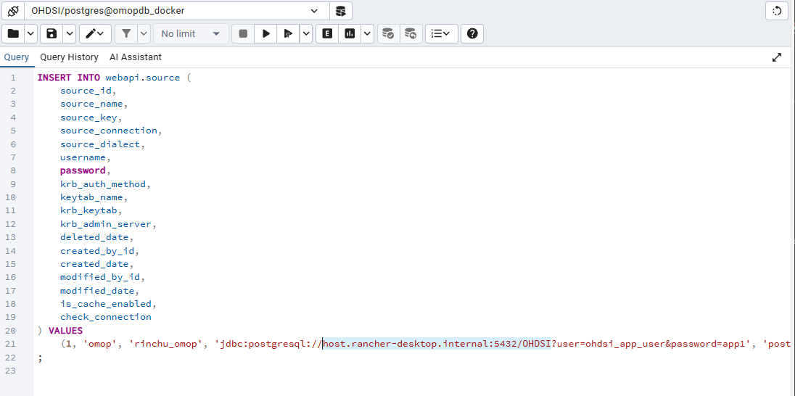

   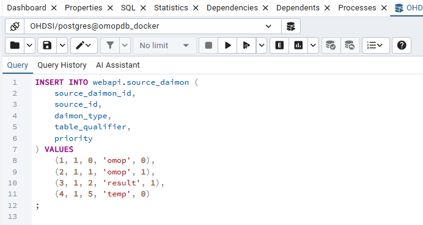

7. エクスプローラーで作業フォルダを開き、`controller_restart.bat` をダブルクリックしてコンテナを再起動します

8. ポータルページの **WebAPI → Data Sources** ボタンをクリックし、登録したデータソースが表示されていることを確認します

   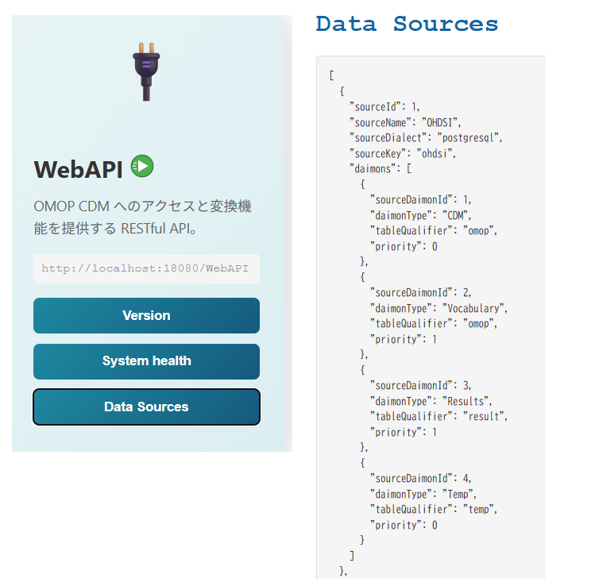

> [!TIP]
> WebAPIデータソース登録の詳細については、OHDSI Japan のガイドを参照してください。
> [データソースの追加 - OHDSI Japan](https://rwd-data-environment-in-hospital.github.io/Documents/Files/Add_Data_Sources.html)

### 4.3 Atlas
- URL: `http://localhost:18081/atlas`
- 確認事項:
  - ページが表示されること
  - 4.2 のデータソース登録前は下図のようなエラー画面が表示されます（登録後、再読み込みで解消されます）

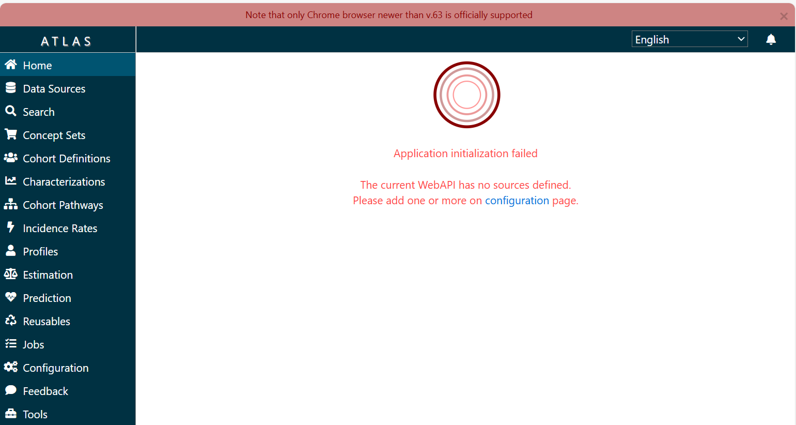

データソースを登録すると、エラーが解消されトップページが正常に表示されます。

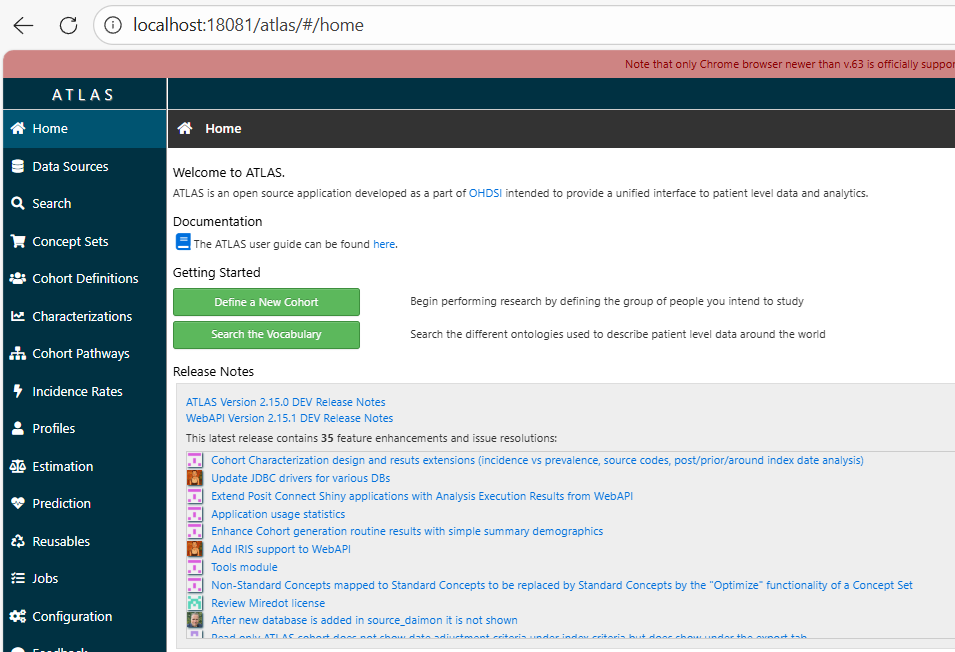

**Data Sources** メニューをクリックすると登録したデータソースが選択でき、Data Density などのダッシュボード画面が表示されます。

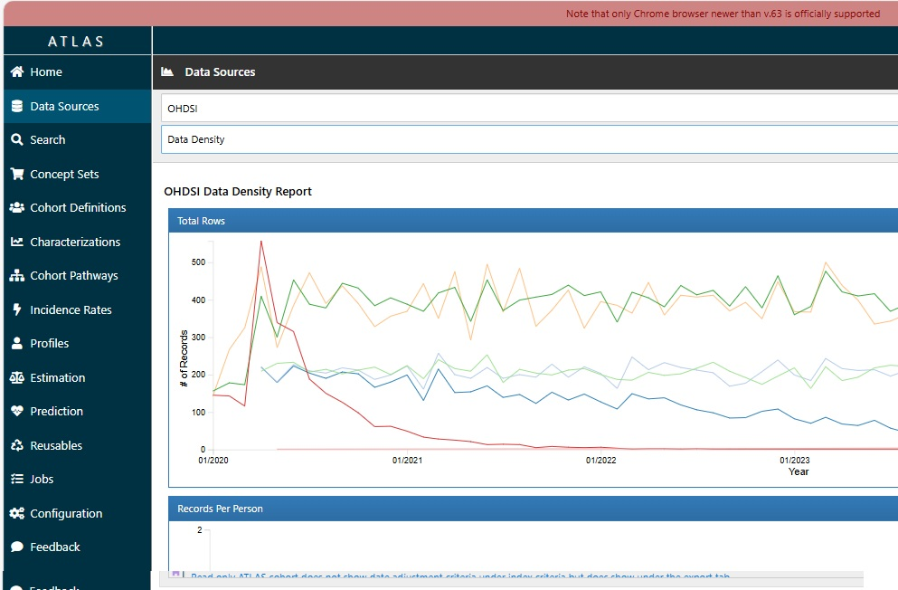

> [!NOTE]
> 起動直後の初回アクセスで白画面になる場合があります。ブラウザの再読み込み（F5）で解消されます。

### 4.4 RStudio/HADES
ポータルページの **RStudio/HADES → Open RStudio** ボタンをクリックしてアクセスします。ユーザー名・パスワードともに `rstudio` でログインしてください。

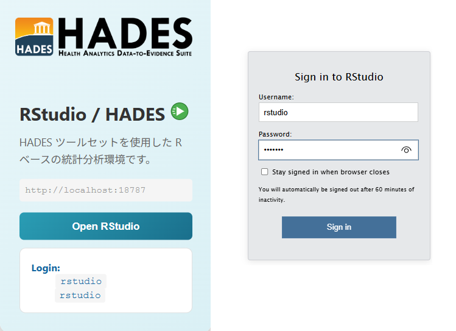

- 確認事項:
  - ログインできること（ログイン後の画面が展開しない場合はF5で再読み込み）
  - フォルダリストに `hades_user` フォルダが表示されていること
  - HADES ライブラリ確認: RStudio のコンソールで以下のコマンドを使って動作確認できます（すべて実行する必要はありません）

    ```r
    # Achilles のロード確認
    library(Achilles)
    #> Loading required package: DatabaseConnector

    # Achilles のバージョン確認
    packageVersion("Achilles")
    #> [1] '1.8'

    # 主要HADESパッケージのバージョンを一覧確認
    sapply(c("Achilles", "CohortMethod", "DataQualityDashboard"), packageVersion)
    #> $Achilles
    #> [1] 1 8
    #> $CohortMethod
    #> [1] 6 0 1
    #> $DataQualityDashboard
    #> [1] 2 8 7
    ```

    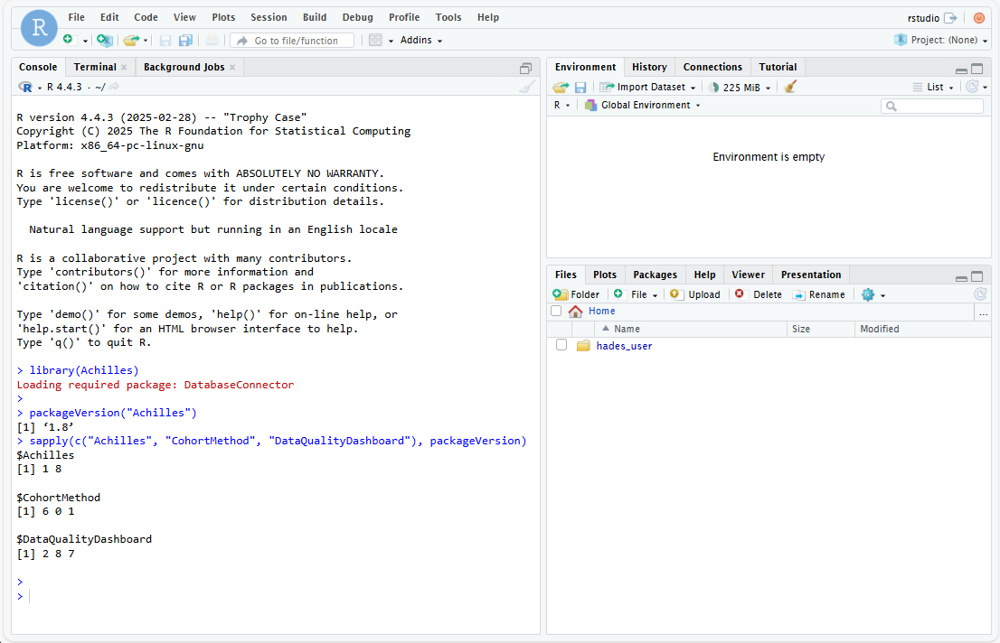

## 5. Tips & Tricks

### 5.1 各バッチファイルの説明
よく使うバッチファイルの説明は以下の通りです。
- `controller_start.bat`: 全コンテナを起動します。
- `controller_stop.bat`: 全コンテナを停止します。
- `controller_restart.bat`: 全コンテナを再起動します。
- `load_images.bat`: `images` フォルダ内のDockerイメージをロードします。

### 5.2 WebAPI Application Database の接続先設定について

> [!NOTE]
> **用語の整理**
> OHDSI では以下の2つのデータベースを使い分けています。混同しないよう注意してください。
>
> | 用語 | 説明 | 設定箇所 |
> |------|------|---------|
> | **WebAPI Application Database** | WebAPI自身がコホート定義・解析結果・設定情報を保存するDB（`webapi` スキーマ） | `application.properties`（本セクション） |
> | **CDM Source** | OMOP CDM形式の患者データが格納されたDB。Atlasで分析対象として選択するもの | Section 4.2 のデータソース登録 |

`webapi_setting/application.properties` は WebAPI Application Database への接続先を設定するファイルです。

本環境では WebAPI Application Database はコンテナ内（omopdb）に保持する設計となっており、**通常はこのファイルを変更する必要はありません**。

病院の既存のデータベースサーバー上にOMOPデータがあり、WebAPI Application Database もそのサーバーで管理したい場合は、接続先を変更することができます。外部に保持する主な目的としては以下が挙げられます：

- **データの一元管理**: 院内の既存DBサーバーでWebAPIの設定・解析結果をまとめて管理・バックアップしたい
- **データの永続化**: Dockerコンテナやボリュームを削除・再構築してもコホート定義や解析結果を失いたくない
- **複数環境での共有**: 複数のWebAPIインスタンスで同じ設定・コホート定義を共有したい

設定ファイルのテンプレートや各設定項目の詳細については、管理者向けドキュメントの **「application.properties 設定リファレンス」** を参照してください（`documents\for_administrator.md`）。
