# ETLパイプライン説明

## 概要

RINCHU プロジェクトのETL（Extract, Transform, Load）処理は、以下のメインスクリプトで段階的に実行されます：

1. **`01_etl_execution_to_stem.sql`**: 生データからステージングテーブル（stem_source）への変換
2. **`02_etl_execution_stem_mapped.sql`**: `v_stem` から `stem_m` への中間テーブルマッピング付与（TRUNCATE + INSERT + ANALYZE）
3. **`03_mapping_checklist.sql`**: マッピング状況の確認用チェックリストCSVを出力
4. **`04_etl_execution_to_final.sql`**: ステージングテーブルからOMOP CDM最終形式への変換とEraテーブルの集計
5. **`05_result_checklist.sql`**: ETL実行結果のチェックリストCSVを出力
6. **`06_production_deployment_master.sql` / `06_production_deployment_data.sql`**: 検証済みデータのProduction環境への移行


これらのスクリプトは、生データから OMOP CDM（Observational Medical Outcomes Partnership Common Data Model）形式への変換を段階的に実行します。

## ETL処理フロー

### 1. Person ステージング処理
患者情報の変換と正規化を実行します。

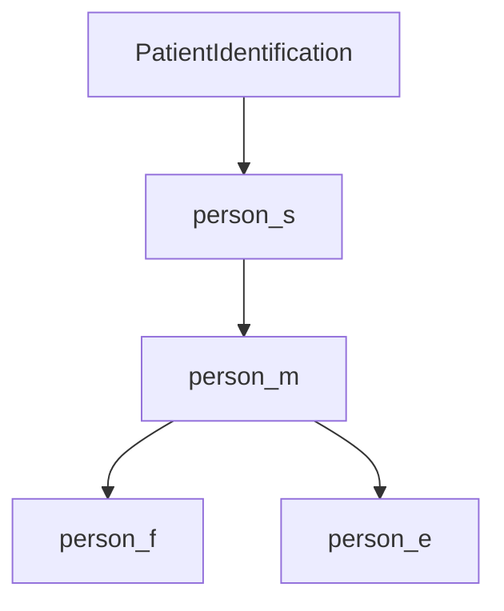

- **person_s**: 生データから抽出した患者情報（Source）
- **person_m**: 変換・マッピングされた患者情報（Mapped）  
- **person_f**: 最終確定された患者情報（Finalized）
- **person_e**: エラーレコード（Error）

### 2. Visit Occurrence ステージング処理
受診情報の変換を実行します。

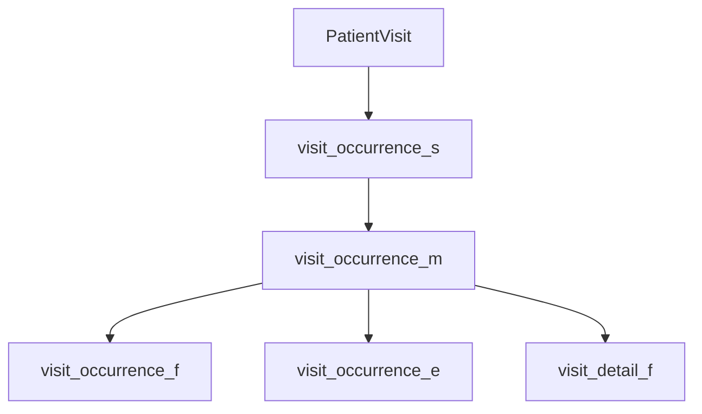

- **visit_detail_f**: 詳細な受診情報も同時に生成

### 3. Death ステージング処理
死亡情報の変換を実行します。

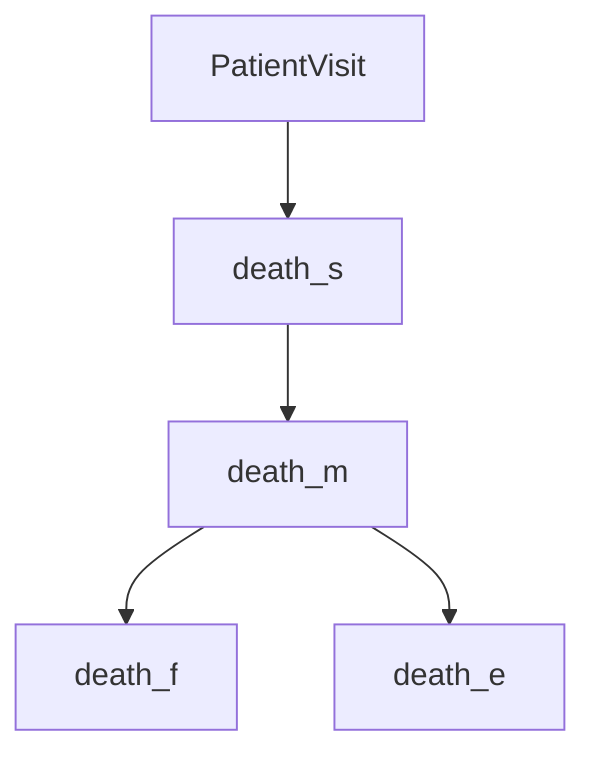

### 4. 共通ステージング処理 (stem_source)
複数のソーステーブルを統一フォーマット（stem_source）に変換します。

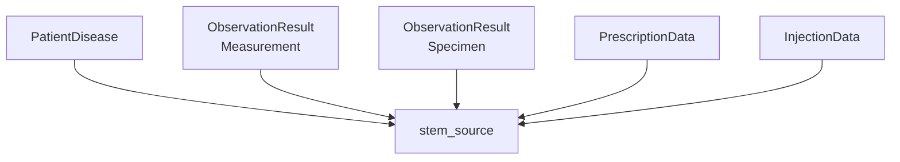

**変換対象:**
- **PatientDisease** → 診断情報
- **ObservationResult (Measurement)** → 検査・測定値
- **ObservationResult (Specimen)** → 検体情報
- **PrescriptionData** → 処方薬情報
- **InjectionData** → 注射薬情報

### 4.5 中間テーブルマッピング付与 (Staging table Mapping)

`stem_source` に source_to_concept_mapを介して concept を結合した VIEW `v_stem` をテーブル `stem_m` に書き出します。マッピングテーブル更新後は本ステップを再実行する必要があります。
このテーブルから内包するソースコードと、マッピング状況を可視化したマッピングチェックリストを作成します。

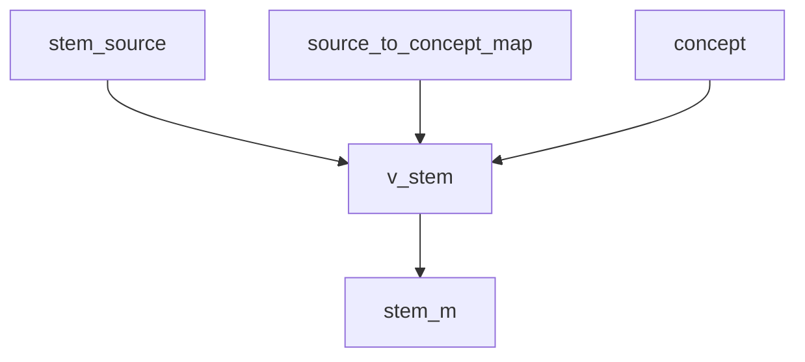

- 処理: `TRUNCATE stem_m` → `INSERT INTO stem_m SELECT * FROM v_stem` → `ANALYZE stem_m`
- 後続: ドメイン別ステージング処理 (`condition_occurrence_m` 等) は `stem_m` を入力に取ります

### 5. ドメイン別ステージング処理
マッピング付与された `stem_m` から各OMOP CDMドメインテーブルに変換します。

#### 5.1 Condition Occurrence（診断）
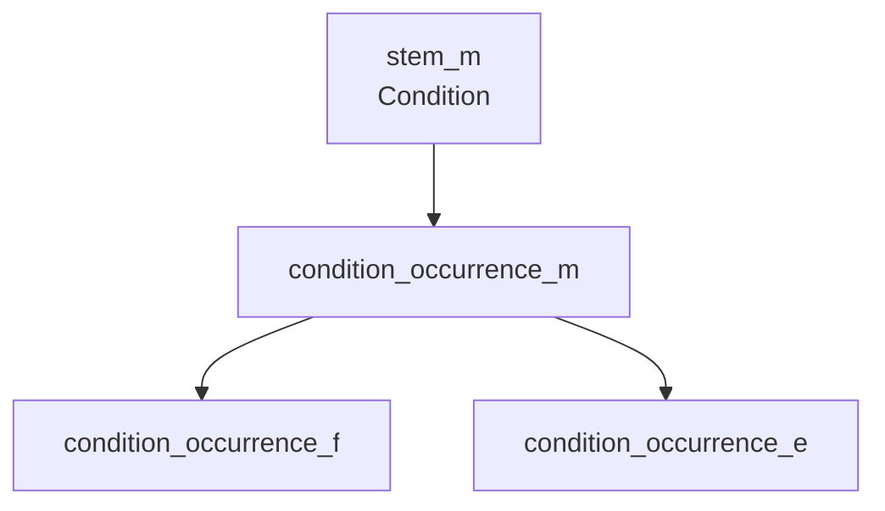

#### 5.2 Drug Exposure（薬剤投与）
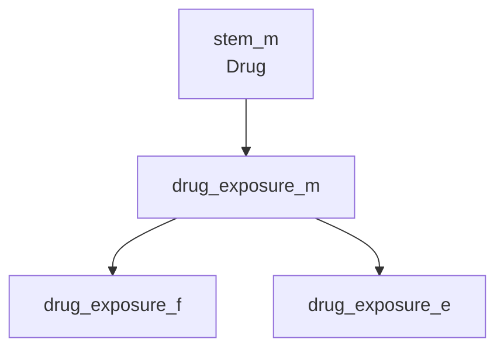

#### 5.3 Device Exposure（医療機器）
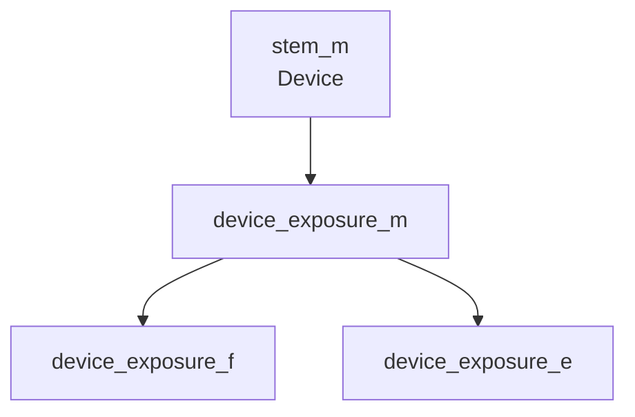

#### 5.4 Measurement（測定値）
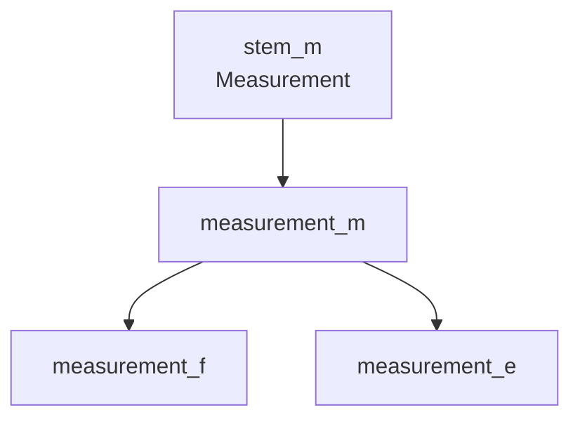

#### 5.5 Observation（観察）
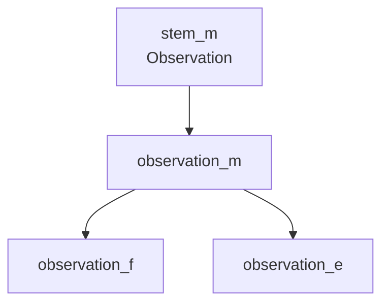

#### 5.6 Procedure Occurrence（処置）


#### 5.7 Specimen（検体）
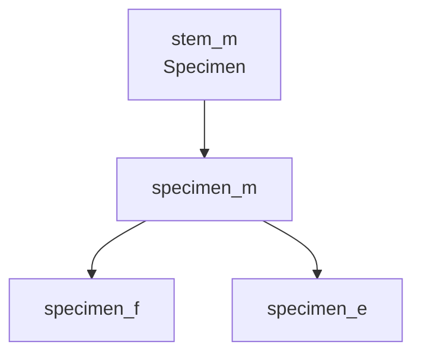

#### 5.8 Observation Period（観察期間）
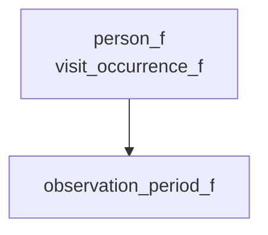

#### 5.9 Condition Era（診断期間）
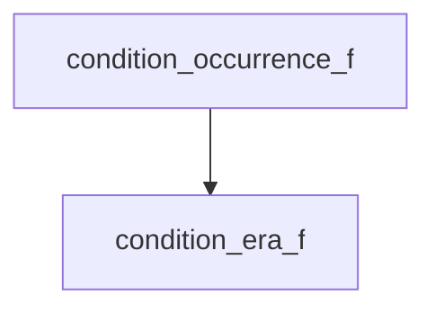

#### 5.10 Drug Era（薬剤投与期間）
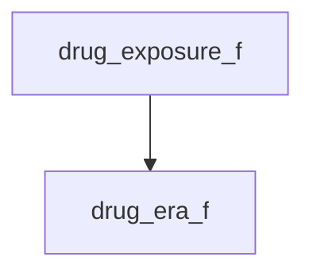

#### 5.11 Dose Era（用量期間）
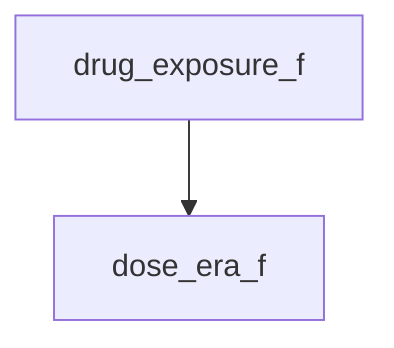

### 6. Production環境への移行

Workingスキーマから本番環境（Production）への最終データ移行を実行します。
この処理は2つのSQLファイルで構成されています：

#### 6.1 マスタデータの移行（06_production_deployment_master.sql）
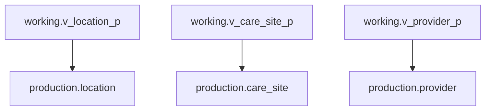

#### 6.2 患者データの移行（06_production_deployment_data.sql）
```mermaid
graph TD
    A[working.v_person_p] --> B[production.person]
    C[working.v_death_p] --> D[production.death]
    E[working.v_visit_occurrence_p] --> F[production.visit_occurrence]
    G[working.v_visit_detail_p] --> H[production.visit_detail]
    I[working.v_observation_period_p] --> J[production.observation_period]
    K[working.v_condition_occurrence_p] --> L[production.condition_occurrence]
    M[working.v_drug_exposure_p] --> N[production.drug_exposure]
    O[working.v_device_exposure_p] --> P[production.device_exposure]
    Q[working.v_measurement_p] --> R[production.measurement]
    S[working.v_observation_p] --> T[production.observation]
    U[working.v_procedure_occurrence_p] --> V[production.procedure_occurrence]
    W[working.v_specimen_p] --> X[production.specimen]
    Y[working.v_condition_era_p] --> Z[production.condition_era]
    AA[working.v_drug_era_p] --> AB[production.drug_era]
    AC[working.v_dose_era_p] --> AD[production.dose_era]
```

> ⚠️ **重要**: Production移行時は外部キー制約を一時的に無効化してデータを投入し、完了後に再有効化します。

## テーブル命名規則

### サフィックスの意味
- **`_s`**: Source - 生データから抽出された初期段階
- **`_m`**: Mapped - コード変換・マッピング済み
- **`_f`**: Finalized - 最終確定済み（品質チェック完了）
- **`_e`**: Error - エラーレコード（問題のあるデータ）
- **`_p`**: Production - 本番環境投入用

## 実行手順

### 前提条件
1. **Vocabulary データ**：OMOP Vocabulary（Athena）がロード済みであること
2. **Source-to-Concept Map**：必要なマッピングテーブルが準備済みであること
3. **ソースデータ**：変換対象の生データがsourceスキーマに格納済みであること

### 実行方法

#### ステップ1: ステージングデータの生成 (stem_source)
```bash
psql -U username -d database_name -f 5000_etl_execute/bat/01_etl_execution_to_stem.sql
```

#### ステップ2: 中間テーブルマッピング付与
```bash
psql -U username -d database_name -f 5000_etl_execute/bat/02_etl_execution_stem_mapped.sql
```

#### ステップ3: マッピングチェックリストの出力（任意）
```bash
psql -U username -d database_name -f 5000_etl_execute/bat/03_mapping_checklist.sql
```

#### ステップ4: 最終データの生成とEraテーブルの集計
```bash
psql -U username -d database_name -f 5000_etl_execute/bat/04_etl_execution_to_final.sql
```

#### ステップ5: 結果チェックリストの出力（任意）
```bash
psql -U username -d database_name -f 5000_etl_execute/bat/05_result_checklist.sql
```

#### ステップ6: Production環境への移行
```bash
psql -U username -d database_name -f 5000_etl_execute/bat/06_production_deployment_master.sql
psql -U username -d database_name -f 5000_etl_execute/bat/06_production_deployment_data.sql
```

> 💡 **ヒント**: バッチファイル（.bat）を使用すると、環境変数が自動的に設定されます：
> - `01_etl_execution_to_stem.bat`
> - `02_etl_execution_stem_mapped.bat`
> - `03_mapping_checklist.bat`
> - `04_etl_execution_to_final.bat`
> - `05_result_checklist.bat`
> - `06_production_deployment.bat`

> 💡 **マッピング洗練サイクル**
> マッピングテーブルを更新した後は、以下のサイクルで `stem_m` を再構築してチェックリストを再確認できます：
> 1. STCM CSV を更新して `4000_load_vocab/bat/03_import_stcm.bat` を実行
> 2. `02_etl_execution_stem_mapped.bat` を再実行 (`stem_source` の再構築は不要)
> 3. `03_mapping_checklist.bat` を再実行して洗練結果を確認

### 各段階での確認ポイント

#### 1. ステージング処理後の確認
```sql
-- エラーレコードの確認
SELECT * FROM working.person_e;
SELECT * FROM working.visit_occurrence_e;
SELECT * FROM working.condition_occurrence_e;
-- ... 他の_eテーブル
```

#### 2. マッピング状況の確認
```sql
-- 未マッピングレコードの確認
SELECT event_source_value, COUNT(*) 
FROM working.stem_source 
WHERE target_concept_id = 0 
GROUP BY event_source_value;

-- ドメイン別のレコード数確認
SELECT source_domain_id, COUNT(*) 
FROM working.stem_source 
GROUP BY source_domain_id;
```

#### 3. データ件数の確認
```sql
-- 各段階でのレコード数比較
SELECT 'person_s' as stage, COUNT(*) FROM working.person_s
UNION ALL
SELECT 'person_m' as stage, COUNT(*) FROM working.person_m
UNION ALL
SELECT 'person_f' as stage, COUNT(*) FROM working.person_f;
```

## エラーハンドリング

### よくあるエラーと対処法

1. **外部キー制約エラー**
   - 症状：Production環境への移行時にFK制約違反
   - 対処：`ALTER TABLE ... DISABLE TRIGGER ALL;` で制約を一時無効化

2. **マッピングエラー**
   - 症状：target_concept_id = 0 が多数発生
   - 対処：source_to_concept_mapの追加・更新が必要

3. **データ型エラー**
   - 症状：型変換エラー
   - 対処：ビュー定義での型キャスト処理を確認

## パフォーマンス最適化

### 推奨事項
1. **バッチ実行**：大量データの場合は段階的に実行
2. **インデックス**：処理前に一時的にインデックスを削除
3. **統計情報**：処理後に統計情報を更新

```sql
-- 統計情報の更新
ANALYZE working.person_f;
ANALYZE working.visit_occurrence_f;
ANALYZE working.condition_occurrence_f;
ANALYZE working.drug_exposure_f;
ANALYZE working.device_exposure;
ANALYZE working.measurement_f;
ANALYZE working.observation_period_f;
ANALYZE working.condition_era_f;
ANALYZE working.drug_era_f;
ANALYZE working.dose_era_f;
-- ... 他のテーブル
```

## モニタリング

### ログ確認
```sql
-- 処理時間の記録
\timing on

-- 進行状況の確認
SELECT schemaname, tablename, n_tup_ins, n_tup_upd 
FROM pg_stat_user_tables 
WHERE schemaname IN ('working', 'production');
```

## まとめ
このETLパイプラインは、生の医療データを段階的にOMOP CDM形式に変換し、品質管理とエラーハンドリングを含む包括的なデータ処理システムです。各段階でのデータ品質確認と、適切なエラー処理により、信頼性の高いデータ変換を実現しています。