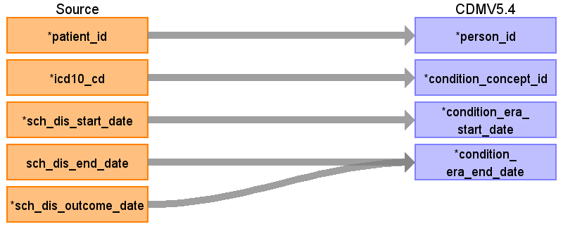

## Table name: condition_era

### Reading from patientdisease

ターゲットテーブル:condition_era
 ・当テーブルはOMOP&nbsp;CDMのcondition_occurrenceテーブルから作成される。
 
 ・ETL処理についてはGitHub&nbsp;OHDSI/CommonDataModel&nbsp;に含まれているスクリプトを引用・改変している。
 &nbsp;&nbsp;&nbsp;&nbsp;https://github.com/OHDSI/CommonDataModel/blob/main/rmd/sqlScripts.Rmd
 
 ・処理概要は以下の通り
 &nbsp;&nbsp;30日ルール:&nbsp;同一疾患の診断記録間隔が30日以内の場合、連続した一つのエラ（Era）として統合される。
 &nbsp;&nbsp;エラ期間:&nbsp;疾患の開始から終了（30日間隔が空く）までの期間とする。
 &nbsp;&nbsp;発生回数:&nbsp;一つのエラ内に含まれる診断記録の件数
 
 本項では、condition_occurrenceの元となる、PatientDisease&nbsp;と&nbsp;condition_era&nbsp;テーブルの各項目のとの出力結果の対応を記載する。
 

| Destination Field | Source field | Logic | Comment field |
| --- | --- | --- | --- |
| condition_era_id |  |  | 一意の連番を設定する |
| person_id | patient_id |  | person.person_source_valueと結合してperson_idを取得・登録する  |
| condition_concept_id | icd10_cd |  | condition_occurrenceを作成するときにマッピングしたOMOP標準コードが設定される  |
| condition_era_start_date | sch_dis_start_date |  | 患者、病名毎にcondition_start_dateのうち最初の日付     |
| condition_era_end_date | sch_dis_outcome_date sch_dis_end_date |  | 患者、病名毎に以下を集計   ・condition_end_date、condition_end_dateが存在しない場合condition_start_date+1日のうち、最後の日付  |
| condition_occurrence_count |  |  | 患者毎の対象期間の同一病名のcondition_occurrenceのレコード数（30日毎） |

