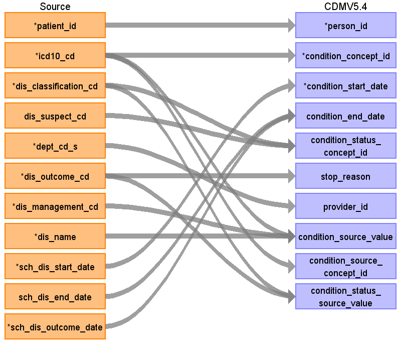

## Table name: condition_occurrence

### Reading from patientdisease

ターゲットテーブル:condition_occurrence
 ・当テーブルは&nbsp;PatientDisease、ObservationResult、PrescriptionData、InjectionDataなどから作成する
 ・各テーブルの&nbsp;病名、検査値、薬剤名などを&nbsp;ATHENA&nbsp;Vocabularyを介したstandard&nbsp;conceptへの変換後、standard&nbsp;conceptのdomainが&nbsp;"Condition"&nbsp;で定義されているデータが格納される。
 
 本項では、PatientDiseaseをもとに生成された、condition_occurrenceテーブルの各項目のとの出力結果の対応を記載する。
 ・concept変換元のソースコードはICD-10とし、ATHENA&nbsp;Vocabularyを介したstandard&nbsp;conceptへの変換を行う。

| Destination Field | Source field | Logic | Comment field |
| --- | --- | --- | --- |
| condition_occurrence_id |  |  | 一意の連番を設定する |
| person_id | patient_id |  | person.person_source_valueと結合してperson_idを取得・登録する  |
| condition_concept_id | icd10_cd | Source_to_concept_map:   VocabID:RINCHU_DIAGCD,&nbsp;ATHENA_ICD10   DomainID:Condition | ICD10コードをAthenaのconcept+concept_relationshipを介してStandard&nbsp;Vocabularyに変換する   ATHENAから生成したマッピングで対応できない病名コードは個別マッピングを行う   個別マッピングがあればそれを優先使用し、なければ自動マッピング生成テーブルを使用する  |
| condition_start_date | sch_dis_start_date |  | 病名開始日をそのまま登録する  |
| condition_start_datetime |  |  | （設定しない） |
| condition_end_date | sch_dis_outcome_date sch_dis_end_date | COALESCE(&nbsp;--&nbsp;OUTCOME_DATEを優先、なければEND_DATEを使用　ただし9999-12-31はNULLに変換する   &nbsp;&nbsp;NULLIF(sch_dis_outcome_date,&nbsp;'9999-12-31'::date),   &nbsp;&nbsp;NULLIF(sch_dis_end_date,&nbsp;'9999-12-31'::date)   )&nbsp;AS&nbsp;end_date  | OUTCOME_DATEを優先、なければEND_DATEを使用　ただし9999-12-31はNULLに変換する      |
| condition_end_datetime |  |  | （設定しない） |
| condition_type_concept_id |  |  | 32817（EHR）固定とする |
| condition_status_concept_id | dis_classification_cd dis_suspect_cd | Source_to_concept_map:   VocabID:RINCHU_DIS_STATUS   DomainID:Condition&nbsp;Status  | 主診断フラグおよび疑いフラグをもとにStandard&nbsp;Vocabularyに変換する   （疑いフラグ優先、次に主診断フラグ）   |
| stop_reason | dis_outcome_cd | CASE   &nbsp;&nbsp;--&nbsp;HL7表&nbsp;0241-患者の結果   &nbsp;&nbsp;WHEN&nbsp;dis_outcome_cd&nbsp;=&nbsp;'D'&nbsp;THEN&nbsp;dis_outcome_cd&nbsp;\|\|&nbsp;'\|死亡'&nbsp;   &nbsp;&nbsp;WHEN&nbsp;dis_outcome_cd&nbsp;=&nbsp;'R'&nbsp;THEN&nbsp;dis_outcome_cd&nbsp;\|\|&nbsp;'\|回復'&nbsp;   &nbsp;&nbsp;WHEN&nbsp;dis_outcome_cd&nbsp;=&nbsp;'N'&nbsp;THEN&nbsp;dis_outcome_cd&nbsp;\|\|&nbsp;'\|回復せず/変わらない'&nbsp;   &nbsp;&nbsp;WHEN&nbsp;dis_outcome_cd&nbsp;=&nbsp;'W'&nbsp;THEN&nbsp;dis_outcome_cd&nbsp;\|\|&nbsp;'\|悪化'&nbsp;   &nbsp;&nbsp;WHEN&nbsp;dis_outcome_cd&nbsp;=&nbsp;'S'&nbsp;THEN&nbsp;dis_outcome_cd&nbsp;\|\|&nbsp;'\|後遺症'&nbsp;   &nbsp;&nbsp;WHEN&nbsp;dis_outcome_cd&nbsp;=&nbsp;'F'&nbsp;THEN&nbsp;dis_outcome_cd&nbsp;\|\|&nbsp;'\|完全に回復した'&nbsp;   &nbsp;&nbsp;WHEN&nbsp;dis_outcome_cd&nbsp;=&nbsp;'U'&nbsp;THEN&nbsp;dis_outcome_cd&nbsp;\|\|&nbsp;'\|未知'&nbsp;   &nbsp;&nbsp;--&nbsp;JHSD表&nbsp;0006-転帰区分   &nbsp;&nbsp;WHEN&nbsp;dis_outcome_cd&nbsp;=&nbsp;'I'&nbsp;THEN&nbsp;dis_outcome_cd&nbsp;\|\|&nbsp;'\|中止'&nbsp;   &nbsp;&nbsp;WHEN&nbsp;dis_outcome_cd&nbsp;=&nbsp;'M'&nbsp;THEN&nbsp;dis_outcome_cd&nbsp;\|\|&nbsp;'\|寛解'&nbsp;   &nbsp;&nbsp;WHEN&nbsp;dis_outcome_cd&nbsp;=&nbsp;'C'&nbsp;THEN&nbsp;dis_outcome_cd&nbsp;\|\|&nbsp;'\|継続'&nbsp;   &nbsp;&nbsp;WHEN&nbsp;dis_outcome_cd&nbsp;=&nbsp;'O'&nbsp;THEN&nbsp;dis_outcome_cd&nbsp;\|\|&nbsp;'\|その他'&nbsp;   &nbsp;&nbsp;ELSE&nbsp;NULL   END&nbsp;AS&nbsp;stop_reason, | 転帰区分\|転帰名称の形式に編集して判読可能な値として登録する  |
| provider_id | dept_cd_s |  | 当該標準診療科コードを示すprovider_idを取得して登録する  |
| visit_occurrence_id |  |  | （設定しない） |
| visit_detail_id |  |  | （設定しない） |
| condition_source_value | dis_management_cd icd10_cd dis_name | COALESCE(icd10_cd,&nbsp;'')&nbsp;\|\|&nbsp;'\|'&nbsp;\|\|&nbsp;COALESCE(dis_management_cd,&nbsp;'')&nbsp;\|\|&nbsp;'\|'&nbsp;\|\|&nbsp;COALESCE(dis_name,&nbsp;'')  | ICD10コード\|病名管理番号\|病名表記の形式に編集して判読可能な値として登録する   |
| condition_source_concept_id | icd10_cd | Source_to_concept_map:   VocabID:RINCHU_DIAGCD,&nbsp;ATHENA_ICD10   DomainID:Condition | ICD10コードをAthenaのconceptを介してconcept_idに変換する  |
| condition_status_source_value | dis_outcome_cd dis_classification_cd | COALESCE(dis_classification_cd,&nbsp;'')&nbsp;\|\|&nbsp;'\|'&nbsp;\|\|&nbsp;COALESCE(dis_suspect_cd,&nbsp;'')&nbsp; | 主診断フラグ\|疑いフラグの形式に編集してどちらの値も判読可能な値として登録する  |

