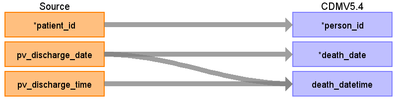

## Table name: death

### Reading from patientvisit

ターゲットテーブル:death
 ・当テーブルはPatientVisitテーブルから生成する
 
 本項では、PatientVisitをもとに生成された、deathテーブルの各項目のとの出力結果の対応を記載する。
 ・PatientVisitに退院実施レコードの退院先コードが「死亡」の場合、退院日を死亡日としてレコードを生成する
 

| Destination Field | Source field | Logic | Comment field |
| --- | --- | --- | --- |
| person_id | patient_id |  | person.person_source_valueと結合してperson_idを取得・登録する  |
| death_date | pv_discharge_date | TO_DATE(pv_discharge_date,&nbsp;'YYYYMMDD')&nbsp;AS&nbsp;death_date | PV_ADTSEGMENT='ADT^A03^ADT_A03’(退院実施)かつPV_DISCHARGE_CD_L='20'(死亡)のレコードのみ、PV_DISCHARGE_DATEを登録する     |
| death_datetime | pv_discharge_date pv_discharge_time |  CASE   &nbsp;&nbsp;WHEN&nbsp;pv_discharge_time&nbsp;=&nbsp;'999999'   &nbsp;&nbsp;&nbsp;&nbsp;OR&nbsp;pv_discharge_time&nbsp;IS&nbsp;NULL   &nbsp;&nbsp;&nbsp;&nbsp;OR&nbsp;pv_discharge_time&nbsp;~&nbsp;'^[0-9]{6}\$'&nbsp;=&nbsp;false&nbsp;   &nbsp;&nbsp;&nbsp;&nbsp;OR&nbsp;SUBSTRING(pv_discharge_time,&nbsp;1,&nbsp;2)::integer&nbsp;>=&nbsp;24&nbsp;   &nbsp;&nbsp;&nbsp;&nbsp;OR&nbsp;SUBSTRING(pv_discharge_time,&nbsp;3,&nbsp;2)::integer&nbsp;>=&nbsp;60&nbsp;   &nbsp;&nbsp;&nbsp;&nbsp;OR&nbsp;SUBSTRING(pv_discharge_time,&nbsp;5,&nbsp;2)::integer&nbsp;>=&nbsp;60&nbsp;   &nbsp;&nbsp;THEN&nbsp;TO_TIMESTAMP(pv_discharge_date&nbsp;\|\|&nbsp;'000000',&nbsp;'YYYYMMDDHH24MISS')   &nbsp;&nbsp;ELSE&nbsp;TO_TIMESTAMP(pv_discharge_date&nbsp;\|\|&nbsp;pv_discharge_time,&nbsp;'YYYYMMDDHH24MISS')   END&nbsp;AS&nbsp;death_datetime     | PV_ADTSEGMENT='ADT^A03^ADT_A03’(退院実施)かつPV_DISCHARGE_CD_L='20'(死亡)のレコードのみ、PV_DISCHARGE_DATE+PV_DISCHARGE_TIMEを登録する   |
| death_type_concept_id |  |  | 32817（EHR）固定とする |
| cause_concept_id |  |  | （設定しない） |
| cause_source_value |  |  | （設定しない） |
| cause_source_concept_id |  |  | （設定しない） |

