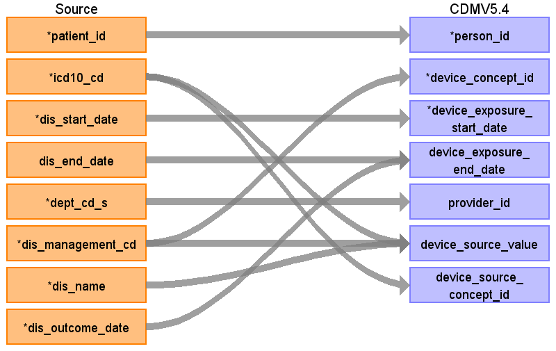

## Table name: device_exposure

### Reading from patientdisease

ターゲットテーブル:device_exposure
 ・当テーブルは&nbsp;PatientDisease、ObservationResult、PrescriptionData、InjectionData&nbsp;からデータが登録される。
 ・各テーブルの&nbsp;病名、検査値、薬剤名などを&nbsp;ATHENA&nbsp;Vocabularyを介したstandard&nbsp;conceptへの変換後、standard&nbsp;conceptのdomainが&nbsp;"Device"&nbsp;で定義されているデータが格納される。
 　例：「標準病名コード&nbsp;/&nbsp;20088828:義歯床下粘膜異常」&nbsp;→&nbsp;「OMOP&nbsp;コンセプト&nbsp;ID&nbsp;45767697&nbsp;/&nbsp;Physical&nbsp;therapy&nbsp;device」
 　（注：本データソース側には該当のデータを格納しているエンティティが存在しない。このため各施設で発生したすべての機器/材料/器具などデータが登録されるわけではない。)
 
 本項では、PatientDiseaseをもとに生成された、device_exposureテーブルの各項目のとの出力結果の対応を記載する。
 

| Destination Field | Source field | Logic | Comment field |
| --- | --- | --- | --- |
| device_exposure_id |  |  | 一意の連番を設定する |
| person_id | patient_id |  | person.person_source_valueと結合してperson_idを取得・登録する |
| device_concept_id | dis_management_cd |  |  |
| device_exposure_start_date | dis_start_date |  |  |
| device_exposure_start_datetime |  |  | （設定しない） |
| device_exposure_end_date | dis_end_date dis_outcome_date | COALESCE(&nbsp;--&nbsp;OUTCOME_DATEを優先、なければEND_DATEを使用　ただし9999-12-31はNULLに変換する   &nbsp;&nbsp;NULLIF(sch_dis_outcome_date,&nbsp;'9999-12-31'::date),   &nbsp;&nbsp;NULLIF(sch_dis_end_date,&nbsp;'9999-12-31'::date)   )&nbsp;AS&nbsp;end_date  | OUTCOME_DATEを優先、なければEND_DATEを使用　ただし9999-12-31はNULLに変換する   |
| device_exposure_end_datetime |  |  | （設定しない） |
| device_type_concept_id |  |  | 32817（EHR）固定とする |
| unique_device_id |  |  | （設定しない） |
| production_id |  |  | （設定しない） |
| quantity |  |  |  |
| provider_id | dept_cd_s |  | 当該標準診療科コードを示すprovider_idを取得して登録する  |
| visit_occurrence_id |  |  | （設定しない） |
| visit_detail_id |  |  | （設定しない） |
| device_source_value | icd10_cd dis_management_cd dis_name | COALESCE(icd10_cd,&nbsp;'')&nbsp;\|\|&nbsp;'\|'&nbsp;\|\|&nbsp;COALESCE(dis_management_cd,&nbsp;'')&nbsp;\|\|&nbsp;'\|'&nbsp;\|\|&nbsp;COALESCE(dis_name,&nbsp;'')   | ICD10コード\|病名管理番号\|病名表記の形式に編集して判読可能な値として登録する    |
| device_source_concept_id | icd10_cd | Source_to_concept_map:   VocabID:RINCHU_DIAGCD,&nbsp;ATHENA_ICD10   DomainID:Device    | ICD10コードをAthenaのconceptを介してconcept_idに変換する     |
| unit_concept_id |  |  | （設定しない） |
| unit_source_value |  |  | （設定しない） |
| unit_source_concept_id |  |  | （設定しない） |

