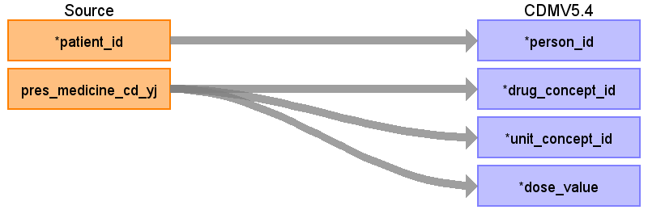
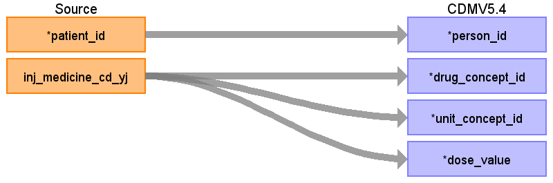

## Table name: dose_era

### Reading from prescriptiondata

ターゲットテーブル:drug_era
 ・当テーブルはOMOP&nbsp;CDMのdrug_exposureテーブルから作成される。
 ・ETL処理についてはGitHub&nbsp;OHDSI/CommonDataModel&nbsp;に含まれているスクリプトを引用改変している。
 &nbsp;&nbsp;&nbsp;&nbsp;https://github.com/OHDSI/CommonDataModel/blob/main/rmd/sqlScripts.Rmd
 
 ・処理概要は以下の通り
 &nbsp;&nbsp;30日ルール:&nbsp;同一薬剤・同一用量の投薬記録間隔が30日以内の場合、連続した一つのdose_eraとして統合される。
 &nbsp;&nbsp;&nbsp;&nbsp;30日以上空いた場合は「連続したdrug_eraにはならず、複数のdrug_eraレコード」として出力される。
 &nbsp;&nbsp;成分レベル統合:&nbsp;drug_concept_idを成分（Ingredient）レベルに統合される。
 &nbsp;&nbsp;用量別統合:&nbsp;同一成分でも用量が異なる場合は別々のdose_eraとして扱う。
 &nbsp;&nbsp;用量情報:&nbsp;drug_strengthベースの高精度計算が用いられている。
 
 本項では、drug_exposureの元となる、PrescriptionData&nbsp;と&nbsp;dose_eraテーブルの各項目のとの出力結果の対応を記載する。

| Destination Field | Source field | Logic | Comment field |
| --- | --- | --- | --- |
| dose_era_id |  |  | 一意の連番を設定する |
| person_id | patient_id |  |  |
| drug_concept_id | pres_medicine_cd_yj | route_concept_idに変換   Source_to_concept_map:   VocabID:RINCHU_DRUG   DomainID:Drug | YJコードをsource_to_concept_mapを介してRxNome他のStandard&nbsp;Vocabularyに変換する  |
| unit_concept_id | pres_medicine_cd_yj |  | 標準化された薬剤のコンセプトIDから、drug_strengthの以下のコンセプトIDを適宜設定する。   &nbsp;&nbsp;amount_unit_concept_id   &nbsp;&nbsp;numerator_unit_concept_id   &nbsp;&nbsp;denominator_unit_concept_id |
| dose_value | pres_medicine_cd_yj |  | 標準化された薬剤のコンセプトIDから、drug_strengthの以下のコンセプトIDを適宜設定する。   &nbsp;&nbsp;amount_value   &nbsp;&nbsp;numerator_value   &nbsp;&nbsp;denominator_value    |
| dose_era_start_date |  |  | drug_exposure_start_dateの（同一薬剤のと投与期間30日毎に）最初の日付 |
| dose_era_end_date |  |  | drug_exposure_end_dateの（同一薬剤のと投与期間30日毎に）最後の日付 |

### Reading from injectiondata

本項では、drug_exposureの元となる、InjectionData&nbsp;と&nbsp;dose_eraテーブルの各項目のとの出力結果の対応を記載する。

| Destination Field | Source field | Logic | Comment field |
| --- | --- | --- | --- |
| dose_era_id |  |  | 一意の連番を設定する |
| person_id | patient_id |  |  |
| drug_concept_id | inj_medicine_cd_yj | route_concept_idに変換   Source_to_concept_map:   VocabID:RINCHU_DRUG   DomainID:Drug | YJコードをsource_to_concept_mapを介してRxNome他のStandard&nbsp;Vocabularyに変換する  |
| unit_concept_id | inj_medicine_cd_yj |  | 標準化された薬剤のコンセプトIDから、drug_strengthの以下のコンセプトIDを適宜設定する。   &nbsp;&nbsp;amount_unit_concept_id   &nbsp;&nbsp;numerator_unit_concept_id   &nbsp;&nbsp;denominator_unit_concept_id |
| dose_value | inj_medicine_cd_yj |  | 標準化された薬剤のコンセプトIDから、drug_strengthの以下のコンセプトIDを適宜設定する。   &nbsp;&nbsp;amount_value   &nbsp;&nbsp;numerator_value   &nbsp;&nbsp;denominator_value    |
| dose_era_start_date |  |  | drug_exposure_start_dateの（同一薬剤のと投与期間30日毎に）最初の日付 |
| dose_era_end_date |  |  | drug_exposure_end_dateの（同一薬剤のと投与期間30日毎に）最後の日付 |

