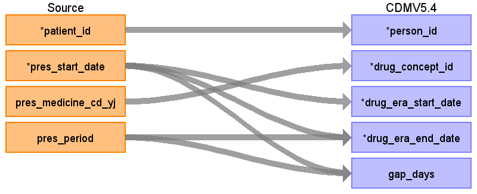
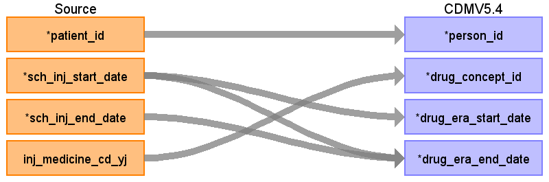

## Table name: drug_era

### Reading from prescriptiondata

ターゲットテーブル:drug_era
 ・当テーブルはOMOP&nbsp;CDMのdrug_exposureテーブルから作成される。
 
 ・ETL処理についてはGitHub&nbsp;OHDSI/CommonDataModel&nbsp;に含まれているスクリプトを引用・改変している。
 &nbsp;&nbsp;&nbsp;&nbsp;https://github.com/OHDSI/CommonDataModel/blob/main/rmd/sqlScripts.Rmd
 
 ・処理概要は以下の通り
 &nbsp;&nbsp;30日ルール:&nbsp;同一薬剤の投薬記録間隔が30日以内の場合、連続した一つのdrug_eraとして統合される。
 &nbsp;&nbsp;&nbsp;&nbsp;30日以上空いた場合は「連続したdrug_eraにはならず、複数のdrug_eraレコード」として出力される。
 &nbsp;&nbsp;成分レベル統合:&nbsp;drug_concept_idを成分（Ingredient）レベルに統合される。
 &nbsp;&nbsp;重複除去:&nbsp;重複する投薬期間を統合して正確な投薬日数を算出する。
 &nbsp;&nbsp;空白日数算出:&nbsp;drug_era期間内の実際の非投薬日数を計算する。
 
 
 本項では、drug_exposureの元となる、PrescriptionData&nbsp;と&nbsp;drug_eraテーブルの各項目のとの出力結果の対応を記載する。

| Destination Field | Source field | Logic | Comment field |
| --- | --- | --- | --- |
| drug_era_id |  |  | 一意の連番を設定する |
| person_id | patient_id |  | person.person_source_valueと結合してperson_idを取得・登録する  |
| drug_concept_id | pres_medicine_cd_yj |  | drug_exposeにRxNormで登録されたコンセプトから「Ingredient：成分」を設定 |
| drug_era_start_date | pres_start_date |  | drug_exposure_start_dateの（同一薬剤のと投与期間30日毎に）最初の日付 |
| drug_era_end_date | pres_start_date pres_period |  | drug_exposure_end_dateの（同一薬剤のと投与期間30日毎に）最後の日付 |
| drug_exposure_count |  |  | 患者毎の対象期間の同一薬剤のdrug_exposeのレコード数（30日毎） |
| gap_days | pres_start_date pres_period |  | drug_sub_exposure_start_dateとdrug_era_end_dateの日数（30日毎） |

### Reading from injectiondata

本項では、drug_exposureの元となる、InjectionData&nbsp;と&nbsp;drug_eraテーブルの各項目のとの出力結果の対応を記載する。

| Destination Field | Source field | Logic | Comment field |
| --- | --- | --- | --- |
| drug_era_id |  |  | 一意の連番を設定する |
| person_id | patient_id |  | person.person_source_valueと結合してperson_idを取得・登録する  |
| drug_concept_id | inj_medicine_cd_yj |  | drug_exposeにRxNormで登録されたコンセプトから「Ingredient：成分」を設定 |
| drug_era_start_date | sch_inj_start_date |  | drug_exposure_start_dateの（同一薬剤のと投与期間30日毎に）最初の日付 |
| drug_era_end_date | sch_inj_start_date sch_inj_end_date |  | drug_exposure_end_dateの（同一薬剤のと投与期間30日毎に）最後の日付 |
| drug_exposure_count |  |  | 患者毎の対象期間の同一薬剤のdrug_exposeのレコード数（30日毎） |
| gap_days |  |  | drug_sub_exposure_start_dateとdrug_era_end_dateの日数（30日毎） |

