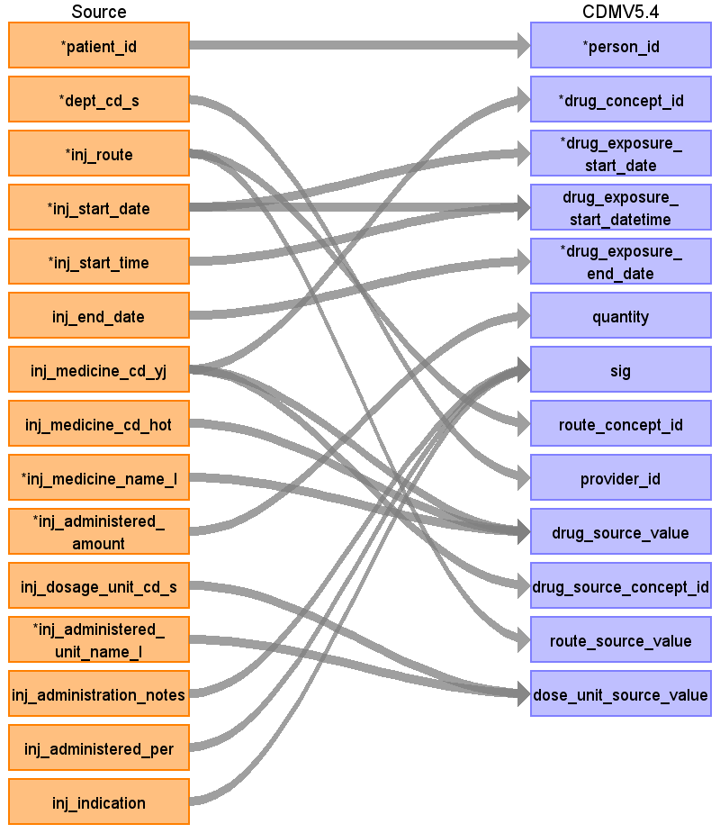
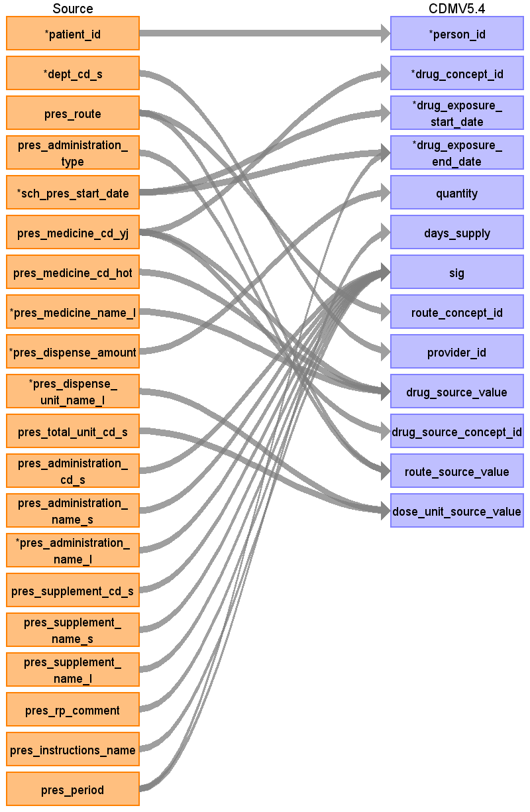

## Table name: drug_exposure

### Reading from injectiondata

ターゲットテーブル:drug_exposure
 ・当テーブルは主にPrescriptionDataとInjectionDataから作成する
 
 本項では、InjectionDataをもとに生成された、drug_exposureテーブルの各項目のとの出力結果の対応を記載する。
 ・concept変換元のソースコードはYJコードとし、臨中ネット様が作成予定のマッピングテーブルを介したstandard&nbsp;conceptへの変換を行う。

| Destination Field | Source field | Logic | Comment field |
| --- | --- | --- | --- |
| drug_exposure_id |  |  | 一意の連番を設定する |
| person_id | patient_id |  | person.person_source_valueと結合してperson_idを取得・登録する  |
| drug_concept_id | inj_medicine_cd_yj | route_concept_idに変換   Source_to_concept_map:   VocabID:RINCHU_DRUG   DomainID:Drug | YJコードをsource_to_concept_mapを介してRxNome他のStandard&nbsp;Vocabularyに変換する  |
| drug_exposure_start_date | inj_start_date |  |  |
| drug_exposure_start_datetime | inj_start_date inj_start_time | CASE   &nbsp;&nbsp;WHEN&nbsp;inj_start_time&nbsp;=&nbsp;'999999'&nbsp;   &nbsp;&nbsp;&nbsp;&nbsp;OR&nbsp;inj_start_time&nbsp;IS&nbsp;NULL   &nbsp;&nbsp;&nbsp;&nbsp;OR&nbsp;inj_start_time&nbsp;~&nbsp;'^[0-9]{6}\$'&nbsp;=&nbsp;false   &nbsp;&nbsp;&nbsp;&nbsp;OR&nbsp;SUBSTRING(inj_start_time,&nbsp;1,&nbsp;2)::integer&nbsp;>=&nbsp;24   &nbsp;&nbsp;&nbsp;&nbsp;OR&nbsp;SUBSTRING(inj_start_time,&nbsp;3,&nbsp;2)::integer&nbsp;>=&nbsp;60&nbsp;   &nbsp;&nbsp;&nbsp;&nbsp;OR&nbsp;SUBSTRING(inj_start_time,&nbsp;5,&nbsp;2)::integer&nbsp;>=&nbsp;60&nbsp;   &nbsp;&nbsp;THEN&nbsp;TO_TIMESTAMP(inj_start_time&nbsp;\|\|&nbsp;'000000','YYYYMMDDHH24MISS')::timestamp   &nbsp;&nbsp;ELSE&nbsp;TO_TIMESTAMP(inj_start_date&nbsp;\|\|&nbsp;inj_start_time,'YYYYMMDDHH24MISS')::timestamp   END&nbsp;AS&nbsp;start_datetime  | 投薬開始日＋投薬開始時刻を登録する  （prescriptiondataが元テーブルの場合、設定しない） |
| drug_exposure_end_date | inj_end_date | COALESCE(NULLIF(sch_inj_end_date,&nbsp;'9999-12-31'::date),&nbsp;sch_inj_start_date)&nbsp;AS&nbsp;end_date | 投薬終了日のデータがある場合投薬終了日、なければ投薬開始日を設定  |
| drug_exposure_end_datetime |  |  | （設定しない） |
| verbatim_end_date |  |  | （設定しない） |
| drug_type_concept_id |  |  | 32817（EHR）固定とする |
| stop_reason |  |  | （設定しない） |
| refills |  |  | （設定しない） |
| quantity | inj_administered_amount |  | 投薬量をそのままセットする  |
| days_supply |  |  | （設定しない） |
| sig | inj_administration_notes inj_administered_per inj_indication | &nbsp;CASE   &nbsp;&nbsp;WHEN&nbsp;inj_administration_notes&nbsp;IS&nbsp;NULL&nbsp;   &nbsp;&nbsp;&nbsp;&nbsp;AND&nbsp;inj_administered_per&nbsp;IS&nbsp;NULL&nbsp;   &nbsp;&nbsp;&nbsp;&nbsp;AND&nbsp;inj_indication&nbsp;IS&nbsp;NULL&nbsp;   &nbsp;&nbsp;THEN&nbsp;NULL   &nbsp;&nbsp;&nbsp;&nbsp;ELSE&nbsp;COALESCE(inj_administration_notes,&nbsp;'')&nbsp;\|\|&nbsp;'\|'&nbsp;\|\|&nbsp;COALESCE(inj_administered_per,&nbsp;'')&nbsp;\|\|&nbsp;'\|'&nbsp;\|\|&nbsp;COALESCE(inj_indication,&nbsp;'')   END&nbsp;AS&nbsp;sig   | 以下の項目を連結してセットする   ・投薬注記   ・時間当たりの投薬   ・指示    |
| route_concept_id | inj_route | "Source_to_concept_map:   VocabID:RINCHU_DRUG_ROUTE   DomainID:Route" | 投薬経路をsource_to_concept_mapを介してStandard&nbsp;Vocabularyに変換する  |
| lot_number |  |  | （設定しない） |
| provider_id | dept_cd_s |  | 当該標準診療科コードを示すprovider_idを取得して登録する  |
| visit_occurrence_id |  |  | （設定しない） |
| visit_detail_id |  |  | （設定しない） |
| drug_source_value | inj_medicine_cd_yj inj_medicine_cd_hot inj_medicine_name_l | COALESCE(inj_medicine_cd_yj,&nbsp;'')&nbsp;\|\|&nbsp;'\|'&nbsp;\|\|&nbsp;COALESCE(inj_medicine_cd_hot,&nbsp;'')&nbsp;\|\|&nbsp;'\|'&nbsp;\|\|&nbsp;COALESCE(inj_medicine_name_l,&nbsp;'')&nbsp;AS&nbsp;source_regvalue   | YJコード\|HOTコード\|薬剤名称の形式に編集して判読可能な値として登録する    |
| drug_source_concept_id | inj_medicine_cd_yj | route_concept_idに変換   Source_to_concept_map:   VocabID:RINCHU_DRUG   DomainID:Drug | source_to_concept_mapからYJコードのconcept_idを取得しセットする  |
| route_source_value | inj_route |  | 投与経路をそのままセットする  |
| dose_unit_source_value | inj_dosage_unit_cd_s inj_administered_unit_name_l | COALESCE(inj_dosage_unit_cd_s,&nbsp;'')&nbsp;\|\|&nbsp;'\|'&nbsp;\|\|&nbsp;COALESCE(inj_administered_unit_name_l,&nbsp;'')&nbsp;AS&nbsp;unit_source_regvalue  | 与薬単位標準コードと与薬単位名称を連結してセットする   |

### Reading from prescriptiondata

本項では、PrescriptionDataをもとに生成された、drug_exposureテーブルの各項目のとの出力結果の対応を記載する。
 ・concept変換元のソースコードはYJコードとし、臨中ネット様が作成予定のマッピングテーブルを介したstandard&nbsp;conceptへの変換を行う。
 ・処方データに基づくquantity,&nbsp;unitには「与薬量」「調剤量」「1&nbsp;日あたりの総投与量」から「調剤量」にかかる項目を登録する
 
 

| Destination Field | Source field | Logic | Comment field |
| --- | --- | --- | --- |
| drug_exposure_id |  |  | 一意の連番を設定する |
| person_id | patient_id |  | person.person_source_valueと結合してperson_idを取得・登録する  |
| drug_concept_id | pres_medicine_cd_yj | route_concept_idに変換   Source_to_concept_map:   VocabID:RINCHU_DRUG   DomainID:Drug | YJコードをsource_to_concept_mapを介してRxNome他のStandard&nbsp;Vocabularyに変換する  |
| drug_exposure_start_date | sch_pres_start_date |  | 投薬開始日をそのまま登録する  |
| drug_exposure_start_datetime |  |  | （prescriptiondataが元テーブルの場合、設定しない） |
| drug_exposure_end_date | pres_period sch_pres_start_date | CASE&nbsp;   &nbsp;&nbsp;WHEN&nbsp;pres_period&nbsp;IS&nbsp;NOT&nbsp;NULL&nbsp;AND&nbsp;pres_period&nbsp;>&nbsp;0&nbsp;THEN&nbsp;sch_pres_start_date&nbsp;+&nbsp;(pres_period&nbsp;-&nbsp;1)&nbsp;*&nbsp;INTERVAL&nbsp;'1&nbsp;day'   &nbsp;&nbsp;ELSE&nbsp;sch_pres_start_date&nbsp;   END&nbsp;AS&nbsp;end_date | 投薬終了日が有効な日付の場合はそのまま登録する。有効な日付でない場合は投薬開始日に投与日数を加算して投薬終了日を導出する  |
| drug_exposure_end_datetime |  |  | （設定しない） |
| verbatim_end_date |  |  | （設定しない） |
| drug_type_concept_id |  |  | 32817（EHR）固定とする |
| stop_reason |  |  | （設定しない） |
| refills |  |  | （設定しない） |
| quantity | pres_dispense_amount |  | 調剤量をそのままセットする  |
| days_supply | pres_period |  | （設定しない） |
| sig | pres_administration_cd_s pres_administration_name_s pres_administration_name_l pres_supplement_cd_s pres_supplement_name_s pres_supplement_name_l pres_rp_comment pres_instructions_name | COALESCE(pres_administration_cd_s,'')&nbsp;\|\|&nbsp;'\|'&nbsp;\|\|&nbsp;   COALESCE(pres_administration_name_s,&nbsp;'')&nbsp;\|\|&nbsp;'\|'&nbsp;\|\|   COALESCE(pres_administration_name_l,&nbsp;'')&nbsp;\|\|   COALESCE(pres_supplement_cd_s,&nbsp;'')&nbsp;\|\|&nbsp;'\|'&nbsp;\|\|   COALESCE(pres_supplement_name_s,&nbsp;'')&nbsp;\|\|&nbsp;'\|'&nbsp;\|\|   COALESCE(pres_supplement_name_l,&nbsp;'')&nbsp;\|\|&nbsp;'\|'&nbsp;\|\|   COALESCE(pres_rp_comment,&nbsp;'')&nbsp;\|\|&nbsp;'\|'&nbsp;\|\|   COALESCE(pres_instructions_name,&nbsp;'')&nbsp;AS&nbsp;sig        | 以下のカラムを連結する   ・標準用法コード   ・標準用法テキスト   ・用法テキスト   ・標準補足用法コード   ・標準補足用法名称   ・補足用法名称   ・用法コメント   ・依頼者の投薬指示コード   ・依頼者の投薬指示内容         |
| route_concept_id | pres_route | Source_to_concept_map:   VocabID:RINCHU_DRUG_ROUTE   DomainID:Route | 投薬経路をsource_to_concept_mapを介してStandard&nbsp;Vocabularyに変換する  |
| lot_number |  |  | （設定しない） |
| provider_id | dept_cd_s |  | 当該標準診療科コードを示すprovider_idを取得して登録する  |
| visit_occurrence_id |  |  | （設定しない） |
| visit_detail_id |  |  | （設定しない） |
| drug_source_value | pres_medicine_cd_hot pres_medicine_name_l pres_medicine_cd_yj | COALESCE(pres_medicine_cd_yj,&nbsp;'')&nbsp;\|\|&nbsp;'\|'&nbsp;\|\|&nbsp;COALESCE(pres_medicine_cd_hot,&nbsp;'')&nbsp;\|\|&nbsp;'\|'&nbsp;\|\|&nbsp;COALESCE(pres_medicine_name_l,&nbsp;'') | HOTコード\|薬剤名称の形式に編集して判読可能な値として登録する  |
| drug_source_concept_id | pres_medicine_cd_yj |  | source_to_concept_mapからYJコードのsource_concept_idを取得しセットする  |
| route_source_value | pres_route pres_administration_type | &nbsp;COALESCE(pres_route,&nbsp;'')&nbsp;\|\|&nbsp;'\|'&nbsp;\|\|&nbsp;COALESCE(pres_administration_type,&nbsp;'')&nbsp;AS&nbsp;route_source_regvalue  | 投与経路\|用法種別の形式に編集して判読可能な値として登録する   |
| dose_unit_source_value | pres_dispense_unit_name_l pres_total_unit_cd_s | COALESCE(pres_dispense_unit_cd_s,&nbsp;'')&nbsp;\|\|&nbsp;'\|'&nbsp;\|\|&nbsp;COALESCE(pres_dispense_unit_name_l,&nbsp;'')&nbsp;AS&nbsp;unit_source_regvalue  | 調剤料単位標準コードと調剤量単位名称を連結して登録する   |

