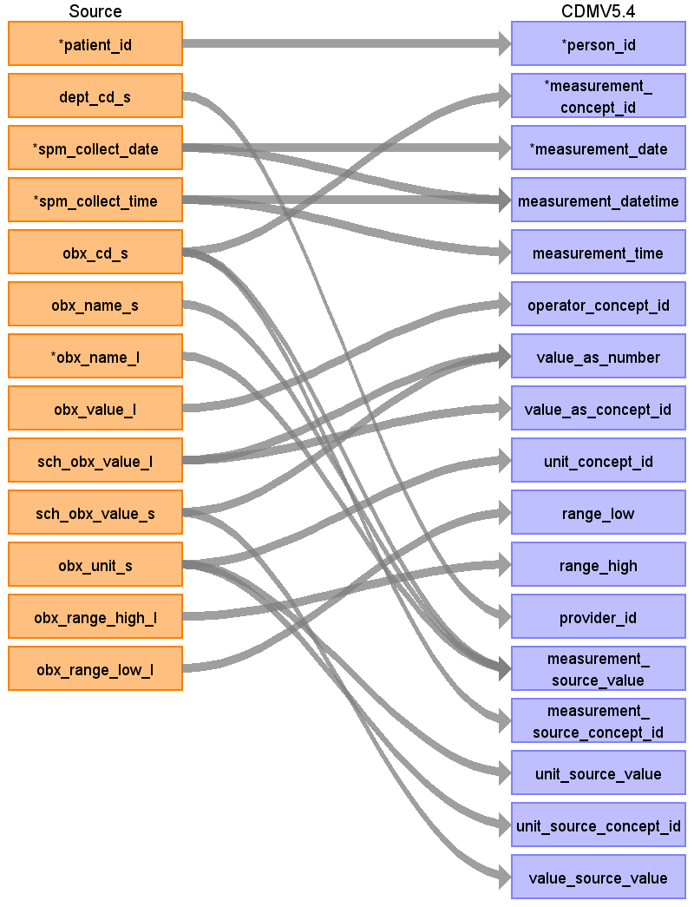
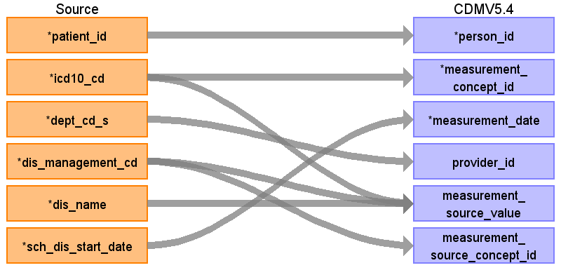

## Table name: measurement

### Reading from observationresult

ターゲットテーブル:measurement
 ・当テーブルは&nbsp;PatientDisease、ObservationResult、PrescriptionData、InjectionData&nbsp;からデータが登録される。
 ・各テーブルの&nbsp;病名、検査値、薬剤名などを&nbsp;ATHENA&nbsp;Vocabularyを介したstandard&nbsp;conceptへの変換後、standard&nbsp;conceptのdomainが&nbsp;"Measurement"&nbsp;で定義されているデータが格納される。
 
 本項では、ObservationResultをもとに生成された、device_exposureテーブルの各項目のとの出力結果の対応を記載する。
 ・concept変換元のソースコードは標準検査項目コードとし、臨中ネット様が作成予定のマッピングテーブルを介したstandard&nbsp;conceptへの変換を行う。
 

| Destination Field | Source field | Logic | Comment field |
| --- | --- | --- | --- |
| measurement_id |  |  | 一意の連番を設定する |
| person_id | patient_id |  | person.person_source_valueと結合してperson_idを取得・登録する  |
| measurement_concept_id | obx_cd_s | measurement_concept_idに変換   Source_to_concept_map:   VocabID:RINCHU_OBX_CD   DomainID:Measurement | 標準検査コード(JLAC11)をsource_to_concept_mapを介してSNOMED,LOINC他のStandard&nbsp;Vocabularyに変換する  |
| measurement_date | spm_collect_date |  | 検体採取日をそのまま登録する  |
| measurement_datetime | spm_collect_date spm_collect_time | CASE   &nbsp;&nbsp;WHEN&nbsp;spm_collect_time&nbsp;=&nbsp;'999999'&nbsp;   &nbsp;&nbsp;&nbsp;&nbsp;OR&nbsp;spm_collect_time&nbsp;IS&nbsp;NULL&nbsp;   &nbsp;&nbsp;&nbsp;&nbsp;OR&nbsp;spm_collect_time&nbsp;~&nbsp;'^[0-9]{6}\$'&nbsp;=&nbsp;false&nbsp;   &nbsp;&nbsp;&nbsp;&nbsp;OR&nbsp;SUBSTRING(spm_collect_time,&nbsp;1,&nbsp;2)::integer&nbsp;>=&nbsp;24&nbsp;   &nbsp;&nbsp;&nbsp;&nbsp;OR&nbsp;SUBSTRING(spm_collect_time,&nbsp;3,&nbsp;2)::integer&nbsp;>=&nbsp;60&nbsp;   &nbsp;&nbsp;&nbsp;&nbsp;OR&nbsp;SUBSTRING(spm_collect_time,&nbsp;5,&nbsp;2)::integer&nbsp;>=&nbsp;60&nbsp;   &nbsp;&nbsp;THEN&nbsp;TO_TIMESTAMP(spm_collect_date&nbsp;\|\|&nbsp;'000000','YYYYMMDDHH24MISS')   &nbsp;&nbsp;ELSE&nbsp;TO_TIMESTAMP(spm_collect_date&nbsp;\|\|&nbsp;spm_collect_time,'YYYYMMDDHH24MISS')   END&nbsp;AS&nbsp;start_datetime  | 検体採取日＋検体採取時刻を登録する  （patientdisease&nbsp;が元テーブルの場合、設定しない） |
| measurement_time | spm_collect_time | CASE   &nbsp;&nbsp;WHEN&nbsp;spm_collect_time&nbsp;=&nbsp;'999999'&nbsp;   &nbsp;&nbsp;&nbsp;&nbsp;OR&nbsp;spm_collect_time&nbsp;IS&nbsp;NULL&nbsp;   &nbsp;&nbsp;&nbsp;&nbsp;OR&nbsp;spm_collect_time&nbsp;~&nbsp;'^[0-9]{6}\$'&nbsp;=&nbsp;false&nbsp;   &nbsp;&nbsp;&nbsp;&nbsp;OR&nbsp;SUBSTRING(spm_collect_time,&nbsp;1,&nbsp;2)::integer&nbsp;>=&nbsp;24&nbsp;   &nbsp;&nbsp;&nbsp;&nbsp;OR&nbsp;SUBSTRING(spm_collect_time,&nbsp;3,&nbsp;2)::integer&nbsp;>=&nbsp;60&nbsp;   &nbsp;&nbsp;&nbsp;&nbsp;OR&nbsp;SUBSTRING(spm_collect_time,&nbsp;5,&nbsp;2)::integer&nbsp;>=&nbsp;60&nbsp;   &nbsp;&nbsp;THEN&nbsp;'00:00:00'::time   &nbsp;&nbsp;ELSE&nbsp;TO_TIMESTAMP(spm_collect_time,'HH24MISS')::time   END&nbsp;AS&nbsp;start_time | 検体採取時刻をそのまま登録する （patientdisease&nbsp;が元テーブルの場合、設定しない） |
| measurement_type_concept_id |  |  | 32817（EHR）固定とする |
| operator_concept_id | obx_value_l | "Source_to_concept_map:   VocabID:RINCHU_OBX_OPERATOR   DomainID:Meas&nbsp;Value&nbsp;Operator"      検査結果値に含まれる当符号の抽出ロジックは以下      CASE&nbsp;   &nbsp;&nbsp;--&nbsp;定性マーカーを抽出   &nbsp;&nbsp;WHEN&nbsp;obx_value_l&nbsp;~&nbsp;'\([+\-±]+\)'&nbsp;THEN&nbsp;   &nbsp;&nbsp;&nbsp;&nbsp;(regexp_match(obx_value_l,&nbsp;'(\([+\-±]+\))'))[1]      &nbsp;&nbsp;--&nbsp;純粋な数値の場合はNULL   &nbsp;&nbsp;WHEN&nbsp;obx_value_l&nbsp;~&nbsp;'^[+-]?[0-9]*\.?[0-9]+([eE][+-]?[0-9]+)?\$'&nbsp;THEN&nbsp;   &nbsp;&nbsp;&nbsp;&nbsp;NULL      &nbsp;&nbsp;--&nbsp;演算子+数値のみの場合はNULL（例:&nbsp;<40,&nbsp;>=5.0,&nbsp;<=25）   &nbsp;&nbsp;WHEN&nbsp;obx_value_l&nbsp;~&nbsp;'^(<\|>\|<=\|>=\|≤\|≥\|≧\|＜\|＞)\s*[0-9]+\.?[0-9]*\$'&nbsp;THEN&nbsp;   &nbsp;&nbsp;&nbsp;&nbsp;NULL      &nbsp;&nbsp;ELSE&nbsp;   &nbsp;&nbsp;&nbsp;&nbsp;--&nbsp;その他の非数値データ：演算子記号（記号・日本語）を除去した値を返す   &nbsp;&nbsp;&nbsp;&nbsp;--&nbsp;ただし、除去後に純粋な数値になる場合はNULLを返す（例:&nbsp;600.0<,&nbsp;180.0以上）   &nbsp;&nbsp;&nbsp;&nbsp;CASE   &nbsp;&nbsp;&nbsp;&nbsp;&nbsp;&nbsp;WHEN&nbsp;TRIM(   &nbsp;&nbsp;&nbsp;&nbsp;&nbsp;&nbsp;&nbsp;&nbsp;regexp_replace(   &nbsp;&nbsp;&nbsp;&nbsp;&nbsp;&nbsp;&nbsp;&nbsp;&nbsp;&nbsp;obx_value_l,&nbsp;   &nbsp;&nbsp;&nbsp;&nbsp;&nbsp;&nbsp;&nbsp;&nbsp;&nbsp;&nbsp;'(<\|>\|<=\|>=\|≤\|≥\|≧\|＜\|＞\|以上\|以下\|未満\|ｲｼﾞｮｳ\|ｲｶ\|ﾐﾏﾝ)',&nbsp;   &nbsp;&nbsp;&nbsp;&nbsp;&nbsp;&nbsp;&nbsp;&nbsp;&nbsp;&nbsp;'',&nbsp;   &nbsp;&nbsp;&nbsp;&nbsp;&nbsp;&nbsp;&nbsp;&nbsp;&nbsp;&nbsp;'g'   &nbsp;&nbsp;&nbsp;&nbsp;&nbsp;&nbsp;&nbsp;&nbsp;)   &nbsp;&nbsp;&nbsp;&nbsp;&nbsp;&nbsp;)&nbsp;~&nbsp;'^[+-]?[0-9]*\.?[0-9]+([eE][+-]?[0-9]+)?\$'&nbsp;THEN   &nbsp;&nbsp;&nbsp;&nbsp;&nbsp;&nbsp;&nbsp;&nbsp;NULL   &nbsp;&nbsp;&nbsp;&nbsp;&nbsp;&nbsp;ELSE   &nbsp;&nbsp;&nbsp;&nbsp;&nbsp;&nbsp;&nbsp;&nbsp;regexp_replace(   &nbsp;&nbsp;&nbsp;&nbsp;&nbsp;&nbsp;&nbsp;&nbsp;&nbsp;&nbsp;obx_value_l,&nbsp;   &nbsp;&nbsp;&nbsp;&nbsp;&nbsp;&nbsp;&nbsp;&nbsp;&nbsp;&nbsp;'(<\|>\|<=\|>=\|≤\|≥\|≧\|＜\|＞\|以上\|以下\|未満\|ｲｼﾞｮｳ\|ｲｶ\|ﾐﾏﾝ)',&nbsp;   &nbsp;&nbsp;&nbsp;&nbsp;&nbsp;&nbsp;&nbsp;&nbsp;&nbsp;&nbsp;'',&nbsp;   &nbsp;&nbsp;&nbsp;&nbsp;&nbsp;&nbsp;&nbsp;&nbsp;&nbsp;&nbsp;'g'   &nbsp;&nbsp;&nbsp;&nbsp;&nbsp;&nbsp;&nbsp;&nbsp;)   &nbsp;&nbsp;&nbsp;&nbsp;END   END&nbsp;AS&nbsp;value_source_value    | 検査結果値に含まれる当符号を抽出し、source_to_concept_mapを介してStandard&nbsp;Vocabularyに変換する （patientdisease&nbsp;が元テーブルの場合、設定しない） |
| value_as_number | sch_obx_value_s sch_obx_value_l | CASE   &nbsp;&nbsp;WHEN&nbsp;sch_obx_value_s&nbsp;IS&nbsp;NOT&nbsp;NULL&nbsp;THEN&nbsp;sch_obx_value_s      &nbsp;&nbsp;--&nbsp;sch_obx_value_sがNULLの場合、obx_value_lから等符号を除去した数値を抽出して登録   &nbsp;&nbsp;WHEN&nbsp;obx_value_l&nbsp;IS&nbsp;NOT&nbsp;NULL&nbsp;THEN   &nbsp;&nbsp;&nbsp;&nbsp;CASE   &nbsp;&nbsp;&nbsp;&nbsp;&nbsp;&nbsp;--&nbsp;不等号（記号・日本語）を除去して数値を抽出   &nbsp;&nbsp;&nbsp;&nbsp;&nbsp;&nbsp;WHEN&nbsp;TRIM(   &nbsp;&nbsp;&nbsp;&nbsp;&nbsp;&nbsp;&nbsp;&nbsp;regexp_replace(   &nbsp;&nbsp;&nbsp;&nbsp;&nbsp;&nbsp;&nbsp;&nbsp;&nbsp;&nbsp;obx_value_l,   &nbsp;&nbsp;&nbsp;&nbsp;&nbsp;&nbsp;&nbsp;&nbsp;&nbsp;&nbsp;'(<\|>\|<=\|>=\|≤\|≥\|≧\|＜\|＞\|以上\|以下\|未満\|ｲｼﾞｮｳ\|ｲｶ\|ﾐﾏﾝ)',   &nbsp;&nbsp;&nbsp;&nbsp;&nbsp;&nbsp;&nbsp;&nbsp;&nbsp;&nbsp;'',   &nbsp;&nbsp;&nbsp;&nbsp;&nbsp;&nbsp;&nbsp;&nbsp;&nbsp;&nbsp;'g'   &nbsp;&nbsp;&nbsp;&nbsp;&nbsp;&nbsp;&nbsp;&nbsp;)   &nbsp;&nbsp;&nbsp;&nbsp;&nbsp;&nbsp;)&nbsp;~&nbsp;'^[+-]?[0-9]*\.?[0-9]+([eE][+-]?[0-9]+)?\$'   &nbsp;&nbsp;&nbsp;&nbsp;&nbsp;&nbsp;THEN&nbsp;TRIM(   &nbsp;&nbsp;&nbsp;&nbsp;&nbsp;&nbsp;&nbsp;&nbsp;regexp_replace(   &nbsp;&nbsp;&nbsp;&nbsp;&nbsp;&nbsp;&nbsp;&nbsp;&nbsp;&nbsp;obx_value_l,   &nbsp;&nbsp;&nbsp;&nbsp;&nbsp;&nbsp;&nbsp;&nbsp;&nbsp;&nbsp;'(<\|>\|<=\|>=\|≤\|≥\|≧\|＜\|＞\|以上\|以下\|未満\|ｲｼﾞｮｳ\|ｲｶ\|ﾐﾏﾝ)',   &nbsp;&nbsp;&nbsp;&nbsp;&nbsp;&nbsp;&nbsp;&nbsp;&nbsp;&nbsp;'',   &nbsp;&nbsp;&nbsp;&nbsp;&nbsp;&nbsp;&nbsp;&nbsp;&nbsp;&nbsp;'g'   &nbsp;&nbsp;&nbsp;&nbsp;&nbsp;&nbsp;&nbsp;&nbsp;)   &nbsp;&nbsp;&nbsp;&nbsp;&nbsp;&nbsp;)::numeric   &nbsp;&nbsp;&nbsp;&nbsp;&nbsp;&nbsp;ELSE&nbsp;NULL   &nbsp;&nbsp;&nbsp;&nbsp;END      &nbsp;&nbsp;ELSE&nbsp;NULL   END&nbsp;AS&nbsp;value_as_number     | 標準単位換算値（数値型）をそのまま登録する  （patientdisease&nbsp;が元テーブルの場合、設定しない） |
| value_as_concept_id | sch_obx_value_l | Source_to_concept_map:   VocabID:RINCHU_OBX_VALUE   DomainID:Meas&nbsp;Value | 検査結果値をsource_to_concept_mapを介してStandard&nbsp;Vocabularyに変換する （patientdisease&nbsp;が元テーブルの場合、設定しない） |
| unit_concept_id | obx_unit_s | Source_to_concept_map:   VocabID:RINCHU_OBX_UNIT   DomainID:Unit | 標準単位をsource_to_concept_mapを介してStandard&nbsp;Vocabularyに変換する （patientdisease&nbsp;が元テーブルの場合、設定しない） |
| range_low | obx_range_low_l | CASE&nbsp;   &nbsp;&nbsp;WHEN&nbsp;obx_range_low_l&nbsp;~&nbsp;'^[+-]?[0-9]*\.?[0-9]+([eE][+-]?[0-9]+)?\$'&nbsp;   &nbsp;&nbsp;THEN&nbsp;obx_range_low_l::numeric   &nbsp;&nbsp;ELSE&nbsp;NULL&nbsp;   END&nbsp;AS&nbsp;range_low | 正常値下限をそのまま登録する （patientdisease&nbsp;が元テーブルの場合、設定しない） |
| range_high | obx_range_high_l | CASE&nbsp;   &nbsp;&nbsp;WHEN&nbsp;obx_range_high_l&nbsp;~&nbsp;'^[+-]?[0-9]*\.?[0-9]+([eE][+-]?[0-9]+)?\$'&nbsp;   &nbsp;&nbsp;THEN&nbsp;obx_range_high_l::numeric   &nbsp;&nbsp;ELSE&nbsp;NULL&nbsp;   END&nbsp;AS&nbsp;range_high | 正常値上限をそのまま登録する （patientdisease&nbsp;が元テーブルの場合、設定しない） |
| provider_id | dept_cd_s |  | 当該標準診療科コードを示すprovider_idを取得して登録する  |
| visit_occurrence_id |  |  | （設定しない） |
| visit_detail_id |  |  | （設定しない） |
| measurement_source_value | obx_cd_s obx_name_s obx_name_l | COALESCE(obx_cd_s,&nbsp;'')&nbsp;\|\|&nbsp;'\|'&nbsp;\|\|&nbsp;COALESCE(obx_name_s,&nbsp;'')&nbsp;\|\|&nbsp;'\|'&nbsp;\|\|&nbsp;COALESCE(obx_name_l,&nbsp;'')&nbsp;\|\|&nbsp;'\|'&nbsp;\|\|&nbsp;COALESCE(spm_cd_s,&nbsp;'')&nbsp;\|\|&nbsp;'\|'&nbsp;\|\|&nbsp;COALESCE(spm_name_s,&nbsp;'')&nbsp;AS&nbsp;source_regvalue   | 検査項目標準コード\|検査項目標準名称\|材料標準コード\|材料標準名称の形式に編集して判読可能な値として登録する   検査項目標準コード\|検査項目標準名称の形式に編集して判読可能な値として登録する   (patientdiseaseの場合、ICD10コード\|病名管理番号\|病名表記) |
| measurement_source_concept_id | obx_cd_s | measurement_concept_idに変換   Source_to_concept_map:   VocabID:RINCHU_OBX_CD   DomainID:Measurement | source_to_concept_mapから検査項目標準コード(JLAC11)のsource_concept_idを取得しセットする  |
| unit_source_value | obx_unit_s |  | 取得元データの単位を登録する。 （patientdisease&nbsp;が元テーブルの場合、設定しない） |
| unit_source_concept_id | obx_unit_s | Source_to_concept_map:   VocabID:RINCHU_OBX_UNIT   DomainID:Unit | 標準単位をsource_to_concept_mapを介してsource_concept_idに変換する （patientdisease&nbsp;が元テーブルの場合、設定しない） |
| value_source_value | sch_obx_value_s |  | 検査結果値そのままを登録する。 （patientdisease&nbsp;が元テーブルの場合、設定しない） |
| measurement_event_id |  |  | （設定しない） |
| meas_event_field_concept_id |  |  | （設定しない） |

### Reading from patientdisease

本項では、PasientDiseaseをもとに生成された、device_exposureテーブルの各項目のとの出力結果の対応を記載する。
 　例：「ICD10&nbsp;/&nbsp;R70.1:血漿粘（稠）度異常&nbsp;(2)」&nbsp;→&nbsp;「OMOP&nbsp;コンセプト&nbsp;ID&nbsp;/&nbsp;4246053:&nbsp;Elevated&nbsp;erythrocyte&nbsp;sedimentation&nbsp;rate&nbsp;and&nbsp;abnormality&nbsp;of&nbsp;plasma&nbsp;viscosity」
 

| Destination Field | Source field | Logic | Comment field |
| --- | --- | --- | --- |
| measurement_id |  |  | 一意の連番を設定する |
| person_id | patient_id |  | person.person_source_valueと結合してperson_idを取得・登録する  |
| measurement_concept_id | icd10_cd | Source_to_concept_map:   VocabID:RINCHU_DIAGCD,&nbsp;ATHENA_ICD10   DomainID:Measurement    | （patientdiseaseの場合、ICD-10コードをAthenaのStandard&nbsp;Vocabularyに変換する）  |
| measurement_date | sch_dis_start_date |  | 病名開始日をそのまま登録する  |
| measurement_datetime |  |  | （patientdisease&nbsp;が元テーブルの場合、設定しない） |
| measurement_time |  |  | （patientdisease&nbsp;が元テーブルの場合、設定しない） |
| measurement_type_concept_id |  |  | 32817（EHR）固定とする |
| operator_concept_id |  |  | （patientdisease&nbsp;が元テーブルの場合、設定しない） |
| value_as_number |  |  | （patientdisease&nbsp;が元テーブルの場合、設定しない） |
| value_as_concept_id |  |  | （patientdisease&nbsp;が元テーブルの場合、設定しない） |
| unit_concept_id |  |  | （patientdisease&nbsp;が元テーブルの場合、設定しない） |
| range_low |  |  | （patientdisease&nbsp;が元テーブルの場合、設定しない） |
| range_high |  |  | （patientdisease&nbsp;が元テーブルの場合、設定しない） |
| provider_id | dept_cd_s |  | 当該標準診療科コードを示すprovider_idを取得して登録する  |
| visit_occurrence_id |  |  | （設定しない） |
| visit_detail_id |  |  | （設定しない） |
| measurement_source_value | dis_management_cd icd10_cd dis_name | COALESCE(icd10_cd,&nbsp;'')&nbsp;\|\|&nbsp;'\|'&nbsp;\|\|&nbsp;COALESCE(dis_management_cd,&nbsp;'')&nbsp;\|\|&nbsp;'\|'&nbsp;\|\|&nbsp;COALESCE(dis_name,&nbsp;'')  | ICD10コード\|病名管理番号\|病名表記の形式に編集して判読可能な値として登録する  検査項目標準コード\|検査項目標準名称の形式に編集して判読可能な値として登録する   (patientdiseaseの場合、ICD10コード\|病名管理番号\|病名表記) |
| measurement_source_concept_id | dis_management_cd | Source_to_concept_map:   VocabID:RINCHU_DIAGCD,&nbsp;ATHENA_ICD10   DomainID:Measurement | source_to_concept_mapから標準コード(ICD10)のsource_concept_idを取得しセットする     |
| unit_source_value |  |  | （patientdisease&nbsp;が元テーブルの場合、設定しない） |
| unit_source_concept_id |  |  | （patientdisease&nbsp;が元テーブルの場合、設定しない） |
| value_source_value |  |  | （patientdisease&nbsp;が元テーブルの場合、設定しない） |
| measurement_event_id |  |  | （設定しない） |
| meas_event_field_concept_id |  |  | （設定しない） |

