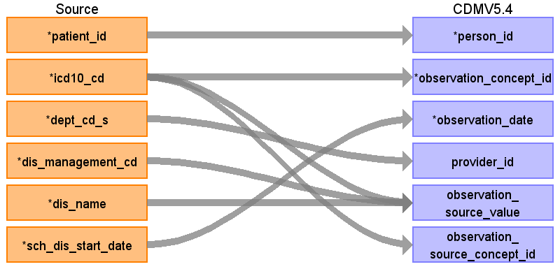

## Table name: observation

### Reading from patientdisease

ターゲットテーブル:observation
 ・当テーブルは&nbsp;PatientDisease、ObservationResult、PrescriptionData、InjectionData&nbsp;からデータが登録される。
 ・各テーブルの&nbsp;病名、検査値、薬剤名などを&nbsp;ATHENA&nbsp;Vocabularyを介したstandard&nbsp;conceptへの変換後、standard&nbsp;conceptのdomainが&nbsp;"Observation"&nbsp;で定義されているデータが格納される。
 　（注：本データソース側には「所見」や「経過観察」などを格納しているエンティティが存在しない。このため、各施設で発生したすべての&nbsp;Observation（観察）が登録されるわけではない。）
 
 本項では、PasientDiseaseをもとに生成された、observationテーブルの各項目のとの出力結果の対応を記載する。
 　例：「ICD10&nbsp;/&nbsp;H17:角膜瘢痕及び混濁の細分類」&nbsp;→&nbsp;「OMOP&nbsp;コンセプト&nbsp;ID&nbsp;（SNOMED）/&nbsp;4109135:&nbsp;Corneal&nbsp;scars&nbsp;and&nbsp;opacities」
 
 
 

| Destination Field | Source field | Logic | Comment field |
| --- | --- | --- | --- |
| observation_id |  |  | 一意の連番を設定する |
| person_id | patient_id |  | person.person_source_valueと結合してperson_idを取得・登録する  |
| observation_concept_id | icd10_cd | Source_to_concept_map:   VocabID:RINCHU_DIAGCD,&nbsp;ATHENA_ICD10   DomainID:Observation    | ICD-10コードをsource_to_concept_mapを介してSNOMED他のStandard&nbsp;Vocabularyに変換する     |
| observation_date | sch_dis_start_date |  |  |
| observation_datetime |  |  | （設定しない） |
| observation_type_concept_id |  |  | 32817（EHR）固定とする |
| value_as_number |  |  | （設定しない） |
| value_as_string |  |  | （設定しない） |
| value_as_concept_id |  |  | （設定しない） |
| qualifier_concept_id |  |  | （設定しない） |
| unit_concept_id |  |  | （設定しない） |
| provider_id | dept_cd_s |  | 当該標準診療科コードを示すprovider_idを取得して登録する  |
| visit_occurrence_id |  |  | （設定しない） |
| visit_detail_id |  |  | （設定しない） |
| observation_source_value | dis_management_cd icd10_cd dis_name | COALESCE(icd10_cd,&nbsp;'')&nbsp;\|\|&nbsp;'\|'&nbsp;\|\|&nbsp;COALESCE(dis_management_cd,&nbsp;'')&nbsp;\|\|&nbsp;'\|'&nbsp;\|\|&nbsp;COALESCE(dis_name,&nbsp;'')  | ICD10コード\|病名管理番号\|病名表記の形式に編集して判読可能な値として登録する      |
| observation_source_concept_id | icd10_cd | Source_to_concept_map:   VocabID:RINCHU_DIAGCD,&nbsp;ATHENA_ICD10   DomainID:Observation    | ICD10コードをAthenaのconceptを介してconcept_idに変換する  |
| unit_source_value |  |  | （設定しない） |
| qualifier_source_value |  |  | （設定しない） |
| value_source_value |  |  | （設定しない） |
| observation_event_id |  |  |  |
| obs_event_field_concept_id |  |  |  |

