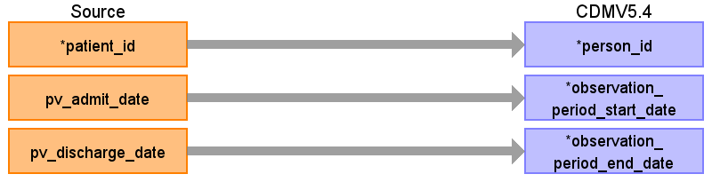
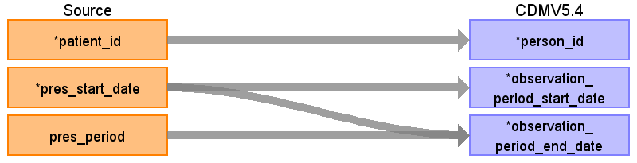
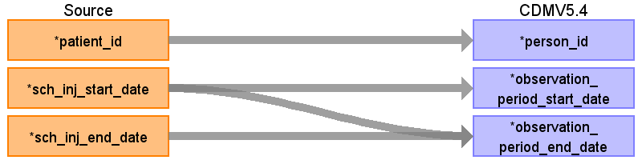
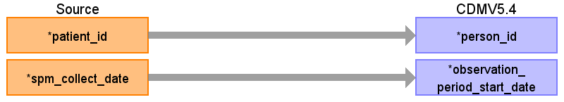
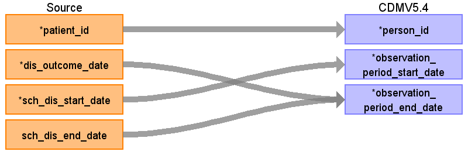

## Table name: observation_period

### Reading from patientvisit

ターゲットテーブル:observation_period
 ・当テーブルは&nbsp;OMOP&nbsp;CDMの以下のテーブルからデータが登録される。
 &nbsp;&nbsp;drug_exposure
 &nbsp;&nbsp;procedure_occurrence
 &nbsp;&nbsp;condition_occurrence
 &nbsp;&nbsp;observation
 &nbsp;&nbsp;measurement
 &nbsp;&nbsp;device_exposure
 &nbsp;&nbsp;specimen
 &nbsp;&nbsp;visit_occurrence
 &nbsp;&nbsp;death
 ・患者ID毎にこれらのテーブルの最古の日付と最新の日付を該当の期間として、observation_period_start_date&nbsp;と&nbsp;observation_period_end_date&nbsp;を設定している。
 
 本項では、visit_occurrenceの元となる、PatientVisit&nbsp;&nbsp;と&nbsp;observation_periodテーブルの各項目のとの出力結果の対応を記載する。

| Destination Field | Source field | Logic | Comment field |
| --- | --- | --- | --- |
| observation_period_id |  |  | 一意の連番を設定する |
| person_id | patient_id |  | PATIENT_IDをそのまま登録する  |
| observation_period_start_date | pv_admit_date |  | 外来受診入院実施日（外来受診の場合は来院日時の日付、入院の場合は入院日時の日付）をそのまま登録する  |
| observation_period_end_date | pv_discharge_date |  | PV_ADTSEGMENT='ADT^A01^ADT_A01'(入院実施)に続く’退院実施&nbsp;：ADT^A03^ADT_A03’(退院実施)のレコードがあれば、そのレコードの退院実施日をそのまま登録する （patientvisit&nbsp;が元テーブルの場合、設定しない） |
| period_type_concept_id |  |  | 32817（EHR）固定とする |

### Reading from prescriptiondata

本項では、drug_exposureの元となる、PrescriptionData&nbsp;&nbsp;と&nbsp;observation_periodテーブルの各項目のとの出力結果の対応を記載する。

| Destination Field | Source field | Logic | Comment field |
| --- | --- | --- | --- |
| observation_period_id |  |  | 一意の連番を設定する |
| person_id | patient_id |  |  |
| observation_period_start_date | pres_start_date |  |  |
| observation_period_end_date | pres_start_date pres_period | CASE&nbsp;   &nbsp;&nbsp;WHEN&nbsp;pres_period&nbsp;IS&nbsp;NOT&nbsp;NULL&nbsp;AND&nbsp;pres_period&nbsp;>&nbsp;0&nbsp;THEN&nbsp;sch_pres_start_date&nbsp;+&nbsp;(pres_period&nbsp;-&nbsp;1)&nbsp;*&nbsp;INTERVAL&nbsp;'1&nbsp;day'   &nbsp;&nbsp;ELSE&nbsp;sch_pres_start_date&nbsp;   END&nbsp;AS&nbsp;end_date  | 投薬終了日が有効な日付の場合はそのまま登録する。有効な日付でない場合は投薬開始日に投与日数を加算して投薬終了日を導出する  （patientvisit&nbsp;が元テーブルの場合、設定しない） |
| period_type_concept_id |  |  | 32817（EHR）固定とする |

### Reading from injectiondata

本項では、drug_exposureの元となる、InjectionData&nbsp;&nbsp;と&nbsp;observation_periodテーブルの各項目のとの出力結果の対応を記載する。

| Destination Field | Source field | Logic | Comment field |
| --- | --- | --- | --- |
| observation_period_id |  |  | 一意の連番を設定する |
| person_id | patient_id |  |  |
| observation_period_start_date | sch_inj_start_date |  |  |
| observation_period_end_date | sch_inj_end_date sch_inj_start_date | COALESCE(NULLIF(sch_inj_end_date,&nbsp;'9999-12-31'::date),&nbsp;sch_inj_start_date)&nbsp;AS&nbsp;end_date | 投薬終了日があれば投薬終了日、なければ投薬開始日を設定する （patientvisit&nbsp;が元テーブルの場合、設定しない） |
| period_type_concept_id |  |  | 32817（EHR）固定とする |

### Reading from observationresult

本項では、observationの元となる、ObservationResult&nbsp;&nbsp;と&nbsp;observation_periodテーブルの各項目のとの出力結果の対応を記載する。

| Destination Field | Source field | Logic | Comment field |
| --- | --- | --- | --- |
| observation_period_id |  |  | 一意の連番を設定する |
| person_id | patient_id |  | PATIENT_IDをそのまま登録する  |
| observation_period_start_date | spm_collect_date |  | 検体採取日を設定する  |
| observation_period_end_date |  |  | （patientvisit&nbsp;が元テーブルの場合、設定しない） |
| period_type_concept_id |  |  | 32817（EHR）固定とする |

### Reading from patientdisease

本項では、condition_occurrenceの元となる、PatientDisease&nbsp;&nbsp;と&nbsp;observation_periodテーブルの各項目のとの出力結果の対応を記載する。

| Destination Field | Source field | Logic | Comment field |
| --- | --- | --- | --- |
| observation_period_id |  |  | 一意の連番を設定する |
| person_id | patient_id |  | PATIENT_IDをそのまま登録する  |
| observation_period_start_date | sch_dis_start_date |  | 病名開始日ををのまま登録する  |
| observation_period_end_date | dis_outcome_date sch_dis_end_date | COALESCE(&nbsp;--&nbsp;OUTCOME_DATEを優先、なければEND_DATEを使用　ただし9999-12-31はNULLに変換する   &nbsp;&nbsp;NULLIF(sch_dis_outcome_date,&nbsp;'9999-12-31'::date),   &nbsp;&nbsp;NULLIF(sch_dis_end_date,&nbsp;'9999-12-31'::date)   )&nbsp;AS&nbsp;end_date  | OUTCOME_DATEを優先、なければEND_DATEを使用  （patientvisit&nbsp;が元テーブルの場合、設定しない） |
| period_type_concept_id |  |  | 32817（EHR）固定とする |

