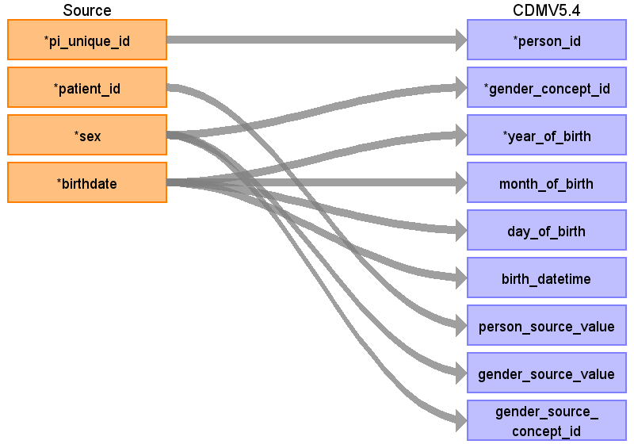
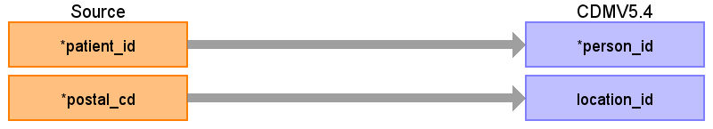

## Table name: person

### Reading from patientidentification

ターゲットテーブル:person
 ・当テーブルはPatientIdentification、PatientAddress、および郵便番号マスタを患者IDをキーに結合したデータをもとに生成する
 
 本項では、PatientIdentificationをもとに生成された、personテーブルの各項目のとの出力結果の対応を記載する。

| Destination Field | Source field | Logic | Comment field |
| --- | --- | --- | --- |
| person_id | pi_unique_id |  | SSMIX標準DBにオリジナルの患者IDとは別に施設ごとのユニークIDが採番されているので、それを利用  |
| gender_concept_id | sex | CASE   &nbsp;&nbsp;WHEN&nbsp;gender_source_value&nbsp;=&nbsp;'M'&nbsp;THEN&nbsp;8507   &nbsp;&nbsp;WHEN&nbsp;gender_source_value&nbsp;=&nbsp;'F'&nbsp;THEN&nbsp;8532   &nbsp;&nbsp;ELSE&nbsp;0   END&nbsp;AS&nbsp;gender_concept_id | 固定変換   F：8532   M：8507  |
| year_of_birth | birthdate | EXTRACT(YEAR&nbsp;FROM&nbsp;sch_birthdate)&nbsp; | 生年月日の年を登録  |
| month_of_birth | birthdate | EXTRACT(MONTH&nbsp;FROM&nbsp;sch_birthdate)&nbsp; | 生年月日の月を登録  |
| day_of_birth | birthdate | EXTRACT(DAY&nbsp;FROM&nbsp;sch_birthdate)&nbsp; | 生年月日の日を登録  |
| birth_datetime | birthdate |  | 生年月日を登録  |
| race_concept_id |  |  | 0&nbsp;固定 |
| ethnicity_concept_id |  |  | 0&nbsp;固定 |
| location_id |  |  |  |
| provider_id |  |  | 設定しない |
| care_site_id |  |  | care_siteに医療機関番号を登録し、そのcare_site_idを登録する   （施設ごとのETLではその施設固定値となるが、医科と歯科で医療機関番号異なる場合は考慮が必要） |
| person_source_value | patient_id |  | PATIENT_IDをそのまま登録する  |
| gender_source_value | sex |  | 性別をそのまま登録する（男性、女性以外の性別が登録されている場合もそのまま）  |
| gender_source_concept_id | sex | CASE   &nbsp;&nbsp;WHEN&nbsp;gender_source_value&nbsp;=&nbsp;'M'&nbsp;THEN&nbsp;8507   &nbsp;&nbsp;WHEN&nbsp;gender_source_value&nbsp;=&nbsp;'F'&nbsp;THEN&nbsp;8532   &nbsp;&nbsp;ELSE&nbsp;0   END&nbsp;AS&nbsp;gender_concept_id | 固定変換   F：8532   M：8507  |
| race_source_value |  |  | SSMIX標準DBにカラムはあるがデータはないので対象外とする |
| race_source_concept_id |  |  | 設定しない |
| ethnicity_source_value |  |  | SSMIX標準DBにカラムはあるがデータはないので対象外とする |
| ethnicity_source_concept_id |  |  | 設定しない |

### Reading from patientaddress

本項では、PatientAddressをもとに生成された、personテーブルの各項目のとの出力結果の対応を記載する。
 ・PatientAddressは１つのPATIEND_IDで複数のレコードを保持する場合があるため、もっとも直近の住所レコードを採用する
 ・PatientAddressが保持する郵便番号から都道府県番号に変換し、locationと紐づけを行う
 
 

| Destination Field | Source field | Logic | Comment field |
| --- | --- | --- | --- |
| person_id | patient_id |  | SSMIX標準DBにオリジナルの患者IDとは別に施設ごとのユニークIDが採番されているので、それを利用  |
| gender_concept_id |  |  |  |
| year_of_birth |  |  |  |
| month_of_birth |  |  |  |
| day_of_birth |  |  |  |
| birth_datetime |  |  |  |
| race_concept_id |  |  | 0&nbsp;固定 |
| ethnicity_concept_id |  |  | 0&nbsp;固定 |
| location_id | postal_cd |  | 郵便番号から郵便番号マスタを介して都道府県名を取得後、location_idに変換  |
| provider_id |  |  | 設定しない |
| care_site_id |  |  | care_siteに医療機関番号を登録し、そのcare_site_idを登録する   （施設ごとのETLではその施設固定値となるが、医科と歯科で医療機関番号異なる場合は考慮が必要） |
| person_source_value |  |  |  |
| gender_source_value |  |  |  |
| gender_source_concept_id |  |  |  |
| race_source_value |  |  | SSMIX標準DBにカラムはあるがデータはないので対象外とする |
| race_source_concept_id |  |  | 設定しない |
| ethnicity_source_value |  |  | SSMIX標準DBにカラムはあるがデータはないので対象外とする |
| ethnicity_source_concept_id |  |  | 設定しない |

