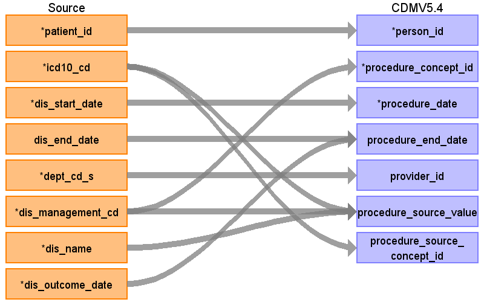

## Table name: procedure_occurrence

### Reading from patientdisease

ターゲットテーブル:procedure_occurrence
 ・当テーブルは&nbsp;PatientDisease、ObservationResult、PrescriptionData、InjectionData&nbsp;からデータが登録される。
 ・各テーブルの&nbsp;病名、検査値、薬剤名などを&nbsp;ATHENA&nbsp;Vocabularyを介したstandard&nbsp;conceptへの変換後、standard&nbsp;conceptのdomainが&nbsp;"Procedure"&nbsp;で定義されているデータが格納される。
 　例：「ICD10&nbsp;/&nbsp;Z10.0:&nbsp;職場健診」&nbsp;→&nbsp;「OMOP&nbsp;コンセプト&nbsp;ID&nbsp;/&nbsp;45581006:&nbsp;Occupational&nbsp;health&nbsp;examination」
 　（注：本データソース側には「診療行為」を格納しているエンティティが存在しない。このため、各施設で発生したすべての診療行為が登録されるわけではない。）
 
 本項では、PatientDiseaseをもとに生成された、procedure_occurrenceテーブルの各項目のとの出力結果の対応を記載する。
 
 

| Destination Field | Source field | Logic | Comment field |
| --- | --- | --- | --- |
| procedure_occurrence_id |  |  | 一意の連番を設定する |
| person_id | patient_id |  |  |
| procedure_concept_id | dis_management_cd |  |  |
| procedure_date | dis_start_date |  |  |
| procedure_datetime |  |  | （設定しない） |
| procedure_end_date | dis_end_date dis_outcome_date | COALESCE(&nbsp;--&nbsp;OUTCOME_DATEを優先、なければEND_DATEを使用　ただし9999-12-31はNULLに変換する   &nbsp;&nbsp;NULLIF(sch_dis_outcome_date,&nbsp;'9999-12-31'::date),   &nbsp;&nbsp;NULLIF(sch_dis_end_date,&nbsp;'9999-12-31'::date)   )&nbsp;AS&nbsp;end_date  | OUTCOME_DATEを優先、なければEND_DATEを使用　ただし9999-12-31はNULLに変換する   |
| procedure_end_datetime |  |  | （設定しない） |
| procedure_type_concept_id |  |  | 32817（EHR）固定とする |
| modifier_concept_id |  |  | （設定しない） |
| quantity |  |  | （設定しない） |
| provider_id | dept_cd_s |  | 当該標準診療科コードを示すprovider_idを取得して登録する |
| visit_occurrence_id |  |  | （設定しない） |
| visit_detail_id |  |  | （設定しない） |
| procedure_source_value | dis_management_cd icd10_cd dis_name | COALESCE(icd10_cd,&nbsp;'')&nbsp;\|\|&nbsp;'\|'&nbsp;\|\|&nbsp;COALESCE(dis_management_cd,&nbsp;'')&nbsp;\|\|&nbsp;'\|'&nbsp;\|\|&nbsp;COALESCE(dis_name,&nbsp;'')  | ICD10コード\|病名管理番号\|病名表記の形式に編集して判読可能な値として登録する   |
| procedure_source_concept_id | icd10_cd | Source_to_concept_map:   VocabID:RINCHU_DIAGCD,&nbsp;ATHENA_ICD10   DomainID:Procedure | ICD10コードをAthenaのconceptを介してconcept_idに変換する  |
| modifier_source_value |  |  | （設定しない） |

