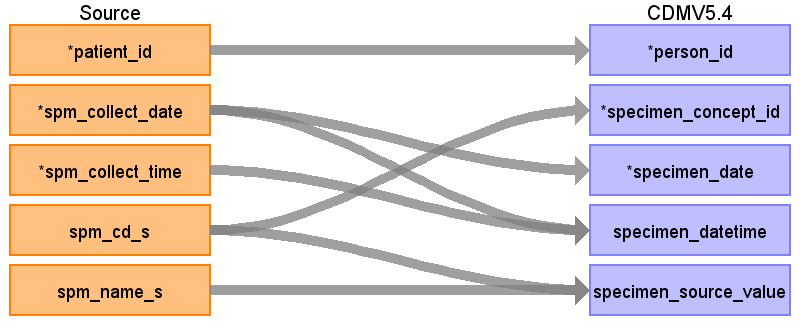

## Table name: specimen

### Reading from observationresult

ターゲットテーブル:specimen
 ・当テーブルは主にObservationResultから作成される。
 ・ObservationResultの材料標準コードを&nbsp;ATHENA&nbsp;Vocabularyを介したstandard&nbsp;conceptへの変換後、standard&nbsp;conceptのdomainが&nbsp;"Specimen"&nbsp;で定義されているデータが格納される。
 
 本項では、ObservationResultをもとに生成された、specimenテーブルの各項目のとの出力結果の対応を記載する。
 ・specimenは同一患者、同一採取日時、同一材料コードで１レコードになるよう集約を行う

| Destination Field | Source field | Logic | Comment field |
| --- | --- | --- | --- |
| specimen_id |  |  | 一意の連番を設定する   （同一採取日時同一材料コードで複数レコード存在する場合は１レコードに集約する） |
| person_id | patient_id |  | person.person_source_valueと結合してperson_idを取得・登録する  |
| specimen_concept_id | spm_cd_s | specimen_concept_idに変換   Source_to_concept_map:   VocabID:RINCHU_SPM_CD   DomainID:Measurement | 臨中標準材料コードをsource_to_concept_mapを介してSNOMED,LOINC他のStandard&nbsp;Vocabularyに変換する  |
| specimen_type_concept_id |  |  | 32817（EHR）固定とする |
| specimen_date | spm_collect_date |  | 検体採取日をそのまま登録する  |
| specimen_datetime | spm_collect_date spm_collect_time | CASE   &nbsp;&nbsp;WHEN&nbsp;spm_collect_time&nbsp;=&nbsp;'999999'&nbsp;   &nbsp;&nbsp;&nbsp;&nbsp;OR&nbsp;spm_collect_time&nbsp;IS&nbsp;NULL&nbsp;   &nbsp;&nbsp;&nbsp;&nbsp;OR&nbsp;spm_collect_time&nbsp;~&nbsp;'^[0-9]{6}\$'&nbsp;=&nbsp;false&nbsp;   &nbsp;&nbsp;&nbsp;&nbsp;OR&nbsp;SUBSTRING(spm_collect_time,&nbsp;1,&nbsp;2)::integer&nbsp;>=&nbsp;24&nbsp;   &nbsp;&nbsp;&nbsp;&nbsp;OR&nbsp;SUBSTRING(spm_collect_time,&nbsp;3,&nbsp;2)::integer&nbsp;>=&nbsp;60&nbsp;   &nbsp;&nbsp;&nbsp;&nbsp;OR&nbsp;SUBSTRING(spm_collect_time,&nbsp;5,&nbsp;2)::integer&nbsp;>=&nbsp;60&nbsp;   &nbsp;&nbsp;THEN&nbsp;TO_TIMESTAMP(spm_collect_date&nbsp;\|\|&nbsp;'000000','YYYYMMDDHH24MISS')   &nbsp;&nbsp;ELSE&nbsp;TO_TIMESTAMP(spm_collect_date&nbsp;\|\|&nbsp;spm_collect_time,'YYYYMMDDHH24MISS')   END&nbsp;AS&nbsp;start_datetime  | 検体採取日＋検体採取時刻を登録する   |
| quantity |  |  | （設定しない） |
| unit_concept_id |  |  | （設定しない） |
| anatomic_site_concept_id |  |  |  |
| disease_status_concept_id |  |  | （設定しない） |
| specimen_source_id |  |  | （設定しない） |
| specimen_source_value | spm_cd_s spm_name_s | COALESCE(spm_cd_s,&nbsp;'')&nbsp;\|\|&nbsp;'\|'&nbsp;\|\|&nbsp;COALESCE(spm_name_s,&nbsp;'')&nbsp;AS&nbsp;source_regvalue  | 臨中標準材料コード＋臨中標準材料名称を登録する   |
| unit_source_value |  |  | （設定しない） |
| anatomic_site_source_value |  |  | （設定しない） |
| disease_status_source_value |  |  | （設定しない） |

