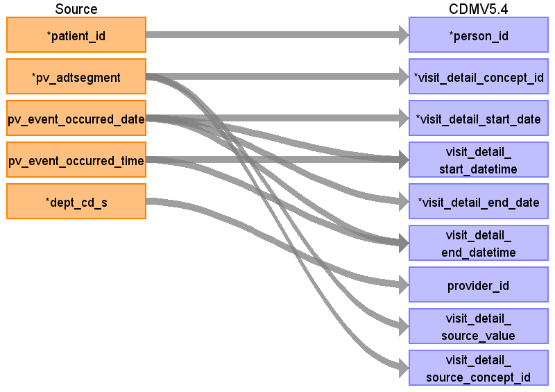

## Table name: visit_detail

### Reading from patientvisit

ターゲットテーブル:visit_detail
 ・当テーブルはPatientVisitテーブルから生成する
 
 本項では、PatientVisitをもとに生成された、visit_detailテーブルの各項目のとの出力結果の対応を記載する。
 ・visit_detailには１転科転棟、および１外出外泊ごとのレコード作成する。外出泊帰院実施イベントがある場合は外出泊レコードの終了日に反映する。
 ・visit_detailに登録される転科転棟、および外出外泊イベントは、visit_occurrenceの入院イベントレコードと関連付ける
 ・provider_idには診療科コードに相当する情報を保存し、対象診療科を識別可能とする。

| Destination Field | Source field | Logic | Comment field |
| --- | --- | --- | --- |
| visit_detail_id |  |  | 一意の連番を設定する |
| person_id | patient_id |  | person.person_source_valueと結合してperson_idを取得・登録する |
| visit_detail_concept_id | pv_adtsegment | Source_to_concept_map:   VocabID:RINCHU_VIST   DomainID:Visit | ADTセグメント識別子をもとに、以下のイベントに該当するVisitのStandard&nbsp;Vocabularyに変換する   外来診察の受付：ADT^A04^ADT_A01   →（visit_occurrenceに登録するため対象外）   入院実施：ADT^A01^ADT_A01   →（visit_occurrenceに登録するため対象外）   退院実施&nbsp;：ADT^A03^ADT_A03   →（visit_occurrenceに登録するため対象外）   転科・転棟実施：ADT^A02^ADT_A02   →4161975:Transfer&nbsp;to&nbsp;another&nbsp;hospital&nbsp;ward   外出泊実施：ADT^A21^ADT_A21   →8602:Temporary&nbsp;Lodging   外出泊帰院実施：ADT^A22^ADT_A21   →（外出泊実施のイベントレコードに集約するため対象外）  |
| visit_detail_start_date | pv_event_occurred_date | TO_DATE(visit_start_date,&nbsp;'YYYYMMDD')&nbsp;AS&nbsp;visit_start_date | 転科・転棟実施、外出泊実施ともにPV_EVENT_OCCURRED_DATE  |
| visit_detail_start_datetime | pv_event_occurred_date pv_event_occurred_time | CASE   &nbsp;&nbsp;WHEN&nbsp;visit_start_time&nbsp;=&nbsp;'999999'&nbsp;THEN&nbsp;TO_TIMESTAMP(visit_start_date&nbsp;\|\|&nbsp;'000000','YYYYMMDDHH24MISS')   &nbsp;&nbsp;ELSE&nbsp;TO_TIMESTAMP(visit_start_date&nbsp;\|\|&nbsp;visit_start_time,'YYYYMMDDHH24MISS')   END&nbsp;AS&nbsp;visit_start_datetime     | 転科・転棟実施、外出泊実施ともにPV_EVENT_DATE+PV_EVENT_TIME   |
| visit_detail_end_date | pv_event_occurred_date | CASE   &nbsp;&nbsp;WHEN&nbsp;visit_end_date&nbsp;IS&nbsp;NULL&nbsp;THEN&nbsp;TO_DATE('99991231',&nbsp;'YYYYMMDD')   &nbsp;&nbsp;ELSE&nbsp;TO_DATE(visit_end_date,&nbsp;'YYYYMMDD')   END&nbsp;AS&nbsp;visit_end_date    | ADTセグメント識別子ごとに採用する値を選択する   転科・転棟実施：ADT^A02^ADT_A02：PV_EVENT_OCCURRED_DATE   外出泊実施：ADT^A21^ADT_A21：外出泊実施日以降直近の外出泊帰院レコードのPV_EVENT_OCCURRED_DATE  |
| visit_detail_end_datetime | pv_event_occurred_date pv_event_occurred_time | CASE   &nbsp;&nbsp;WHEN&nbsp;visit_end_date&nbsp;IS&nbsp;NULL&nbsp;THEN&nbsp;TO_TIMESTAMP('99991231'&nbsp;\|\|&nbsp;'000000','YYYYMMDDHH24MISS')   &nbsp;&nbsp;ELSE&nbsp;   &nbsp;&nbsp;&nbsp;&nbsp;CASE   &nbsp;&nbsp;&nbsp;&nbsp;&nbsp;&nbsp;WHEN&nbsp;visit_end_time&nbsp;IS&nbsp;NULL&nbsp;THEN&nbsp;TO_TIMESTAMP(visit_end_date&nbsp;\|\|&nbsp;'000000','YYYYMMDDHH24MISS')   &nbsp;&nbsp;&nbsp;&nbsp;&nbsp;&nbsp;WHEN&nbsp;visit_end_time&nbsp;=&nbsp;'999999'&nbsp;THEN&nbsp;TO_TIMESTAMP(visit_end_date&nbsp;\|\|&nbsp;'000000','YYYYMMDDHH24MISS')   &nbsp;&nbsp;&nbsp;&nbsp;&nbsp;&nbsp;ELSE&nbsp;TO_TIMESTAMP(visit_end_date&nbsp;\|\|&nbsp;visit_end_time,'YYYYMMDDHH24MISS')   &nbsp;&nbsp;END   END&nbsp;AS&nbsp;visit_end_datetime  | ADTセグメント識別子ごとに採用する値を選択する   転科・転棟実施：ADT^A02^ADT_A02：PV_EVENT_OCCURRED_DATE+PV_EVENT_OCCURRED_TIME   外出泊実施：ADT^A21^ADT_A21：外出泊実施日以降直近の外出泊帰院レコードのPV_EVENT_OCCURRED_DATE+PV_EVENT_OCCURRED_TIME   |
| visit_detail_type_concept_id |  |  | 32817（EHR）固定とする |
| provider_id | dept_cd_s |  | 当該標準診療科コードを示すprovider_idを取得して登録する |
| care_site_id |  |  | 当該医療機関を示すcare_site_idを固定で登録する |
| visit_detail_source_value | pv_adtsegment |  | ADTセグメント識別子をそのまま登録する  |
| visit_detail_source_concept_id | pv_adtsegment |  | visit_concept_idと同じ値を登録する  |
| admitted_from_concept_id |  |  | （設定しない） |
| admitted_from_source_value |  |  | （設定しない） |
| discharged_to_source_value |  |  | （設定しない） |
| discharged_to_concept_id |  |  | （設定しない） |
| preceding_visit_detail_id |  |  | （設定しない） |
| parent_visit_detail_id |  |  | （設定しない） |
| visit_occurrence_id |  |  | 転科転棟、外出泊イベントが発生した入院イベントレコードから生成したvisit_occurrenceのvisit_occurrence_idを取得 |

