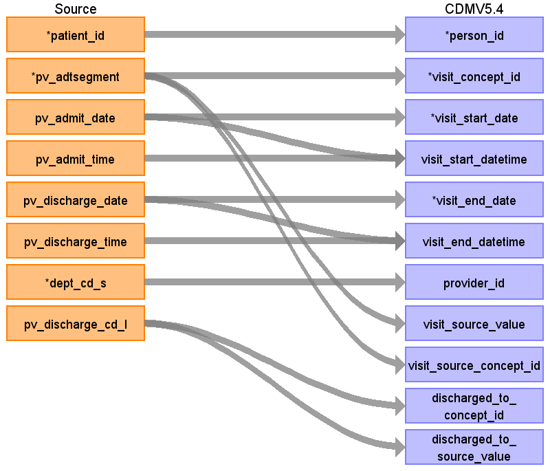

## Table name: visit_occurrence

### Reading from patientvisit

ターゲットテーブル:visit_occurrence
 ・当テーブルはPatientVisitテーブルから生成する
 
 本項では、PatientVisitをもとに生成された、visit_occurrenceテーブルの各項目のとの出力結果の対応を記載する。
 ・visit_occurrenceには１外来受診および１入院ごとのレコード作成する。退院イベントがある場合は入院イベントレコードの終了日に反映する。
 ・PatientVisitに退院実施レコード以前の入院実施レコードが存在しない場合、その入退院イベントレコードは生成しない
 ・PatientVisitの外来受診、入院実施、退院実施以外のレコード（外出泊、転科転棟）はvisit_detailに登録する
 ・provider_idには診療科コードに相当する情報を保存し、対象診療科を識別可能とする。
 

| Destination Field | Source field | Logic | Comment field |
| --- | --- | --- | --- |
| visit_occurrence_id |  |  | 一意の連番をETL処理で設定する |
| person_id | patient_id |  | person.person_source_valueと結合してperson_idを取得・登録する  |
| visit_concept_id | pv_adtsegment | stage.source_to_concept_map_f&nbsp;を以下の条件参照   VocabID:RINCHU_VIST   DomainID:Visit | ADTセグメント識別子をもとに、以下のイベントに該当するVisitのStandard&nbsp;Vocabularyに変換する   外来診察の受付：ADT^A04^ADT_A01   →9202:&nbsp;Outpatient&nbsp;Visit   入院実施：ADT^A01^ADT_A01   →9201:&nbsp;Inpatient&nbsp;Visit   退院実施&nbsp;：ADT^A03^ADT_A03   →（入院のイベントレコードに集約するため対象外）   転科・転棟実施：ADT^A02^ADT_A02   →（Visit_occurrence対象外）   外出泊実施：ADT^A21^ADT_A21   →（Visit_occurrence対象外）   外出泊帰院実施：ADT^A22^ADT_A21   →（Visit_occurrence対象外）  |
| visit_start_date | pv_admit_date | TO_DATE(visit_start_date,&nbsp;'YYYYMMDD')&nbsp;AS&nbsp;visit_start_date | 外来受診入院実施日（外来受診の場合は来院日時の日付、入院の場合は入院日時の日付）をそのまま登録する  |
| visit_start_datetime | pv_admit_date pv_admit_time | CASE   &nbsp;&nbsp;WHEN&nbsp;visit_start_time&nbsp;=&nbsp;'999999'&nbsp;THEN&nbsp;TO_TIMESTAMP(visit_start_date&nbsp;\|\|&nbsp;'000000','YYYYMMDDHH24MISS')   &nbsp;&nbsp;ELSE&nbsp;TO_TIMESTAMP(visit_start_date&nbsp;\|\|&nbsp;visit_start_time,'YYYYMMDDHH24MISS')   END&nbsp;AS&nbsp;visit_start_datetime  | 外来受診入院実施日と外来受診入院実施時刻を連結して登録する |
| visit_end_date | pv_discharge_date | CASE   &nbsp;&nbsp;WHEN&nbsp;visit_end_date&nbsp;IS&nbsp;NULL&nbsp;THEN&nbsp;TO_DATE('99991231',&nbsp;'YYYYMMDD')   &nbsp;&nbsp;ELSE&nbsp;TO_DATE(visit_end_date,&nbsp;'YYYYMMDD')   END&nbsp;AS&nbsp;visit_end_date |  |
| visit_end_datetime | pv_discharge_date pv_discharge_time | CASE   &nbsp;&nbsp;WHEN&nbsp;visit_end_date&nbsp;IS&nbsp;NULL&nbsp;THEN&nbsp;TO_TIMESTAMP('99991231'&nbsp;\|\|&nbsp;'000000','YYYYMMDDHH24MISS')   &nbsp;&nbsp;ELSE&nbsp;   &nbsp;&nbsp;&nbsp;&nbsp;CASE   &nbsp;&nbsp;&nbsp;&nbsp;WHEN&nbsp;visit_end_time&nbsp;IS&nbsp;NULL&nbsp;THEN&nbsp;TO_TIMESTAMP(visit_end_date&nbsp;\|\|&nbsp;'000000','YYYYMMDDHH24MISS')   &nbsp;&nbsp;&nbsp;&nbsp;WHEN&nbsp;visit_end_time&nbsp;=&nbsp;'999999'&nbsp;THEN&nbsp;TO_TIMESTAMP(visit_end_date&nbsp;\|\|&nbsp;'000000','YYYYMMDDHH24MISS')   &nbsp;&nbsp;&nbsp;&nbsp;ELSE&nbsp;TO_TIMESTAMP(visit_end_date&nbsp;\|\|&nbsp;visit_end_time,'YYYYMMDDHH24MISS')   &nbsp;&nbsp;&nbsp;&nbsp;END   END&nbsp;AS&nbsp;visit_end_datetime  | PV_ADTSEGMENT='ADT^A01^ADT_A01'(入院実施)に続く’退院実施&nbsp;：ADT^A03^ADT_A03’(退院実施)のレコードがあれば、そのレコードの退院実施日と退院実施時刻をそのまま登録する   |
| visit_type_concept_id |  |  | 32817（EHR）固定とする |
| provider_id | dept_cd_s |  | 当該標準診療科コードを示すprovider_idを取得して登録する  |
| care_site_id |  |  | 当該医療機関を示すcare_site_idを固定で登録する |
| visit_source_value | pv_adtsegment |  | ADTセグメント識別子をそのまま登録する  |
| visit_source_concept_id | pv_adtsegment |  | visit_concept_idと同じ値を登録する  |
| admitted_from_concept_id |  |  | （設定しない） |
| admitted_from_source_value |  |  | （設定しない） |
| discharged_to_concept_id | pv_discharge_cd_l | stage.source_to_concept_map_f&nbsp;を以下の条件参照   VocabID:RINCHU_VIST   DomainID:Visit | 退院区分に対応するstandard&nbsp;conceptに変換して登録する  |
| discharged_to_source_value | pv_discharge_cd_l |  | 退院区分をそのまま登録する。  |
| preceding_visit_occurrence_id |  |  | （設定しない） |

