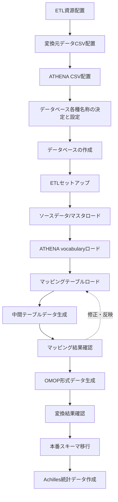
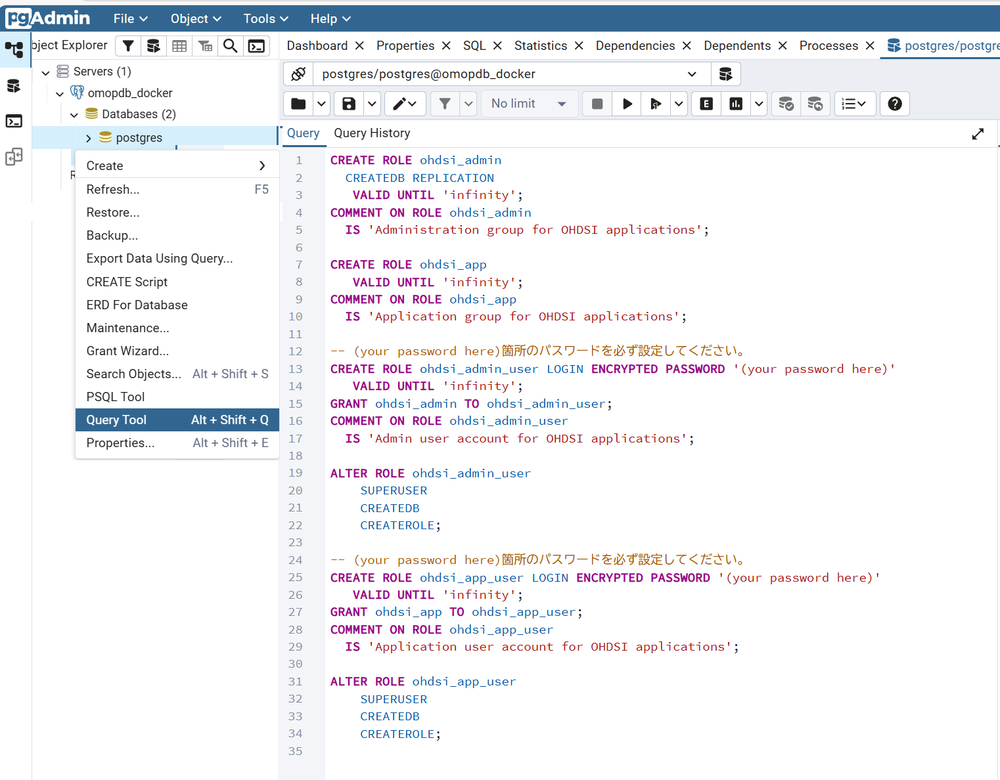
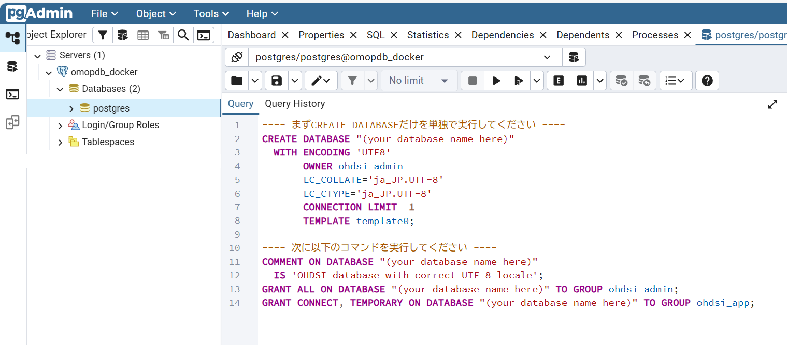

# 臨中ネット標準データベース OMOP変換 README

## 目次

- [A.概要](#a概要)
- [B.環境構築手順](#b環境構築手順)
- [C.データ変換実行手順](#cデータ変換実行手順)
- [D.ログファイルの保存](#dログファイルの保存)
- [E.データ変換実行後のデータ出力手順](#eデータ変換実行後のデータ出力手順)
- [F.付録](#f付録)
  - [臨中ネットデータベースからのデータ抽出方法](#1臨中ネットデータベースからのデータ抽出方法)
- G.参照ドキュメント
   - [ETL一括実行ツール オペレーションマニュアル](./execute_all_process.md) 
   - [ETL pipeline Document](./D000_Documents/Pipeline_Documentation.md)
   - [ETL Specification Document(Rabbit in A Hat)](./D000_Documents/etl_specification/md/index.md)

---

## A.概要

本ドキュメントは、臨中ネットETLプロジェクトの環境構築から実行準備、ETL実行、データ確定までの一連の手順と、各バッチファイルの役割・実行方法をまとめたものです。

> ⚠️ **重要な前提事項**
> このアプリケーションは**PostgreSQL**がインストール済であることを前提としています。
> **PostgreSQL**のインストールが完了していない場合は、必ずインストールしてから本ドキュメントの手順を実行してください。
> このドキュメントには**PostgreSQL**や**pgAdmin**などのソフトウェアの操作説明は含んでいません。初めて環境を構築する際のデータベース初期作成手順のみ**pgAdmin**の基本的な操作が必要ですので、ご注意ください。

### 1.全体の流れ

環境構築からデータ変換を実行するまでの一連の流れは以下のとおりです。

#### プロセスフロー
:::mermaid

:::

### 2.環境構築・データ変換の実行方法

本プロジェクトの環境構築からETL変換・本番データ反映までの実行方法は、以下の**２つの方法**から選択できます。

#### 方法１：環境構築からETL変換までの手順を一括実行する

初期データベース作成を行った後、ETL実行環境構築からデータ変換実行までの一連のプロセスを一括実行する方法です。

**実行手順：**

1. 本ドキュメントの「[B.環境構築手順](#b環境構築手順)」の以下の手順を実行してください
   - **1. 事前準備ファイルの配置**
   - **2.1. OMOPデータベース各種パラメータの決定**
   - **2.2. OMOPデータベース各種パラメータの設定ファイルへの反映**
   - **2.3.データベースユーザおよびデータベースの作成**

2. その後、[ETL一括実行ツール オペレーションマニュアル](./execute_all_process.md) に記載された手順に従って、B.環境構築手順2.2のスキーマ作成からC.データ変換実行手順のすべての手順を一括実行します

**メリット：**

- 最小限の操作で完了できます
- 手順間の待ち時間がなく、全体として最小時間で実行できます。

**デメリット：**

- 一括実行中のエラーが発生した場合、どのステップで失敗したかをログファイルから調査して確認する必要があります。

#### 方法２：各手順を１つずつ順番に実行する

すべての手順を個別に実行し、各ステップの進行状況を確認しながら進める方法です。

**実行手順：**

1. 本ドキュメントの「[B.環境構築手順](#b環境構築手順)」に記載された手順を上から順番に実行します
2. その後「[C.データ変換実行手順](#cデータ変換実行手順)」に記載された手順を実行します
3. 各ステップ完了後にログを確認し、問題がないことを確認してから次のステップに進みます

**メリット：**

- 各ステップの進行状況を詳細に確認できます
- エラーが発生した場合、該当ステップのみ修正・再実行できます
- 途中で処理を中断・再開しやすいです
> ⚠️ **手順を１つづつ実行する際の注意事項**
>
> - 各手順で説明している各バッチの実行はExploreからダブルクリック実行、またはコマンドプロンプトから実行コマンドを入力して実行してください。
> - 各バッチ実行の前提条件が完了していることを確認してください。
> - 実行順序を守ってください。
> - ログは各バッチの同フォルダまたは `log/` フォルダに出力されます。

---

> 💡 **推奨事項**
>
> - **一般利用者**：方法1（一括実行）の使用をお勧めします。特に同じ環境での再処理や本番運用での利用に適しています
> - **学習者・技術者**：方法2（個別実行）の使用をお勧めします。手順を確認しながら進められ、各ステップのログも詳細に確認できます


---

## B.環境構築手順

### 1. 事前準備ファイルの配置

#### 1.1. ETL実行資源の配置

Githubまたはファイル共有などから入手した当アプリケーション資源を任意のフォルダに配置します。

**プロジェクトフォルダ構造：**

```
(任意のフォルダ)/rinchu-omop-etl/
├── 0000_setting/                            【環境設定ファイル・共通コマンド】
├── 1000_database_setup/                     【データベース・スキーマ・テーブル作成】
├── 2000_etl_setup/                          【ETLセットアップ】
├── 3000_load_source/                        【ソースデータ・マスタロード】
├── 4000_load_vocab/                         【ATHENA・マッピング・初期データロード】
├── 5000_etl_execute/                        【ETL実行・マッピング確認・本番デプロイ】
├── 6000_statistics/                         【Achilles統計データ作成】
├── 7000_export_omop/                        【OMOPデータCSV出力ツール】
├── 8000_ohdsi_tools_docker/                 【OHDSI Tools Docker環境】
├── D000_Documents/                          【各種ドキュメント】
├── L000_LogArchive/                         【ログアーカイブ】
├── S000_export_source/                      【ソースDB抽出ツール】
├── execute_all_process.bat                  【ETL一括実行CUIツール】
├── execute_all_process.hta                  【ETL一括実行GUIツール】
├── execute_all_process.md                   【ETL一括実行ツール説明】                         
└── README.md                                【このファイル】
```
> ⚠️ **資源配置の注意事項**
>
> - 日本語を含むフォルダに配置するとBATが正常に動作しない場合があります。
> - `C:\rinchu-omop-etl`や`D:\rinchu\rinchu-omop-etl`などのシンプルなフォルダ配置を推奨します。

---
#### 1.2. 変換元ソースデータの配置

臨中標準データベースからデータをCSV形式で抽出し、以下のフォルダに配置します。
```
└── 3000_load_source/                      【ソースデータ・マスタロード】
   └── dat/                                 臨中DBデータCSV配置フォルダ
       ├── PatientIdentification.csv        患者基本情報データ
       ├── PatientAddress.csv               患者住所データ
       ├── PatientVisit.csv                 患者来院履歴データ
       ├── PatientDisease.csv               患者病名データ
       ├── ObservationResult.csv            検体検査結果データ
       ├── PrescriptionData.csv             処方データ
       └── InjectionData.csv                注射データ
```

---
#### 1.3. ATHENA ボキャブラリデータの配置

OHDSI ATHENAから取得したVocabularyデータをCSV形式で抽出し、以下のフォルダに配置します。
```
└── 4000_load_vocab/                       【ATHENA・マッピング・初期データロード】
   └── athena/                              ATHENAボキャブラリCSV配置フォルダ
       ├── CONCEPT.csv                      コンセプト定義
       ├── CONCEPT_ANCESTOR.csv             コンセプト階層関係
       ├── CONCEPT_CLASS.csv                コンセプト分類
       ├── CONCEPT_RELATIONSHIP.csv         コンセプト関連
       ├── CONCEPT_SYNONYM.csv              コンセプト同義語
       ├── DOMAIN.csv                       ドメイン定義
       ├── DRUG_STRENGTH.csv                医薬品力価
       ├── RELATIONSHIP.csv                 関連タイプ
       └── VOCABULARY.csv                   ボキャブラリメタデータ
```


> ⚠️ **注意事項**
>
> - このプロジェクト配布資源にはATHENA Vocabularyデータを同梱していますので、通常はATHENAからの再取得は不要です。
> - ATHENAから新バージョンのVocabularyを個別に取得して使用したい場合のみ、自身で入手・配置してください。
> - その場合、同梱しているsource to concept mapが使用しているConceptのVocabularyを必ず含めて入手してください。

---
### 2. データベース各種名称の決定と設定・作成

#### 2.1. OMOPデータベース各種パラメータの決定

作成するOMOPデータベースの作成に先立ち、以下の事項をあらかじめ検討し、決定してください。

1. 作成するOMOPデータベースの名称
2. OMOPデータベースアクセスに使用する２ユーザのパスワード(ohdsi_admin_user, ohdsi_app_user)
3. OMOPデータベース内に作成するスキーマの名称
4. データ変換を実行する医療機関の医療機関番号(care_siteのデータに反映)

**決定が必要なパラメータ：**

| パラメータ | 説明 | 設定例 |
| --- | --- | --- |
| `PGUSER` | ETL処理がDBにアクセスする際のユーザー名 | ohdsi_app_user |
| `PGPASSWORD` | ETL処理がDBにアクセスする際のユーザーのパスワード | app1 |
| `PGDATABASE` | ETL処理がアクセスするデータベース名 | OHDSI |
| `SOURCE_SCHEMA` | ソースデータ用スキーマ名 | source |
| `WORKING_SCHEMA` | 中間テーブル用スキーマ名 | stage |
| `PRODUCTION_SCHEMA` | OMOP CDMテーブル用スキーマ名 | omop |
| `ATLASRESULT_SCHEMA` | Achilles統計テーブルスキーマ名 | result |
| `CARE_SITE_SOURCE_VALUE` | ソースデータ医療機関の医療機関番号（７桁） | 9110057 |

---
#### 2.2. OMOPデータベース各種パラメータのETL設定ファイルへの反映

`0000_setting/_env.bat` は、以降の手順で実行する各バッチ処理が使用する共通のパラメータ設定コマンドです。
`0000_setting/_env.bat`をテキストエディタで編集し、2.1で決定したOMOPデータベース各種パラメータを設定してください。

パラメータと意味は以下の通りです。

- `PGUSER`：ETL処理がDBにアクセスする際のユーザー名
- `PGPASSWORD`：ETL処理がDBにアクセスする際のユーザーのパスワード
- `PGDATABASE`：ETL処理がアクセスするデータベース名
- `SOURCE_SCHEMA`：ソースデータ用スキーマ名
- `WORKING_SCHEMA`：中間テーブル用スキーマ名
- `PRODUCTION_SCHEMA`：OMOP CDMテーブル用スキーマ名
- `ATLASRESULT_SCHEMA`：Achilles統計テーブルスキーマ名
- `CARE_SITE_SOURCE_VALUE`：ソースデータ医療機関の医療機関番号（７桁）
- `PGS_UNLOGGED`：テーブル作成後にUNLOGGED化する場合は `Y` を設定（省略時または空の場合はUNLOGGED化しない）

```（_env.batの内容）
[_env.batの内容]REM 環境変数一括設定ファイル

REM PostgreSQL接続情報
SET PGUSER=ohdsi_app_user
SET PGPASSWORD=(パスワード)

REM データベース・スキーマ情報
SET PGDATABASE=ohdsi
SET SOURCE_SCHEMA=source
SET WORKING_SCHEMA=stage
SET PRODUCTION_SCHEMA=omop
SET ATLASRESULT_SCHEMA=result

REM OMOP病院固有設定値情報
REM care_site_source_valueは医療機関番号７桁を設定してください
REM 例）9110057 ※care_site.care_site_source_valueの値と一致すること
SET CARE_SITE_SOURCE_VALUE=9110057

REM POSTGRESQL UNLOGGEDテーブル設定[Y/N]
REM Yに設定するとテーブル作成後にUNLOGGED化してETL処理を高速化します。ただしクラッシュ時にデータが失われるデメリットがあります。
REM SET PGS_UNLOGGED=Y

```

> ⚠️ **注意事項（PGS_UNLOGGED について）**
>
> **効果：**
> - WAL（Write-Ahead Logging）への書き込みが不要になるため、テーブルへのINSERT/UPDATE処理が高速化されます（処理内容によって数倍程度の速度向上が見込めます）。
>
> **リスク：**
> - PostgreSQLプロセスが異常終了（クラッシュ）した場合、UNLOGGEDテーブルのデータは自動的に切り捨てられ、**復元できません**。
>
> **推奨：**
> - 通常は `PGS_UNLOGGED=Y` の設定は推奨しません。
> - 大量データでETL実行時間が運用上受容できない場合のみ、クラッシュ時にETL再実行によるリカバリを受容する前提でUNLOGGEDを使用してください。

---
#### 2.3.データベースユーザおよびデータベースの作成

`1000_database_setup/01_database/01_create_user.sql` にはデータベースユーザ作成のコマンドが、
`1000_database_setup/01_database/02_create_database.sql` にはOMOPデータベース作成のコマンドが記述されています。

実行する前に `01_create_user.sql` のユーザのパスワードと、`02_create_database.sql` の作成するデータベース名を目的とする値に編集してください。

##### (1) ohdsi_admin_userのパスワード設定：(ex:admin1)

```sql
CREATE ROLE ohdsi_app_user LOGIN ENCRYPTED PASSWORD '(your password here)'
   VALID UNTIL 'infinity';
```

##### (2) ohdsi_app_userのパスワード設定：(ex:app1)

```sql
CREATE ROLE ohdsi_app_user LOGIN ENCRYPTED PASSWORD '(your password here)'
   VALID UNTIL 'infinity';
```

##### (3) OMOPデータベース名の設定(ex:ohdsi)
CREATE DATABASE用SQL
```sql
CREATE DATABASE "(your database name here)"
  WITH ENCODING='UTF8'
       OWNER=ohdsi_admin
       LC_COLLATE='ja_JP.UTF-8'
       LC_CTYPE='ja_JP.UTF-8'
       CONNECTION LIMIT=-1
       TEMPLATE template0;
```

DATABASEコメント・権限設定用SQL
```sql
COMMENT ON DATABASE "(your database name here)"
  IS 'OHDSI database with correct UTF-8 locale';
GRANT ALL ON DATABASE "(your database name here)" TO GROUP ohdsi_admin;
GRANT CONNECT, TEMPORARY ON DATABASE "(your database name here)" TO GROUP ohdsi_app;
```

##### (4) SQLの実行

`1000_database_setup/01_database/01_create_user.sql` および `02_create_database.sql` の内容をPgAdminのクエリエディタにコピー＆ペーストして実行し、ユーザとデータベースを作成します。

###### ユーザロール・ユーザの作成 (01_create_user.sql)

> ⚠️ **注意事項**
> - (your password here)のところは先に決めたパスワードに変更してから実行してください。
> 
>


###### データベースの作成 (02_create_database.sql)
> ⚠️ **注意事項**
> - (your database name here)のところは先に決めたデータベース名に変更してから実行してください。
> - すべてを一括で実行するとエラーになります。まずはCREATE DATABASEのSQL文を選択して実行し、次にCOMMENT ON DATABASE以降のSQL文を選択して実行してください。（CREATE DATABASEのSQL文とCOMMENT ON DATABASE以降のSQL文を分けて貼り付けてもよいです）
> - OS環境によってはCREATE DATABASEのSQL文を実行するとロケールに関するエラーが出る場合があります。その場合は以下のようにロケールを変更して実行してください。
       LC_COLLATE='ja_JP.UTF-8' --> 'C.UTF-8'
       LC_CTYPE='ja_JP.UTF-8' --> 'C.UTF-8'

>

##### (5) PostgreSQL パラメータ設定 (03_config_database.bat)

大量データ変換処理を最適化するためのパラメータ設定を行います。この設定はこのデータベースだけに有効な設定ですので、同じPostgreSQLインスタンスに他DBがある場合も、他DBに影響を与えません。

| パラメータ | 設定値 | 説明 |
| --- | --- | --- |
| `work_mem` | `256MB` | ソート・ハッシュ等のクエリ作業メモリ上限。ETL の重い集計・JOIN を On-Memory で完了させ、テンポラリファイル書き出しを回避します。数値を大きくすると逆効果になる場合があり、256MB を適正値としています。 |
| `hash_mem_multiplier` | `2.0` | Hash 系オペレータ (HashAggregate / Hash Join) のみ `work_mem × multiplier` を上限に許容する係数。ここでは Hash 系のみ最大 512MB まで許容して、ETL 中の大規模 Hash Join のテンポラリファイル書き出しを回避します。 |
| `max_parallel_workers_per_gather` | `4` | 単一クエリの Gather ノードあたりに起動する並列ワーカー数の上限。重い View の Parallel Seq Scan を 4 ワーカーで並列実行します。 |
| `parallel_setup_cost` | `100` | 並列実行プラン採用時に発生する起動コスト見積。デフォルト (1000) より低く設定し、プランナが並列計画を採用しやすくします。 |
| `parallel_tuple_cost` | `0.01` | 並列ワーカー → リーダーへ 1 行転送するコスト見積。デフォルト (0.1) より低く設定し、行数の多い処理でも並列計画が選ばれやすくする。 |

**実行方法：**

`1000_database_setup/01_database/03_config_database.bat` を実行

> 💡 **本ステップを 追加した理由**
> 従来の処理設計では大規模データベースの変換にかかる処理時間が非常に長く、機器の処理性能によっては変換処理が完遂できない課題がありました。このステップを追加することで、ETLの処理を最適化し、全体としての処理時間を短縮しました。

---

#### 2.4 スキーマ作成

##### (1)実行内容

作成したデータベースに４つのスキーマを作成します。

- `SOURCE_SCHEMA`：ソースデータ用スキーマ名（臨中DBレプリカテーブル、各種マスタテーブル用）(ex: source)
- `WORKING_SCHEMA`：ETLステージングテーブル用スキーマ名 (ex: stage)
- `PRODUCTION_SCHEMA`：OMOP CDM用スキーマ名 (ex:omop)
- `ATLASRESULT_SCHEMA`：ATLAS/Achillesテーブル用スキーマ名 (ex:result)

##### (2)実行準備

1. `0000_setting/_env.bat`が設定済であること
2. データベースの作成が完了していること

##### (2)実行方法

`1000_database_setup/02_schema/create_schema.bat` を実行します。

---
#### 2.5 ソーステーブル作成

##### (1)実行内容

ソースデータ用スキーマに以下のテーブルを作成します。

**1. 臨中標準データベースレプリカテーブル**

- patientidentification (臨中ネット患者基本データテーブル)
- patientaddress (臨中ネット患者住所データテーブル)
- patientvisit (臨中ネット患者来院履歴テーブル)
- patientdisease (臨中ネット患者病名データテーブル)
- observationresult (臨中ネット検体検査結果データテーブル)
- prescriptiondata (臨中ネット処方データテーブル)
- injectiondata (臨中ネット注射データテーブル)

**2. 各種マスタテーブル**

- mst_medis_byomei (MEDIS病名マスタ): [MEDIS ICD10対応標準病名マスター](https://www2.medis.or.jp/stdcd/byomei/index.html)
- mst_medis_hot13 (MEDIS 医薬品HOTマスタ): [MEDIS 医薬品HOTコードマスター詳細](https://www2.medis.or.jp/master/hcode/)
- mst_zipcode (郵便番号マスタ): [日本郵政ダウンロードサイト](https://www.post.japanpost.jp/zipcode/dl/utf-zip.html)

##### (2)実行準備

1. `0000_setting/_env.bat`が設定済であること
2. データベースの作成・スキーマ作成が完了していること

##### (3)実行方法

`1000_database_setup/03_table_source/create_table.bat` を実行します。

---
#### 2.6 OMOP関連テーブル作成

##### (1)実行内容

OMOP関連の以下のテーブルを作成します。

1. ETLステージングスキーマ　：ETLが生成する中間テーブル群
2. OMOP CDM用スキーマ　：OMOP CDM5.4 テーブル群
3. Atlas/Achilles用スキーマ　：Atlas/Achilles実行結果保存テーブル群（WebAPIから生成したDDLで作成すべきテーブル）

##### (2)実行準備

1. `0000_setting/_env.bat`が設定済であること
2. データベースの作成・スキーマ作成が完了していること

##### (3)実行方法

`1000_database_setup/04_table_omop/create_table.bat` を実行します。

---

### 3. ETLセットアップ（2000_etl_setup）

#### (1)実行内容

臨中データベースからOMOP変換を行うSQLをステージング用スキーマにViewとして作成します。

#### (2)実行準備

1. `0000_setting/_env.bat`が設定済であること
2. データベースの作成・スキーマ作成が完了していること

#### (3)実行方法

`2000_etl_setup/bat/create_etl.BAT` を実行します。

---

## C.データ変換実行手順

### 1. ソースデータロード（3000_load_source）

#### (1)実行内容

- 臨中データベース抽出データCSVをソーススキーマの臨中DBテーブルにロードします。
- 各種マスタCSVをソーススキーマの各マスタテーブルにロードします。

> ⚠️ **重要な注意事項**
>
> - **既存データは削除されます**：各インポートSQLは実行前にTRUNCATE文でテーブルの既存データを削除します。
> - 再実行時は既存データが失われることに注意してください。

#### (2)実行準備

1. `0000_setting/_env.bat`が設定済であること
2. データベースの作成・スキーマ作成・テーブル作成が完了していること
3. 臨中標準データベースから抽出したCSVファイル `3000_load_source/dat/` に保存されていること。
   ※臨中標準データベースからCSVファイルへのデータ抽出方法は任意ですが、[臨中ネットデータベースからのデータ抽出方法](#臨中ネットデータベースからのデータ抽出方法)を参考にしてください
4. 保存したCSVファイルは `01_import_source.sql`に記述している内容と一致していること。
   ※データベースへのロードは `01_import_source.sql`に記述している以下のコマンドで実行します。ファイル名が異なる場合は SQLファイル内のファイル名を修正する必要があります。

> ⚠️ **重要な注意事項**
>
> - **既存データは削除されます**：各インポートSQLは実行前にTRUNCATE文でテーブルの既存データを削除します。
> - 再実行時は既存データが失われることに注意してください。

```sql
[01_import_source.sql]
\echo ====================================
\echo ==== execute data loading      =====
\echo ====================================
\echo ==== PatientIdentification ====
\copy "@schema"."patientidentification" from '../dat/PatientIdentification.csv' csv header
\echo ==== PatientAddress ====
\copy "@schema"."patientaddress" from '../dat/PatientAddress.csv' csv header
\echo ==== PatientVisit ====
\copy "@schema"."patientvisit" from '../dat/PatientVisit.csv' csv header
\echo ==== PatientDisease ====
\copy "@schema"."patientdisease" from '../dat/PatientDisease.csv' csv header
\echo ==== ObservationResult ====
\copy "@schema"."observationresult" from '../dat/ObservationResult.csv' csv header
\echo ==== PrescriptionData ====
\copy "@schema"."prescriptiondata" from '../dat/PrescriptionData.csv' csv header
\echo ==== InjectionData ====
\copy "@schema"."injectiondata" from '../dat/InjectionData.csv' csv header
```

5. 各種マスタCSVファイルが `3000_load_source/mst/` に保存されていること。
6. 保存したCSVファイルは `02_import_master.sql`に記述している内容と一致していること。

   ※データベースへのロードは `02_import_master.sql`に記述している以下のコマンドで実行します。ファイル名やCSVの形式、文字エンコードが変更になった場合はSQLファイル内のファイル名やCOPYコマンドオプションを修正する必要があります。

```sql
[02_import_master.sql]
\echo ====================================
\echo ==== execute data loading      =====
\echo ====================================
\echo ==== mst_medis_byomei ====
\copy "@schema"."mst_medis_byomei" from '../mst/medis_byomei_nmain516.txt' csv ENCODING 'SJIS'
\echo ==== mst_medis_hot13 ====
\copy "@schema"."mst_medis_hot13" from '../mst/medis_iyakuhin_20250331_utf8.csv' csv header ENCODING 'UTF8'
\echo ==== mst_zipcode ====
\copy "@schema"."mst_zipcode" from '../mst/utf_ken_all.csv' csv ENCODING 'UTF8'
```

**マスタファイルについて：**

- MEDIS病名マスタはダウンロードしたtxtファイルの名前だけを変更して配置する想定です。バージョンが異なるとファイル名が異なります。
- MEDIS医薬品マスタはダウンロードしたcsvファイルの名前だけを変更して配置する想定です。バージョンが異なるとファイル名が異なります。
- 郵便番号マスタはダウンロードしたcsvファイルをそのまま配置する想定です。不定期にファイルの名称や形式が変更になる可能性があります。

#### (3)実行方法

1. `3000_load_source/bat/01_import_source.BAT` を実行して、臨中データベース抽出データをロードします。
2. `3000_load_source/bat/02_import_master.BAT` を実行して、各種マスタCSVをロードします。

> ⚠️ **重要な注意事項**
>
> - **既存データは削除されます**：各インポートSQLは実行前にTRUNCATE文でテーブルの既存データを削除します。
> - 再実行時は既存データが失われることに注意してください。

---

### 2. ATHENA Vocabulary・マッピングテーブルロード（4000_load_vocab）

#### 2.1 Vocabularyデータのインポート

##### (1)実行内容

ATHENA等から取得したボキャブラリCSVをロードします。

##### (2)実行準備

1. `0000_setting/_env.bat`が設定済であること
2. データベースの作成・スキーマ作成・テーブル作成が完了していること
3. ATHENAから取得したVocabulary関連CSVファイルが `4000_load_vocab/dat/` に保存されていること。
4. 保存したCSVファイルは `01_import_athena.sql`に記述している内容と一致していること。
   ※データベースへのロードは `01_import_athena.sql`に記述している以下のコマンドで実行します。ファイル名が異なる場合は SQLファイル内のファイル名を修正する必要があります。

> ⚠️ **重要な注意事項**
>
> - **既存データは削除されます**：各インポートSQLは実行前にTRUNCATE文でテーブルの既存データを削除します。
> - 再実行時は既存データが失われることに注意してください。

```sql
[01_import_athena.sql]
\echo ====================================
\echo ==== execute data loading      =====
\echo ====================================
\echo ==== domain ====
\copy "@schema"."domain_f" from '../dat/DOMAIN.csv'WITH (FORMAT CSV, DELIMITER E'\t', HEADER true, QUOTE E'\b', NULL '', ENCODING 'UTF8')
\echo ==== vocabulary ====
\copy "@schema"."vocabulary_f" from '../dat/VOCABULARY.csv'WITH (FORMAT CSV, DELIMITER E'\t', HEADER true, QUOTE E'\b', NULL '', ENCODING 'UTF8')
\echo ==== concept_class ====
\copy "@schema"."concept_class_f" from '../dat/CONCEPT_CLASS.csv'WITH (FORMAT CSV, DELIMITER E'\t', HEADER true, QUOTE E'\b', NULL '', ENCODING 'UTF8')
\echo ==== concept ====
\copy "@schema"."concept_f" from '../dat/CONCEPT.csv'WITH (FORMAT CSV, DELIMITER E'\t', HEADER true, QUOTE E'\b', NULL '', ENCODING 'UTF8')
\echo ==== concept_ancestor ====
\copy "@schema"."concept_ancestor_f" from '../dat/CONCEPT_ANCESTOR.csv'WITH (FORMAT CSV, DELIMITER E'\t', HEADER true, QUOTE E'\b', NULL '', ENCODING 'UTF8')
\echo ==== concept_relationship ====
\copy "@schema"."concept_relationship_f" from '../dat/CONCEPT_RELATIONSHIP.csv'WITH (FORMAT CSV, DELIMITER E'\t', HEADER true, QUOTE E'\b', NULL '', ENCODING 'UTF8')
\echo ==== drug_strength ====
\copy "@schema"."drug_strength_f" from '../dat/DRUG_STRENGTH.csv'WITH (FORMAT CSV, DELIMITER E'\t', HEADER true, QUOTE E'\b', NULL '', ENCODING 'UTF8')
\echo ==== relationship ====
\copy "@schema"."relationship_f" from '../dat/RELATIONSHIP.csv'WITH (FORMAT CSV, DELIMITER E'\t', HEADER true, QUOTE E'\b', NULL '', ENCODING 'UTF8')
```

##### (3)実行方法

`4000_load_vocab/bat/01_import_athena.BAT` を実行します。

---
#### 2.2 自動生成マッピングテーブル生成

##### (1)実行内容

各種マスタとATHENA Vocabularyを連結して自動生成可能なマッピングテーブルを生成し、`4000_load_vocab/stcm` フォルダにsource_to_concept_mapインポート用CSVファイルを生成します。
具体的には以下４種類のVocaburary Mappingデータを自動生成します。

1. `source_to_concept_map_ATHENA_ICD10.csv` : ATHENA conceptとconcept_relationshipからICD10(non-standard) to Standard Vocabularyへのマッピングテーブル
2. `source_to_concept_map_ATHENA_ICD10_MEDISEXTENTION.csv` : MEDIS病名マスタのICD10コードのうち、ICD10に合致しないコードをICD10CM等にマッピングした補完マッピングテーブル
3. `source_to_concept_map_MEDIS_DIAGKNR.csv` : MEDIS病名マスタの病名管理番号からStandard Vocabularyへのマッピングテーブル (病名管理番号->ICD10->Standard Vocabulary)
4. `source_to_concept_map_MEDIS_DIAGEXC.csv` : MEDIS病名マスタの病名交換用コードからStandard Vocabularyへのマッピングテーブル (病名交換用コード->ICD10->Standard Vocabulary)

##### (2)実行準備

1. `0000_setting/_env.bat`が設定済であること
2. データベースの作成・スキーマ作成・テーブル作成が完了していること
3. ETLセットアップが完了していること
4. ATHENAから取得したVocabulary関連CSVファイルのロードが完了していること
5. その他マスタのロードが完了していること

##### (3)実行方法

`4000_load_vocab/bat/02_generate_automapping.BAT` を実行します。

---
#### 2.3 source_to_concept_map一括インポート

##### (1)実行内容

`4000_load_vocab/stcm`フォルダに配置されたCSVをETLのVocabulary Mappingで使用するsource_to_concept_mapに一括でインポートします。
フォルダに配置されるファイルは以下を想定しています。

1. 自動マッピングで生成された４ファイル(2.2に記載)
2. 臨中標準データベース用に個別に作成された以下のマッピング
`source_to_concept_map_JLAC.csv` : observationresultの標準検査項目コードをmeasurement.measurement_concept_idに変換
`source_to_concept_map_RINCHU_DIS_STATUS.csv` : patientdiseaseの主診断フラグ、疑いフラグをcondition.condition_status_concept_idに変換
`source_to_concept_map_RINCHU_DRUG_ROUTE.csv` : prescription/injectiondataの投与経路をdrug_exposure.route_concept_idに変換
`source_to_concept_map_RINCHU_DRUG_UNIT.csv` :  prescription/injectiondataの標準単位コードをdrug_exposure.unit_concept_idに変換
`source_to_concept_map_RINCHU_EVENT_TYPE.csv` : omop共通のtype_concept_idに変換
`source_to_concept_map_RINCHU_OBX_OPERATOR.csv` : observationresultの検査結果値に含む等符号をmeasurement.operator_concept_idに変換
`source_to_concept_map_RINCHU_OBX_UNIT.csv` : observationresultの標準単位コードをmeasurement.unit_concept_idに変換
`source_to_concept_map_RINCHU_OBX_VALUE.csv` : observationresultの結果値をmeasurement.value_concept_idに変換
`source_to_concept_map_RINCHU_SPM_CD.csv` : observationresultの標準材料コードをspecimen.specimen_concept_idに変換
`source_to_concept_map_RINCHU_VISIT.csv` : patientvisitのADTセグメントをvisit_occurrence.visit_concept_idに変換、退院理由をdischarge_concept_idに変換
`source_to_concept_map_YJ.csv` : prescription/injectiondataのYJコードをdrug_exposure.drug_concept_idに変換
> ⚠️ **重要な注意事項**
>
> - **配置したCSVファイルはすべてインポートされます**：上記ファイル以外に配置したCSVファイルもすべてインポートされます。バックアップファイルなどインポートが不要なCSVファイルは配置しないようにしてください。
> - **既存データは削除されます**：各インポートSQLは実行前にTRUNCATE文でテーブルの既存データを削除します。既存のデータが失われることに注意してください。
> - **実行時にバックアップを取得します**:実行時に自動的に登録済のマッピングテーブルをbackupフォルダに出力し履歴データとして保存します。変更履歴の確認や過去のデータに復元が必要な場合にはbackupフォルダに保存されたcsv(zip圧縮済)を使用してください。

##### (2)実行準備

1. 自動生成マッピングテーブルCSV作成が配置されていること
2. 臨中標準データベース用マッピングCSVが配置されていること

##### (3)実行方法

`4000_load_vocab/bat/03_import_stcm.BAT` を実行します。

---
#### 2.4 OMOP初期登録データ一括インポート

##### (1)実行内容

`4000_load_vocab/initdata`フォルダに配置されたlocation, care_site, providerに登録するCSVを一括でインポートします。
フォルダに配置されるファイルは以下を想定しています。

`LOCATION.csv` : ４７都道府県が登録されたlocation登録用データ
`CARE_SITE.csv` : 臨中ネット参加医療機関が登録されたcare_site登録用データ
`PROVIDER.csv` :  SS-MIX2標準診療科コードが登録されたprovider登録用データ
`CDM_SOURCE.csv` :  CDMの基本情報が登録されたデータ
`METADATA.csv` :  CDMの各種属性情報が登録されたデータ

##### (2)実行準備

(1)に記載したCSVファイルが配置されていること

##### (3)実行方法

`4000_load_vocab/bat/04_import_initdata.BAT` を実行します。

---

### 3. ETL実行 (5000_etl_execute)

ここからはソースデータをOMOP形式に変換する処理を実行する手順を示します。

> 💡 **補足説明**
> - ETLのプロセスフローは[ETL pipeline Document](./D000_Documents/Pipeline_Documentation.md)を参照してください。
> - ETLのデータ変換仕様は[ETL Specification Document(Rabbit in A Hat)](./D000_Documents/etl_specification/md/index.md)を参照してください。


---
#### 3.1 臨中DBからステージング(中間)テーブルへの変換

##### (1)実行内容

臨中データベースの各テーブルからOMOP変換用ステージングテーブルを生成するETL処理を実行します。

このETL処理ではすべてのVocabulary Mappingは行わず、データ形式の変換だけを行います。次の手順でVocabulary Mappingの洗練を行った後に、Vocabulary Mappingを伴うデータ変換を行います。

* person, visit_occurrence, death:

  (テーブル名_s) : データ形式だけを変換した中間テーブル(vocabulary mappingは未実施)

  (テーブル名_m) : Vocabulary Mapping結果を付加した中間テーブル

- その他イベントテーブル(condition_occurrence, drug_exposureなど):
- stem_source : 各イベントテーブルの項目をすべて統合した形式に変換した中間テーブル(vocabulary mappingは未実施)

##### (2)実行準備

1. 臨中データベース抽出データのロードが完了していること
2. マッピングテーブルのロードが完了していること

##### (3)実行方法

`5000_etl_execute/bat/01_etl_execution_to_stem.bat` を実行します。

---
#### 3.2 中間テーブルマッピング付与 (Staging table Mapping)

##### (1)実行内容

ステージング(中間)テーブル `stem_source` に source_to_concept_map を介してconceptと結合した VIEW `v_stem` を `stem_m` に書き出します（TRUNCATE → INSERT → ANALYZE）。

`stem_m` は次節 3.3 のマッピングチェックリストの入力として、また 3.4 の OMOP 形式変換における各ドメイン (`condition_occurrence_m` 等) の入力として使用されます。

> 💡 **本ステップを 追加した理由**
> 従来の処理設計では大規模データベースの変換にかかる処理時間が非常に長く、機器の処理性能によっては変換処理が完遂できない課題がありました。このステップを追加することで、これ以降の各ステップにかかる処理を軽量化し、全体としての処理時間を短縮しました。

##### (2)実行準備

1. 3.1 臨中DBからステージング(中間)テーブルへの変換が完了していること
2. マッピングテーブル (source_to_concept_map) のロードが完了していること

##### (3)実行方法

`5000_etl_execute/bat/02_etl_execution_stem_mapped.bat` を実行します。

---
#### 3.3 マッピングチェックリスト出力

ステージング(中間)テーブルに生成されたデータとsource_to_concept_mapのマッピングテーブルから、ソースコードのマッピング状況チェックリストCSVファイルを作成します。
チェックリストCSVは `5000_etl_execute/checklist/source_to_concept_map_checklist_yyyymmddhhnnss.csv` に出力されます。
チェックリストCSVを活用してVocabulary Mappingの拡充・洗練を行うことができます。

> 💡 **マッピング確認・洗練サイクルの流れ**
> 1. マッピングチェックリストを利用して追加マッピングすべきコードを選定する
> 2. マッピングを追加・変更したマッピングテーブルのCSVファイルを作成
> 3. 追加・変更したマッピングテーブルのCSVファイルを `4000_load_vocab/stcm`フォルダに配置
> 4. [2.3 source_to_concept_map一括インポート](#23-source_to_concept_map一括インポート)を再実行
> 5. [3.2 中間テーブルマッピング付与](#32-中間テーブルマッピング付与-staging-table-mapping)を再実行（stem_m だけを更新するため stem_source の再構築は不要）
> 6. [3.3 マッピングチェックリスト出力](#33-マッピングチェックリスト出力)を再実行し、マッピング洗練の結果を確認
> 7. 1から6を繰り返し

##### (2)実行準備

1. 臨中データベース抽出データのロードが完了していること
2. マッピングテーブルのロードが完了していること
3. 臨中DBからステージング(中間)テーブルへの変換が完了していること
4. 中間テーブルマッピング付与が完了していること

##### (3)実行方法

`5000_etl_execute/bat/03_mapping_checklist.bat` を実行します。

---
#### 3.4 OMOP中間テーブルからOMOP形式テーブルへの変換

##### (1)実行内容

ステージング(中間)テーブルに生成されたデータとsource_to_concept_mapのマッピングテーブルを結合し、OMOP CDM形式のテーブルを生成するETL処理を実行します。
このETL処理では、OMOP CDM形式の必須項目充足チェックを行い、正常データとエラーデータに仕分けを行います。
エラーとなったデータの内容を確認し、解消のためのアクションを実施した後、再度このETL処理を実行します。失敗データの内容確認が完了するまでこの変換処理を繰り返します。

- (テーブル名_f) : 変換に成功したデータ
- (テーブル名_e) : 変換に失敗したデータ

また、上記の処理に加えて、正常データをもとに以下のテーブル集計処理を行います。

- observarion_period
- condition_era
- drug_era
- dose_era

##### (2)実行準備

- マッピングテーブルの洗練が完了していること。

##### (3)実行方法

`5000_etl_execute/bat/04_etl_execution_to_final.bat` を実行します。

---
#### 3.5 結果チェックリスト出力

##### (1)実行内容

OMOP CDM必須項目充足チェックの成功、失敗の件数を集計し、確認用リストCSVファイルを作成します。

##### (2)実行方法

`5000_etl_execute/bat/05_result_checklist.bat` を実行します。
以下の実行レポートが `5000_etl_execute/result/`に出力されます。

- `report_etl_errors.csv` テーブルごとの成功・失敗を合計した総レコード件数、エラーとなったレコード件数・割合をフィールド別に集計しています。

  [report_etl_errors.csvイメージ]

  | table_name           | total_count | error_field          | error_count | error_percentage |
  | -------------------- | ----------- | -------------------- | ----------- | ---------------- |
  | person               | 100000      | (No error)           |             |                  |
  | condition_occurrence | 100000      | condition_concept_id | 100         | 1                |
  | drug_exposure        | 200000      | drug_exposure_id     | 400         | 0.2              |
- `(table_name)_e.csv` テーブルごとのエラーレコードを出力しています。

---
#### 3.6 本番スキーマへのデプロイ

##### (1)実行内容

変換に成功したデータ、およびVocabulary関連データをOMOP CDMスキーマのテーブルに反映します。

##### (2)実行方法

`5000_etl_execute/bat/06_production_deployment.bat` を実行します。

---

### 4. OHDSI Tools用統計データ作成手順（6000_statistics）

#### 4.1 concept_hierarchy生成

##### (1)実行内容

OHDSIのWebAPIツールから生成したSQLを使用して、AtlasのData Source画面の各種レポートを表示するためのコンセプト階層データを生成します。

##### (2)実行準備

1. `0000_setting/_env.bat`が設定済であること
2. 本番デプロイが完了していること

##### (3)実行方法

6000_statistics `/bat/01_achilles_concept_hierarchy.bat ` を実行します。

---

#### 4.2 Achilles統計の実行

##### (1)実行内容

OHDSIのAchillesツールから生成したSQLを使用して、OMOP CDMデータの統計情報を生成します。
ATLASでの分析に必要なデータ品質指標と記述統計を計算します。

##### (2)実行準備

1. `0000_setting/_env.bat`が設定済であること
2. 本番デプロイが完了していること

##### (3)実行方法

`6000_statistics/bat/02_achilles_statistics.bat` を実行します。
実行結果は ATLASRESULT_SCHEMA に保存されます。

---
#### 4.3 Achillesコンセプトカウント

##### (1)実行内容

OHDSIのWebAPIツールから生成したSQLを使用して、Achilles統計のコンセプト別レコード数を集計します。

##### (2)実行準備

1. `0000_setting/_env.bat`が設定済であること
2. Achilles統計の実行が完了していること

> ⚠️ **注意事項**
>
> Achilles統計の実行が完了していないければ、カウント保存用テーブルが作成されていないためこの集計処理は実行できません。

##### (3)実行方法

6000_statistics `/bat/03_achilles_concept_count.bat ` を実行します。

---

## D.ログファイルの保存

### (1)実行内容

ETL処理の各段階で出力されたログファイルをタイムスタンプ付きのアーカイブフォルダに保存します。
アーカイブされたログファイルは実行時のタイムスタンプ（YYYYMMDDHHNNSS形式）で作成されたフォルダ配下に、元のフォルダ構造を保持して保存されます。

以下のフォルダからログファイル（*.log）が収集されます：

- `1000_database_setup/02_schema`
- `1000_database_setup/03_table_source`
- `1000_database_setup/04_table_omop`
- `2000_etl_setup/log`
- `3000_load_source/log`
- `4000_load_vocab/log`
- `5000_etl_execute/log`
- `S000_export_source/log`

### (2)実行準備

1. ETL処理が完了し、保存すべきログファイルが各フォルダに存在すること
2. ログファイルの内容を確認し、保存が必要であることを確認すること

### (3)実行方法

`L000_LogArchive/archive_logs.bat` を実行します。

実行後、`L000_LogArchive/YYYYMMDDHHNNSS/` 配下に各フォルダ構造が再現され、すべてのログファイルが移動されます。

### (4)実行例

実行すると以下のような構造でログファイルがアーカイブされます：

```
L000_LogArchive/
└── yyyymmddhhnnss/
    ├── 1000_database_setup/
    │   ├── 02_schema/
    │   │   └── create_schema_yyyymmdd_hhnnss.log
    │   ├── 03_table_source/
    │   │   ├── create_table_yyyymmdd_hhnnss.log
    │   │   └── drop_tables_yyyymmdd_hhnnss.log
    │   └── 04_table_omop/
    │       └── create_table_yyyymmdd_hhnnss.log
    ├── 2000_etl_setup/
    │   └── log/
    │       └── create_etl_yyyymmdd_hhnnss.log
    ├── 3000_load_source/
    │   └── log/
    │       ├── 01_import_source_yyyymmdd_hhnnss.log
    │       └── 02_import_master_yyyymmdd_hhnnss.log
    ├── 4000_load_vocab/
    │   └── log/
    │       ├── 01_import_athena_yyyymmdd_hhnnss.log
    │       ├── 02_generate_automapping_yyyymmdd_hhnnss.log
    │       ├── 03_import_stcm_yyyymmdd_hhnnss.log
    │       └── 04_import_initdata_yyyymmdd_hhnnss.log
    └── 5000_etl_execute/
        └── log/
            ├── 01_etl_execution_to_stem_yyyymmdd_hhnnss.log
            ├── 02_etl_execution_stem_mapped_yyyymmdd_hhnnss.log
            ├── 03_mapping_checklist_yyyymmdd_hhnnss.log
            ├── 04_etl_execution_to_final_yyyymmdd_hhnnss.log
            ├── 05_result_checklist_yyyymmdd_hhnnss.log
            └── 06_production_deployment_yyyymmdd_hhnnss.log
```

---

## E.データ変換実行後のデータ出力手順

データ変換実行後、以下の目的に使用可能なツールを備えています

- 生成したOMOPデータをCSVファイルに出力したい
- source_to_concept_mapにconceptを結合した可読性のあるCSVファイルを出力したい

### 1. OMOP CDMデータのエクスポート（7000_export_omop）

#### 1.1 OMOP CDMデータのエクスポート

##### (1)実行内容

OMOP CDMスキーマの各テーブルをCSVファイルとしてエクスポートします。
データの配布や別環境への移行に使用できます。

##### (2)実行準備

1. `0000_setting/_env.bat`が設定済であること
2. 本番デプロイが完了していること

##### (3)実行方法

`7000_export_omop/bat/export_omop.BAT` を実行します。
エクスポートされたCSVファイルは `7000_export_omop/dat/` に保存されます。

> ⚠️ **注意事項**
>
> `7000_export_omop/bat/export_omop.sql`は初期状態では **person_id < 100** の条件に限定しています。用途や目的にそった抽出条件に修正してください。

```sql
[export_omop.sql]
\echo ==== person ====
\COPY (SELECT * FROM @schema.person WHERE person_id <= 100) TO '../dat/person.csv' WITH CSV HEADER;
\echo ==== death ====
\COPY (SELECT * FROM @schema.death limit 100) TO '../dat/death.csv' WITH CSV HEADER;
\echo ==== visit_occurrence ====
\COPY (SELECT * FROM @schema.visit_occurrence WHERE person_id <= 100) TO '../dat/visit_occurrence.csv' WITH CSV HEADER;
\echo ==== visit_detail ====
\COPY (SELECT * FROM @schema.visit_detail WHERE person_id <= 100) TO '../dat/visit_detail.csv' WITH CSV HEADER;
\echo ==== condition_occurrence ====
\COPY (SELECT * FROM @schema.condition_occurrence WHERE person_id <= 100) TO '../dat/condition_occurrence.csv' WITH CSV HEADER;
\echo ==== drug_exposure ====
\COPY (SELECT * FROM @schema.drug_exposure WHERE person_id <= 100) TO '../dat/drug_exposure.csv' WITH CSV HEADER;
\echo ==== procedure_occurrence ====
\COPY (SELECT * FROM @schema.procedure_occurrence WHERE person_id <= 100) TO '../dat/procedure_occurrence.csv' WITH CSV HEADER;
\echo ==== measurement ====
\COPY (SELECT * FROM @schema.measurement WHERE person_id <= 100) TO '../dat/measurement.csv' WITH CSV HEADER;
\echo ==== observation ====
\COPY (SELECT * FROM @schema.observation WHERE person_id <= 100) TO '../dat/observation.csv' WITH CSV HEADER;
\echo ==== specimen ====
\COPY (SELECT * FROM @schema.specimen WHERE person_id <= 100) TO '../dat/specimen.csv' WITH CSV HEADER;
\echo ==== observation_period ====
\COPY (SELECT * FROM @schema.observation_period WHERE person_id <= 100) TO '../dat/observation_period.csv' WITH CSV HEADER;
\echo ==== condition_era ====
\COPY (SELECT * FROM @schema.condition_era WHERE person_id <= 100) TO '../dat/condition_era.csv' WITH CSV HEADER;
\echo ==== drug_era ====
\COPY (SELECT * FROM @schema.drug_era WHERE person_id <= 100) TO '../dat/drug_era.csv' WITH CSV HEADER;
\echo ==== dose_era ====
\COPY (SELECT * FROM @schema.dose_era WHERE person_id <= 100) TO '../dat/dose_era.csv' WITH CSV HEADER;
```

---

#### 1.2 Source to Concept Mapのエクスポート

##### (1)実行内容

source_to_concept_mapテーブルにconceptを結合したデータをVocabulary別にCSVファイルとしてエクスポートします。
マッピングテーブルの共有や確認に使用できます。

##### (2)実行準備

1. `0000_setting/_env.bat`が設定済であること
2. マッピングテーブルのロードが完了していること

##### (3)実行方法

`7000_export_omop/bat/export_stcm_by_vocabulary.bat` を実行します。
エクスポートされたCSVファイルは `7000_export_omop/stcm/` に保存されます。

---

## F.付録

### 1.臨中ネットデータベースからのデータ抽出方法

臨中ネット標準データベースからPostgreSQLのコマンドを使用して各テーブルをCSVファイルでエクスポートする方法を説明します。

`S000_export_source`に以下のファイルを保存しています。
   `export_rinchu.sql` : 各テーブルをCSV形式でエクスポートするコマンド
   `export_rinchu.bat` : PostgreSQLデータベースに対して `export_rinchu.sql`を実行するバッチ
   `_env_source` : `export_rinchu.bat`を実行するためのデータベース接続設定

これらを使用して、以下の手順で臨中ネット標準データベースから各テーブルをCSVファイルでエクスポートすることができます。

1. `S000_export_source`フォルダを臨中ネット標準データベースに接続できる環境にコピーする(PgAdminがインストールされていること）
2. `_env_source`にデータベース名等の設定を行う
3. `export_rinchu.bat`を実行する
4. `log`に出力されたログファイルを確認する
5. `dat`に出力されたCSVファイルを確認する

なお、`export_rinchu.sql`は各テーブルの全データをエクスポートする実装となっています。元データの形式はテーブル、ビューのいずれにも対応しています。

```sql
[export_rinchu.sql]
\echo ==== 各テーブルの全件を抽出します ====
\echo ==== PatientIdentification ====
\copy (SELECT * FROM @schema.patientidentification) to 'dat/PatientIdentification.csv' csv header
\echo ==== PatientAddress ====
\copy (SELECT * FROM @schema.patientaddress) to 'dat/PatientAddress.csv' csv header
\echo ==== PatientVisit ====
\copy (SELECT * FROM @schema.patientvisit) to 'dat/PatientVisit.csv' csv header
\echo ==== PatientDisease ====
\copy (SELECT * FROM @schema.patientdisease) to 'dat/PatientDisease.csv' csv header
\echo ==== ObservationResult ====
\copy (SELECT * FROM @schema.observationresult) to 'dat/ObservationResult.csv' csv header
\echo ==== PrescriptionData ====
\copy (SELECT * FROM @schema.prescriptiondata) to 'dat/PrescriptionData.csv' csv header
\echo ==== InjectionData ====
\copy (SELECT * FROM @schema.injectiondata) to 'dat/InjectionData.csv' csv header
```

もし抽出対象データを限定する必要がある場合は、`export_rinchu.sql`を編集して各テーブルごとに適切なWHERE条件を含むSQLに変更することで抽出データを限定することができます。

```sql
[export_rinchu.sqlを乳がん患者に限定する場合]
\echo ==== C50の病名を持つ患者に限定してデータ抽出します ====
\echo ==== PatientIdentification ====
\COPY (SELECT * FROM @schema.patientidentification WHERE PATIENT_ID IN (SELECT PATIENT_ID FROM @schema.patientdisease WHERE ICD10_CD LIKE 'C50%')) TO 'dat/PatientIdentification.csv' WITH CSV HEADER;
\echo ==== PatientAddress ====
\COPY (SELECT * FROM @schema.patientaddress WHERE PATIENT_ID IN (SELECT PATIENT_ID FROM @schema.patientdisease WHERE ICD10_CD LIKE 'C50%')) TO 'dat/PatientAddress.csv' WITH CSV HEADER;
\echo ==== PatientVisit ====
\COPY (SELECT * FROM @schema.patientvisit WHERE PATIENT_ID IN (SELECT PATIENT_ID FROM @schema.patientdisease WHERE ICD10_CD LIKE 'C50%')) TO 'dat/PatientVisit.csv' WITH CSV HEADER;
\echo ==== PatientDisease ====
\COPY (SELECT * FROM @schema.patientdisease WHERE PATIENT_ID IN (SELECT PATIENT_ID FROM @schema.patientdisease WHERE ICD10_CD LIKE 'C50%')) TO 'dat/PatientDisease.csv' WITH CSV HEADER;
\echo ==== ObservationResult ====
\COPY (SELECT * FROM @schema.observationresult WHERE PATIENT_ID IN (SELECT PATIENT_ID FROM @schema.patientdisease WHERE ICD10_CD LIKE 'C50%')) TO 'dat/ObservationResult.csv' WITH CSV HEADER;
\echo ==== PrescriptionData ====
\COPY (SELECT * FROM @schema.prescriptiondata WHERE PATIENT_ID IN (SELECT PATIENT_ID FROM @schema.patientdisease WHERE ICD10_CD LIKE 'C50%')) TO 'dat/PrescriptionData.csv' WITH CSV HEADER;
\echo ==== InjectionData ====
\COPY (SELECT * FROM @schema.injectiondata WHERE PATIENT_ID IN (SELECT PATIENT_ID FROM @schema.patientdisease WHERE ICD10_CD LIKE 'C50%')) TO 'dat/InjectionData.csv' WITH CSV HEADER;
```

---

