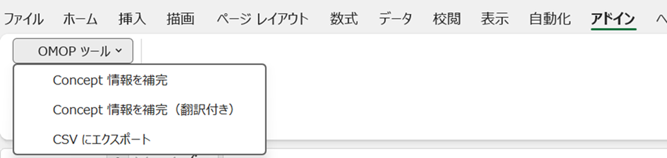

# VocabularyMapping支援ツール 操作マニュアル

バージョン: v1.01

---

## 1. ツール概要

### 作成の背景

OMOP CDM の `source_to_concept_map`（STCM）を作成する際、STCM 形式の Excel シートに `target_concept_id` 等を入力しただけでは、マッピング先の concept の内容を目視で確認することができません。内容を確認できなければ、マッピングが正しく行われたかどうかを検証することもできません。

また、STCM を新規作成するときだけでなく、**すでに作成済みの STCM の内容を理解・検証する場面**においても、concept の詳細情報を人が読める形で参照できる資料が必要です。

このツールは、以下の 2 つの目的のために作成されました。

1. **STCM 作成支援** — 最低限の情報を入力するだけで、マッピング先 concept の詳細情報を自動補完し、内容を目視確認しながら正確なマッピング作業を行えるようにする
2. **STCM の理解・検証支援** — 作成済みの STCM に対して concept 情報を付与し、内容を可読な形で確認・検証できるようにする

---

### 前提条件

> **⚠️ 本ツールを使用するには、PostgreSQL データベースに [ATHENA](https://athena.ohdsi.org/) からダウンロードした OMOP Vocabulary（`concept` テーブル等）が登録済みであることが必須です。**
>
> ATHENA Vocabulary が未登録の場合、concept 情報の検索・補完機能は一切動作しません。
> Vocabulary のダウンロードおよびデータベースへのロードは、本ツールとは別に事前に完了させておいてください。

---

### 実装機能（OMOP ツール メニュー）

本ツールのブックを開くと、Excel のリボン **「アドイン」タブ** に **「OMOP ツール」** メニューが自動的に追加されます。ブックを閉じると同時にメニューも削除されます。



#### 1) Concept情報を補完
ユーザーが最低限の情報（`source_code`、`target_concept_id` 等）を入力するだけで、STCM に必要なカラムを自動補完するとともに、マッピング先 concept の名称・domain・vocabulary 等の詳細情報をシート上に可視化します。

#### 2) Concept情報を補完（翻訳付き）
concept の内容をより理解しやすくするために、`concept_name` の日本語訳を `concept_name_jp` 列に自動入力します。Excel の TRANSLATE 関数を使用した機械翻訳であるため、**翻訳精度および動作は利用環境に依存します。**

#### 3) CSVにエクスポート
STCM テーブルにそのままインポートできる形式（UTF-8 CSV）のファイルを簡単に出力します。出力列・フォーマットは STCM の仕様に合わせて固定されています。

---

## クイックスタート

初めてこのツールを使う場合は、以下の手順で作業を進めてください。

### ステップ 1 — DB 接続設定

> **前提:** PostgreSQL データベースに ATHENA Vocabulary が登録済みであることを確認してください。

`settings` シートの C 列に、ATHENA Vocabulary が登録されている PostgreSQL データベースへの接続情報を設定します（詳細は「2. 事前準備」参照）。

### ステップ 2 — 作業シートの作成

`format` シートをコピーして、作成する STCM ごとの作業シートを作成します。シート名はマッピング対象がわかる名称にしてください。

### ステップ 3 — 最低限の項目を入力

作業シートの 4 行目以降に、以下の入力列（A 列〜E 列）を記入します。

| 列 | 列名 | 備考 |
|----|------|------|
| A | `source_code` | マッピング元のコード |
| B | `source_concept_id` | 不明な場合は空欄で可（0 に自動補完） |
| C | `source_vocabulary_id` | ソースボキャブラリ ID |
| D | `source_code_description` | ソースコードの説明（任意） |
| E | `target_concept_id` | Athena 等で調べたマッピング先の concept ID |

### ステップ 4 — Concept情報を補完

メニュー **「OMOP ツール」→「Concept情報を補完」** を実行します。
マッピング先 concept の詳細情報がシートに自動入力されます。内容を目視で確認しながら、必要に応じて `target_concept_id` を修正・洗練させてください。繰り返し実行することで精度を上げられます。

### ステップ 5 — CSV にエクスポート

マッピング内容が確定したら、メニュー **「OMOP ツール」→「CSV にエクスポート」** を実行します。
STCM テーブルへのインポート用 CSV ファイルが生成されます。

---

## 2. 事前準備（settingsシートの設定）

`settings` シートの C 列に以下の DB 接続情報を設定してください。

| セル | 項目 | 設定例 |
|------|------|--------|
| C2 | ホスト名（host） | localhost |
| C3 | ポート番号（port） | 5432 |
| C4 | ユーザー名（uid） | postgres |
| C5 | パスワード（pwd） | （任意） |
| C6 | データベース名（dbname） | omop_db |
| C7 | スキーマ名（schemaName） | cdm |
| C8 | concept テーブル名（conceptTable） | concept |

> **注意:** ODBC ドライバが事前にインストールされている必要があります。
> 対応ドライバ: PostgreSQL Unicode / SQL Server / MySQL（自動検出・順に試行）

---

## 3. マッピングシートの構成

### 行の役割

| 行番号 | 役割 |
|--------|------|
| 1行目 | タイトル行（任意） |
| 2行目 | データ型定義行（CSV出力時に使用: `文字型` / `数値型` / `日付型`） |
| 3行目 | ヘッダー行（列名を記載） |
| 4行目以降 | データ行（`source_code` が空の行で処理終了） |

---

### 入力列（ユーザーが記入）

| 列名 | 説明 |
|------|------|
| `source_code` | マッピング元のコード（**必須**・空行で処理終了） |
| `source_concept_id` | ソース concept の ID（空欄の場合は `0` で自動補完） |
| `source_vocabulary_id` | ソースボキャブラリ ID（**必須**） |
| `source_code_description` | ソースコードの説明（任意） |
| `target_concept_id` | マッピング先の concept ID（`0` または空で Warning） |

---

### 自動補完列（マクロが入力）— target_concept_id 参照

| 列名 | 説明 |
|------|------|
| `target_vocabulary_id` | target_concept_id の vocabulary_id |
| `valid_start_date` | target_concept_id の有効開始日 |
| `valid_end_date` | target_concept_id の有効終了日 |
| `invalid_reason` | target_concept_id の無効理由 |
| `concept_id` | target_concept_id の concept_id（確認用） |
| `concept_name` | target_concept_id の英語名称 |
| `concept_name_jp` | concept_name の日本語訳（翻訳付き補完時のみ入力） |
| `concept_vocabulary_id` | target_concept_id の vocabulary_id |
| `concept_domain_id` | target_concept_id の domain_id |
| `concept_class_id` | target_concept_id の concept_class_id |
| `standard_concept` | `S`=標準概念、空=非標準（`[W]non-standard concept` の対象） |
| `concept_valid_start_date` | concept テーブルの有効開始日 |
| `concept_valid_end_date` | concept テーブルの有効終了日 |
| `concept_invalid_reason` | concept テーブルの無効理由 |

---

### 自動補完列（マクロが入力）— source_concept_id 参照

| 列名 | 説明 |
|------|------|
| `source_concept_id`（2列目） | source_concept_id の concept_id（確認用） |
| `source_concept_name` | source_concept_id の concept 名 |
| `source_concept_vocabulary_id` | source_concept_id の vocabulary_id |
| `source_concept_domain_id` | source_concept_id の domain_id |
| `source_concept_class_id` | source_concept_id の concept_class_id |

---

### チェック結果列

補完実行後、各行の処理結果が `Error` 列に記録されます。正常時は空白です。

| プレフィックス | 意味 |
|---------------|------|
| （空白） | 正常にマッピングされた |
| `[W]` | Warning — 処理は続行されるが確認・修正を推奨 |
| `[E]` | Error — 必須情報が不足しているため対処が必要 |

**メッセージ一覧:**

| メッセージ | 意味 | 対処方法 |
|-----------|------|----------|
| `[W]target_concept_id未設定` | target_concept_id が空または `0` | target_vocabulary_id=None、日付はデフォルト値（1970-01-01 〜 2099-12-31）で補完される。マッピング先 ID を設定する |
| `[W]non-standard concept` | standard_concept が空（非標準概念） | OMOP CDM では標準概念へのマッピングが推奨。Athena 等で標準概念の ID を確認する |
| `[E]conceptテーブルに存在しないid` | 指定した target_concept_id が DB に存在しない | concept ID を確認し、正しい ID に修正する |
| `[E]source_vocabulary_idが未設定` | source_vocabulary_id が空欄 | source_vocabulary_id を必ず入力する |

---

## 4. 操作手順

Excel メニューバーの **「OMOP ツール」** から各機能を実行します。

---

### Concept情報を補完

`target_concept_id` を DB の concept テーブルで検索し、関連情報を自動入力します。

- `source_concept_id` が `0` より大きい場合は、そのconcept情報も補完します
- `concept_name_jp` 列は空白のままになります
- 実行前に `target_vocabulary_id` 列以降の既存データはすべてクリアされます

---

### Concept情報を補完（翻訳付き）

上記と同じ処理に加え、`concept_name_jp` 列に Excel の TRANSLATE 関数を自動入力します。

```
=TRANSLATE(<concept_name のセル>, "en", "ja")
```

> **注意:** Microsoft 365 の TRANSLATE 関数が使用できるバージョンが必要です。

---

### CSV にエクスポート

シートのデータを UTF-8（BOM付き）CSV として保存します。

**出力列（固定）:**

```
source_code, source_concept_id, source_vocabulary_id, source_code_description,
target_concept_id, target_vocabulary_id, valid_start_date, valid_end_date, invalid_reason
```

**フォーマットルール（2行目のデータ型定義に従う）:**

| データ型 | 出力形式 |
|----------|----------|
| 文字型 | ダブルクォート囲み（内部の `"` は `""` にエスケープ） |
| 日付型 | `yyyy-mm-dd` 形式 |
| 数値型 | そのまま出力 |

---

## 5. 注意事項

- **ODBCドライバ:** PostgreSQL Unicode 等の ODBC ドライバが事前にインストールされている必要があります
- **OneDrive制約:** CSV エクスポート時、OneDrive のクラウドフォルダ（`https://...` のパス）には保存できません。ローカルフォルダを指定してください
- **データクリア:** 補完実行時、`target_vocabulary_id` 列以降の既存データはすべてクリアされます（`source_code` / `source_concept_id` 等の入力列は保持されます）
- **空行禁止:** `source_code` が空の行でデータ処理が終了します。データの途中に空行を入れないでください
- **TRANSLATE関数:** 翻訳付き補完は Microsoft 365 の TRANSLATE 関数が必要です（旧バージョンの Excel では動作しません）
- **source_concept補完列:** `source_concept_name` 等の補完列がシートに存在しない場合、source_concept_id の補完処理はスキップされます
