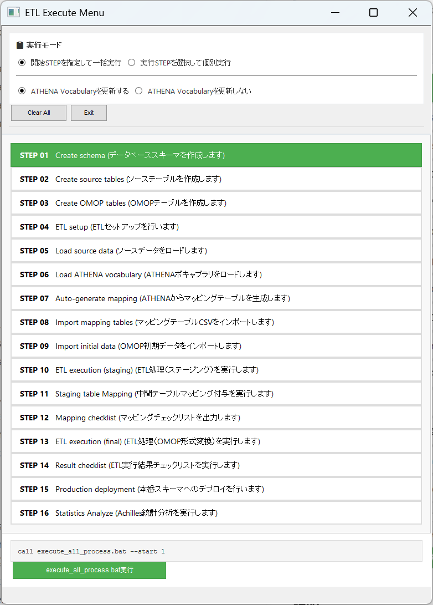
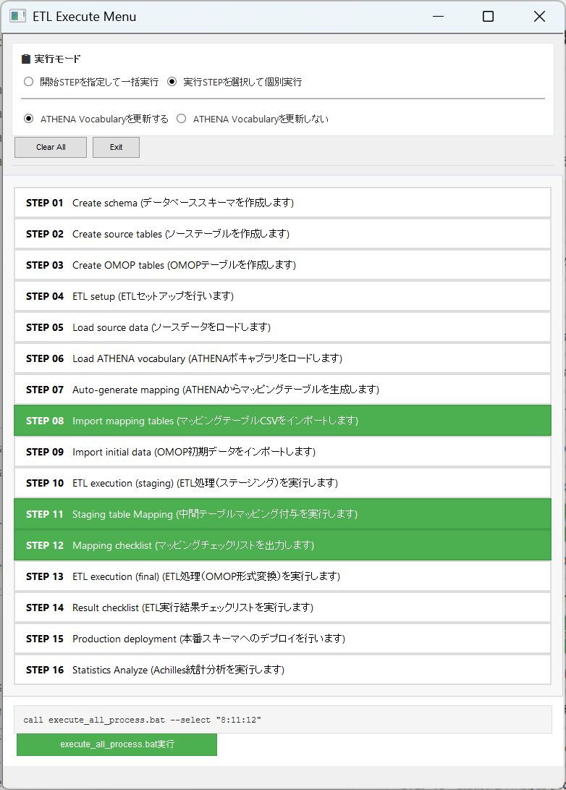

# ETL一括実行ツール(execute_all_process.bat) オペレーションマニュアル

**作成日：** 2026年2月8日（更新）  
**対象ファイル：** `execute_all_process.bat`  
**説明：** OMOP ETL処理の実行アプリケーション。一括実行、選択実行の２つのモードに対応。CUI操作に加えてBATの実行モードをGUIから指定できる機能を備える。

---

## 概要

`execute_all_process.bat` は、以下OMOP変換プロセスを実行するためのCUIアプリケーションです：

[データベース環境構築]
- STEP01 : Create schema (データベーススキーマを作成します)
- STEP02 : Create source tables (ソーステーブルを作成します)
- STEP03 : Create OMOP tables (OMOPテーブルを作成します)
- STEP04 : ETL setup (ETLセットアップを行います)

[ソースデータセットアップ]
- STEP05 : Load source data (ソースデータをロードします)

[OMOP関連データセットアップ]
- STEP06 : Load ATHENA vocabulary (ATHENAボキャブラリをロードします)
- STEP07 : Auto-generate mapping (ATHENAからマッピングテーブルを生成します)
- STEP08 : Import mapping tables (マッピングテーブルCSVをインポートします)
- STEP09 : Import initial data (OMOP初期データをインポートします)

[OMOPデータ変換処理の実行]
- STEP10 : ETL execution (staging) (ETL処理（中間テーブル構築まで）を実行します)
- STEP11 : Staging table Mapping (中間テーブルマッピング付与を実行します)
- STEP12 : Mapping checklist (マッピングチェックリストを出力します)
- STEP13 : ETL execution (final) (ETL処理（OMOP形式変換）を実行します)
- STEP14 : Result checklist (ETL実行結果チェックリストを実行します)

[OMOPデータの本番環境反映]
- STEP15 : Production deployment (本番スキーマへのデプロイを行います)
- STEP16 : Statistics Analyze (Achilles統計分析を実行します)
---

## 事前準備

このアプリケーションを実行するためには、以下の準備が完了していることが前提条件です。

⚠️ **重要な前提事項**
1. PostgreSQLにユーザとデータベースが作成済であること（参照：READMEの環境構築手順）
2. `0000_setting\_env.bat` にデータベース名、接続ユーザ名、スキーマ名が設定されていること（参照：READMEの環境構築手順）
3. 変換元ソースデータCSVが`3000_load_source\dat\*.csv`に配置済であること
4. ATHENAボキャブラリCSVが`4000_load_vocab\athena\*.csv`に配置済であること

---

## 機能説明

### Part 1: GUIアプリケーション機能

**ファイル：** `execute_menu.hta`
**説明：** `execute_all_process.bat`の実行パラメータをGUI操作で設定することができます。


#### 実行手順

1. **HTAファイルを開く**
   - Explorerで `execute_all_process.hta` をダブルクリック
   - または右クリック → 「開く」
>⚠️ **注意事項**
> - 拡張子htaファイルはOSの環境によっては開くアプリケーションが関連付けられておらず、アプリケーションの選択を求められる場合があります。その場合は以下のいずれかの方法で起動することができます。
>     - `execute_all_process.hta`ではなく`execute_all_processGUI.BAT`を実行する
>     - 「アプリを選択して開く」画面最下部の「PCでアプリを選択する」-> `C:\Windows\SysWOW64\mshta.exe`を選択する


2. **実行モード選択**
   - **START（開始STEP指定）モード：** 指定したSTEPから最後のSTEまで連続実行
   - **SELECT（個別STEP選択）モード：** 複数のSTEPを個別に選択して実行

3. **オプション設定**
   - **ATHENA Vocabularyを更新しない** : ATHENA Vocabularyの更新が不要な場合、このオプションを指定すると時間を大幅に短縮できます

4. **実行**
   - 「execute_all_process.bat実行」ボタンをクリック
   - 確認ダイアログで「OK」を選択
   - 画面で指定した実行条件で`execute_all_process.bat`が起動して処理開始

#### 画面遷移

##### STARTモード（開始STEPを指定して一括実行）



**説明：**
- 上部ラジオボタンで「開始STEPを指定して一括実行」を選択
- STEPリストから開始するSTEPを選択
- 下部に実行コマンドが表示される：`call execute_all_process.bat --start 1`
- 「execute_all_process.bat実行」ボタンをクリックすると指定した実行条件で`execute_all_process.bat`が実行される

---

##### SELECTモード（実行するSTEPを選択して個別実行）



**説明：**
- ラジオボタンで「実行STEP内容選択して個別実行」を選択
- STEPリストから実行するSTEPを選択（例：STEP 08と STEP 11）
- 下部に実行コマンドが表示される：`call execute_all_process.bat --select "8:11"`
- 「execute_all_process.bat実行」ボタンをクリックすると指定した実行条件で`execute_all_process.bat`が実行される

---


### Part 2: コマンドライン（CUI）機能

#### 実行方法の種類

`execute_all_process.bat` は3つの実行モードをサポートします：

##### 1. インタラクティブモード（引数なし）

```powershell
execute_all_process.bat
```

**説明：**  
- ユーザーは対話的に開始STEP番号を入力する
- 指定STEPから最後のSTEPまで順序通り実行

**対応シーン：** 初回実行、またはソースデータやATHENA Vocabulary、マッピングテーブルの更新に伴い途中STEPから再実行する場合

**対応シーン例：**
- 初めて実行する場合(STEP1から)
- ソースデータを更新する場合(STEP5から)
- ATHENA Vocabularyを更新する場合(STEP6から)
- マッピングテーブルを更新する場合(STEP8から)

---

##### 2. STARTモード（開始STEP指定）

```powershell
execute_all_process.bat --start <step_number> [--skipathena] [--silent]
```

**パラメータ：**
- `<step_number>` : 開始STEP番号（1～16）
- `--skipathena`  : ATHENA Vocabularyの更新をスキップ(処理時間の大幅短縮)
- `--silent`      : 実行確認入力（Y/N）と完了後のPAUSEをスキップ。タスクスケジューラモードや他BATからの呼び出しに指定する

**説明：**
- 指定したSTEP番号から最後のSTEPまで連続実行

**対応シーン：**
- 途中のSTEPから再実行する場合
- スキーマ作成済みで、データ読み込みから開始する場合

**実行例：**
```powershell
execute_all_process.bat --start 7 --skipathena
--> STEP7(マッピングテーブルインポート)から再実行。ATHENA Vocabularyは更新がないので処理しない。

execute_all_process.bat --start 1 --silent
--> STEP1から全ステップを指定・Y入力不要・PAUSEなしで完了。タスクスケジューラに登録する場合などに利用。
```

> 💡 **タスクスケジューラへの登録方法**  
> タスクスケジューラの「操作」設定では以下のように指定してください：
> 
> | 項目 | 設定値 |
> |---|---|
> | プログラム/スクリプト | `cmd` |
> | 引数の追加 | `/c "C:\...\execute_all_process.bat" --start 1 --silent` |
> | 開始（オプション） | 空欄でも可（BATが自動で自フォルダに移動） |

---

##### 3. SELECTモード（複数STEP個別選択）

```powershell
execute_all_process.bat --select "<step1>:<step2>:<step3>..." [--skipathena] [--silent]
```

**パラメータ：**
- `<step1>:<step2>:<step3>...` : 実行するSTEP番号をコロン（:）で区切って指定
- `--skipathena`  : ATHENA Vocabularyの更新をスキップ(処理時間の大幅短縮)
- `--silent`      : 実行確認入力（Y/N）と完了後のPAUSEをスキップ。タスクスケジューラモードや他BATからの呼び出しに指定する

**説明：**
- 複数のSTEPを個別に選択して実行

**対応シーン：**
- マッピングテーブル更新とチェックリストの作成など、限定的なSTEPを実行する場合

**実行例：**
```powershell
execute_all_process.bat --select "8:11:12"
--> STEP8(マッピングテーブルインポート), STEP11(中間テーブルマッピング付与), STEP12(マッピングチェックリスト出力)を実行
execute_all_process.bat --select "16"
--> STEP16(Achilles統計データ生成)だけを実行
execute_all_process.bat --select "8:11:12" --silent
--> STEP8(マッピングテーブル更新),11(中間テーブルマッピング付与),12(マッピングチェックリスト)をY入力不要・PAUSEなしで実行。マッピング洗練サイクルでよく使用。
```

---

## 具体的な使用例

通常の運用で想定される以下のシーンを想定し、具体的な実行例を説明します。

```
- ユースケース1：初めて実行する場合
- ユースケース2：コンセプトマッピングCSVを更新してデータ変換を再実行する場合
- ユースケース3：コンセプトマッピングテーブルを更新して、データ変換前にマッピングチェックリストを確認する場合
- ユースケース4：変換元のソースデータを更新する場合
- ユースケース5：ATHENAボキャブラリを更新する場合
```


### ユースケース1：初めて実行する場合

**シーン：** OMOP CDM ETLの環境構築を始めて実施。スキーマ作成から統計分析まで、すべてのSTEPを一括実行する。

【実行方法】

```powershell
PS> execute_all_process.bat
```

**説明：** 引数なしで実行すると、ユーザーに開始STEP番号の入力を要求します。

【出力】

```
====================================================================
  OMOP ETL All Steps Execution
====================================================================

The following steps will be executed in order:
   1. Create schema
   2. Create source tables
   3. Create OMOP tables
   4. ETL setup
   5. Load source data
   6. Load ATHENA vocabulary
   7. Auto-generate mapping tables
   8. Import mapping tables
   9. Import initial data
  10. ETL execution (staging)
  11. Stagint table mapping
  12. Mapping checklist
  13. ETL execution (final)
  14. Result checklist
  15. Production deployment
  16. Statistics Analyze

====================================================================
   Pre-execution checklist:
   - _env.bat is properly configured
   - PostgreSQL is running
   - Required CSV files are placed
     * 3000_load_source/dat/: source data CSV
     * 3000_load_source/mst/: master CSV
     * 4000_load_vocab/athena/: ATHENA vocabulary CSV
====================================================================

====================================================================
   Which step do you want to start from?
====================================================================

Enter the starting step number (1-16, or X to cancel): 
```

**ユーザー入力：** `1` を入力してEnter

【実行結果】

```
Starting from step 1

====================================================================
   Do you want to proceed? (Y/N):
====================================================================
```

**ユーザー入力：** `Y` を入力してEnter

```
====================================================================
   Starting batch execution
====================================================================

[2026-02-08 09:00:15] Batch execution started

====================================================================
[1/16] Create schema
====================================================================
[STEP1] Started
... (create_schema.bat実行) ...
[STEP1] Completed

====================================================================
[2/16] Create source tables
====================================================================
[STEP2] Started
... (create_table.bat実行) ...
[STEP2] Completed

====================================================================
[3/16] Create OMOP tables
====================================================================
[STEP3] Started
... (create_table.bat実行) ...
[STEP3] Completed

... (STEP 4～15が順序通り実行) ...

====================================================================
   Batch execution completed successfully!
====================================================================
[2026-02-08 14:30:45] Batch execution completed

Next steps:
   - Please check the log file
   - Check the result checklist if needed

====================================================================
   Log file recording completed
====================================================================

✅ Batch execution completed successfully.
```

---

### ユースケース2：コンセプトマッピングCSVを更新してデータ変換を再実行する場合

**シーン：** マッピングテーブルのCSVファイルを更新した後、その変更を反映してデータ変換を再実行する。STEP8（マッピングテーブルインポート）から最後まで処理を実行する。ATHENA Vocabularyは更新がない。

【実行方法】

```powershell
execute_all_process.bat --start 8 --skipathena
```

**説明：** STEP 8から実行開始（`--start 8`）し、ATHENA Vocabulary関連処理をスキップ（`--skipathena`）します。

【出力】

```
Starting from step 8

====================================================================
   Do you want to proceed? (Y/N):
====================================================================
```

**ユーザー入力：** `Y` を入力してEnter

【実行結果】

```
====================================================================
   Starting batch execution
====================================================================

[2026-02-08 09:00:15] Batch execution started

[STEP1] Skipped ← STEP 1～7は既に実行済みなのでスキップ
[STEP2] Skipped
[STEP3] Skipped
[STEP4] Skipped
[STEP5] Skipped
[STEP6] Skipped [--skipathena flag is set]
[STEP7] Skipped

====================================================================
[8/16] Import mapping tables
====================================================================
[STEP8] Started
... (03_import_stcm.BAT実行) ...
[STEP8] Completed

====================================================================
[9/16] Import initial data
====================================================================
[STEP9] Started
... (04_import_initdata.BAT実行) ...
[STEP9] Completed

====================================================================
[10/16] ETL execution [staging]
====================================================================
[STEP10] Started
... (01_etl_execution_to_stem.bat実行) ...
[STEP10] Completed

====================================================================
[11/16] Staging table Mapping
====================================================================
[STEP11] Started
... (02_etl_execution_stem_mapped.bat実行) ...
[STEP11] Completed

====================================================================
[12/16] Mapping checklist
====================================================================
[STEP12] Started
... (03_mapping_checklist.bat実行) ...
[STEP12] Completed

====================================================================
[13/16] ETL execution [final]
====================================================================
[STEP13] Started
... (04_etl_execution_to_final.bat実行) ...
[STEP13] Completed

====================================================================
[14/16] Result checklist
====================================================================
[STEP14] Started
... (05_result_checklist.bat実行) ...
[STEP14] Completed

====================================================================
[15/16] Production deployment
====================================================================
[STEP15] Started
... (06_production_deployment.bat --data実行) ...
[STEP15] Completed

====================================================================
[16/16] Statistics Analyze
====================================================================
[STEP16] Started
... (01_achilles_concept_hierarchy.bat実行) ...
... (02_achilles_statistics.bat実行) ...
... (03_achilles_concept_count.bat実行) ...
[STEP16] Completed

====================================================================
   Batch execution completed successfully!
====================================================================
[2026-02-08 11:30:45] Batch execution completed

✅ Batch execution completed successfully.
```

---

### ユースケース3：コンセプトマッピングテーブルを更新して、データ変換前にマッピングチェックリストを確認する場合

**シーン：** コンセプトマッピングCSVを更新した後、マッピングテーブルの読み込みと確認チェックリストだけを実行して、データが正しく反映されているか検証する

【実行方法】

```powershell
PS> execute_all_process.bat --select "8:11:12"
```

**説明：** STEP 8（Import mapping tables）、STEP 11（Staging table Mapping）、STEP 12（Mapping checklist）のみを実行します。STCM 更新後は Staging table Mapping を再構築してからマッピングチェックリストを出力する必要があります。

【出力】

```
Steps to execute:
   8. Import mapping tables
   11. Staging table Mapping
   12. Mapping checklist

====================================================================
   Do you want to proceed? (Y/N):
====================================================================
```

**ユーザー入力：** `Y` を入力してEnter

【実行結果】

```
====================================================================
   Starting batch execution
====================================================================

[2026-02-08 09:00:15] Batch execution started

[STEP1] Skipped ← STEP 1～7はスキップ
[STEP2] Skipped
[STEP3] Skipped
[STEP4] Skipped
[STEP5] Skipped
[STEP6] Skipped
[STEP7] Skipped

====================================================================
[8/16] Import mapping tables
====================================================================
[STEP8] Started
... (03_import_stcm.BAT実行) ...
[STEP8] Completed

[STEP9] Skipped  ← STEP 9, 10はスキップ
[STEP10] Skipped

====================================================================
[11/16] Staging table Mapping
====================================================================
[STEP11] Started
... (02_etl_execution_stem_mapped.bat実行) ...
[STEP11] Completed

====================================================================
[12/16] Mapping checklist
====================================================================
[STEP12] Started
... (03_mapping_checklist.bat実行) ...
[STEP12] Completed

[STEP13] Skipped ← STEP 13～16はスキップ
[STEP14] Skipped
[STEP15] Skipped
[STEP16] Skipped

====================================================================
   Batch execution completed successfully!
====================================================================
[2026-02-08 09:30:45] Batch execution completed

✅ Batch execution completed successfully.
```

---

### ユースケース4：変換元のソースデータを更新する場合

**シーン：** ソースシステムから抽出したCSVファイルを更新したので、ソースデータインポートから最後まで処理を再実行する。ATHENA Vocabularyは更新がない。

【実行方法】

```powershell
PS> execute_all_process.bat --start 5 --skipathena
```

**説明：** STEP5（ソースデータのインポート）から実行する。ATHENA Vocabulary関連処理は行わない。

【出力】

```
Starting from step 5

====================================================================
   Do you want to proceed? (Y/N):
====================================================================
```

**ユーザー入力：** `Y` を入力してEnter

【実行結果】

```
====================================================================
   Starting batch execution
====================================================================

[2026-02-08 09:00:15] Batch execution started

[STEP1] Skipped ← STEP 1～4は既に実行済みなのでスキップ
[STEP2] Skipped
[STEP3] Skipped
[STEP4] Skipped

====================================================================
[5/16] Load source data
====================================================================
[STEP5] Started
... (01_import_source.BAT実行) ...
... (02_import_master.BAT実行) ...
[STEP5] Completed

====================================================================
[6/16] Load ATHENA vocabulary [SKIPPED]
====================================================================
[STEP6] Skipped [--skipathena flag is set]

====================================================================
[7/16] Auto-generate mapping tables
====================================================================
[STEP7] Started
... (02_generate_automapping.BAT実行) ...
[STEP7] Completed

====================================================================
[8/16] Import mapping tables
====================================================================
[STEP8] Started
... (03_import_stcm.BAT実行) ...
[STEP8] Completed

... (STEP 9～15が順序通り実行) ...

====================================================================
   Batch execution completed successfully!
====================================================================
[2026-02-08 12:00:45] Batch execution completed

✅ Batch execution completed successfully.
```

---

### ユースケース5：ATHENAボキャブラリを更新する場合

**シーン：** ATHENA Vocabularyファイルを更新してOMOPデータを再生成する。

【実行方法】

```powershell
PS> execute_all_process.bat --start 6
```

**説明：** STEP6（ATHENAボキャブラリのロード）から実行する。

【出力】

```
Starting from step 6

====================================================================
   Do you want to proceed? (Y/N):
====================================================================
```

**ユーザー入力：** `Y` を入力してEnter

【実行結果】

```
====================================================================
   Starting batch execution
====================================================================

[2026-02-08 09:00:15] Batch execution started

[STEP1] Skipped ← STEP 1～5は既に実行済みなのでスキップ
[STEP2] Skipped
[STEP3] Skipped
[STEP4] Skipped
[STEP5] Skipped

====================================================================
[6/16] Load ATHENA vocabulary
====================================================================
[STEP6] Started
... (01_import_athena.BAT実行) ...
[STEP6] Completed

====================================================================
[7/16] Auto-generate mapping tables
====================================================================
[STEP7] Started
... (02_generate_automapping.BAT実行) ...
[STEP7] Completed

====================================================================
[8/16] Import mapping tables
====================================================================
[STEP8] Started
... (03_import_stcm.BAT実行) ...
[STEP8] Completed

... (STEP 9～15が順序通り実行) ...

====================================================================
   Batch execution completed successfully!
====================================================================
[2026-02-08 11:45:45] Batch execution completed

✅ Batch execution completed successfully.
```

---

## 実行権限に関する注意

- Explorerからダブルクリック実行する場合、ユーザー権限で実行されます
- PowerShellやコマンドプロンプトから実行する場合も同様です
- PostgreSQL操作など、管理者権限が必要な処理がある場合は、前提条件を確認してください

---

**更新履歴：** 
- 2026年2月8日（初版作成）
